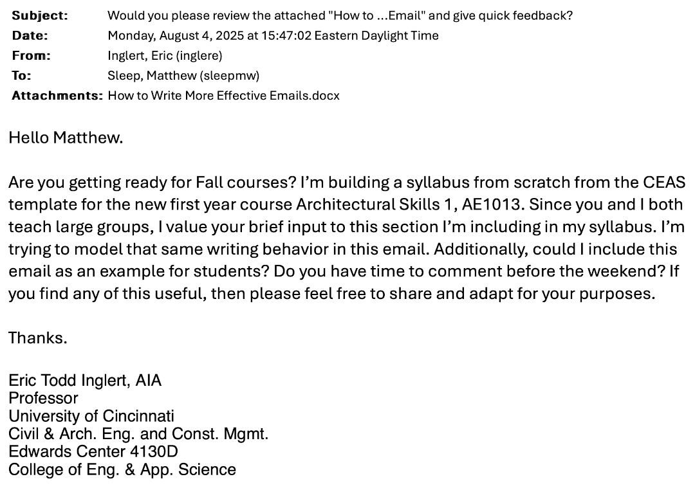

## How to Write More Effective Emails

Everyone could do a better job writing effective emails. Your professor
included! Since email is the dominant communication mode for business as
well as the academy, it is important to write effectively. Effective
email writing has been defined as clear, concise, and productive. [Stein
2022](https://hbr.org/2022/08/5-tips-for-writing-professional-emails).

You should identify what actions you want from your email. Limit your
Cc: list to only those critical few who need the information. Write the
subject line as the main question you seek to answer. After a
professional greeting, write in simple active voice sentences. Make sure
you indicate when you would want an answer, and do not expect everyone
can meet your last-minute deadline! Most of the time it makes sense to
seek answers to one or two questions. Having this personal discipline to
challenge yourself to a word limit of for instance one hundred words
shows that you respect the time of your email recipient. Favor data
attachments over inline and embedded text, because many of your readers
will only skim the body text.

How about the hundreds of emails you get every day? It is important to
have a personal deadline for answering emails sent to you, especially
from colleagues and friends. Twenty-four hours is a standard. If you
send an email, and your recipient has missed responding in a timely
fashion, here is my best personal advice that may seem to some of you to
be at the limit of impertinent: Forward the message that you previously
sent and replace the "Fw:" in the subject line with the words, "Second
request:" Ignoring emails from colleagues and friends is from my
observations, since my first email address in 1989, a mistake that leads
to professional and personal failure. The corollary of this principle is
that long, poorly focused emails are likely to get you ignored!

Proofread once. Do it again. One more time before you hit the send
button!

I have modeled below the behavior that I'm discussing here.

---

