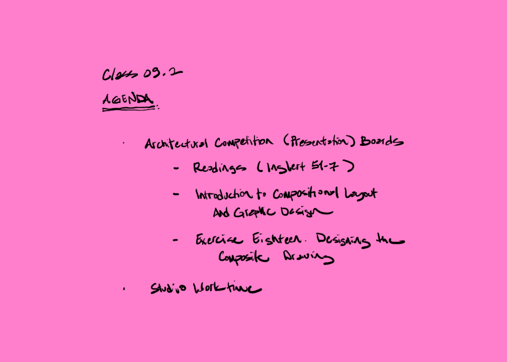

[AE1013](ae1013/)

<!-- remove

<iframe height="420" width="640" allowfullscreen frameborder=0 src="https://echo360.org/media/19eece51-df27-4511-ac0d-9d6ab8080263/public?autoplay=false&automute=false"></iframe>

<iframe height="420" width="640" allowfullscreen frameborder=0 src="https://echo360.org/media/1df2a500-521f-4b61-a742-2e0f40a78f22/public?autoplay=false&automute=false"></iframe>
 

-->
