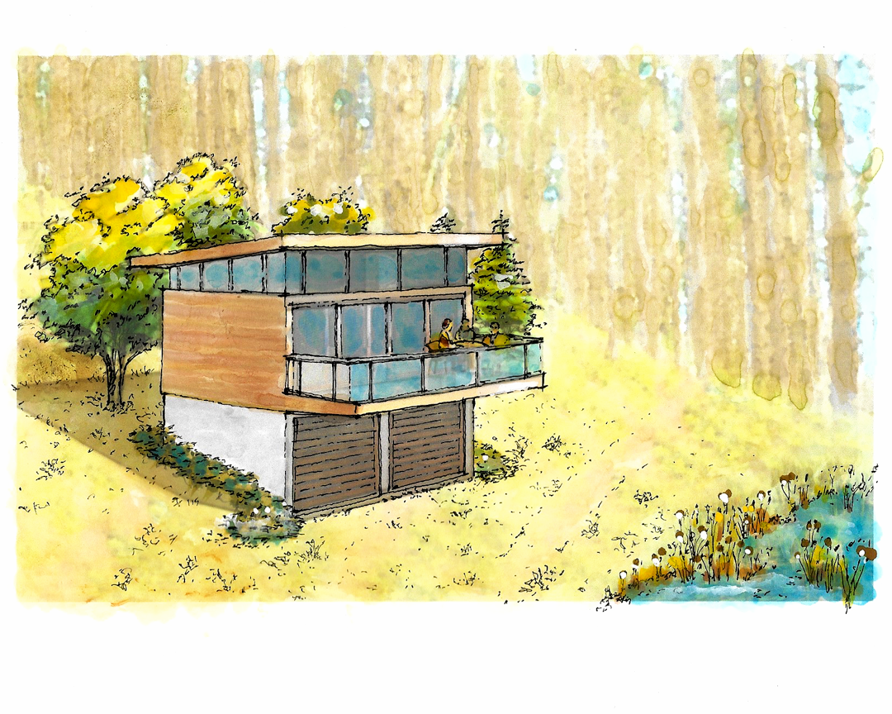
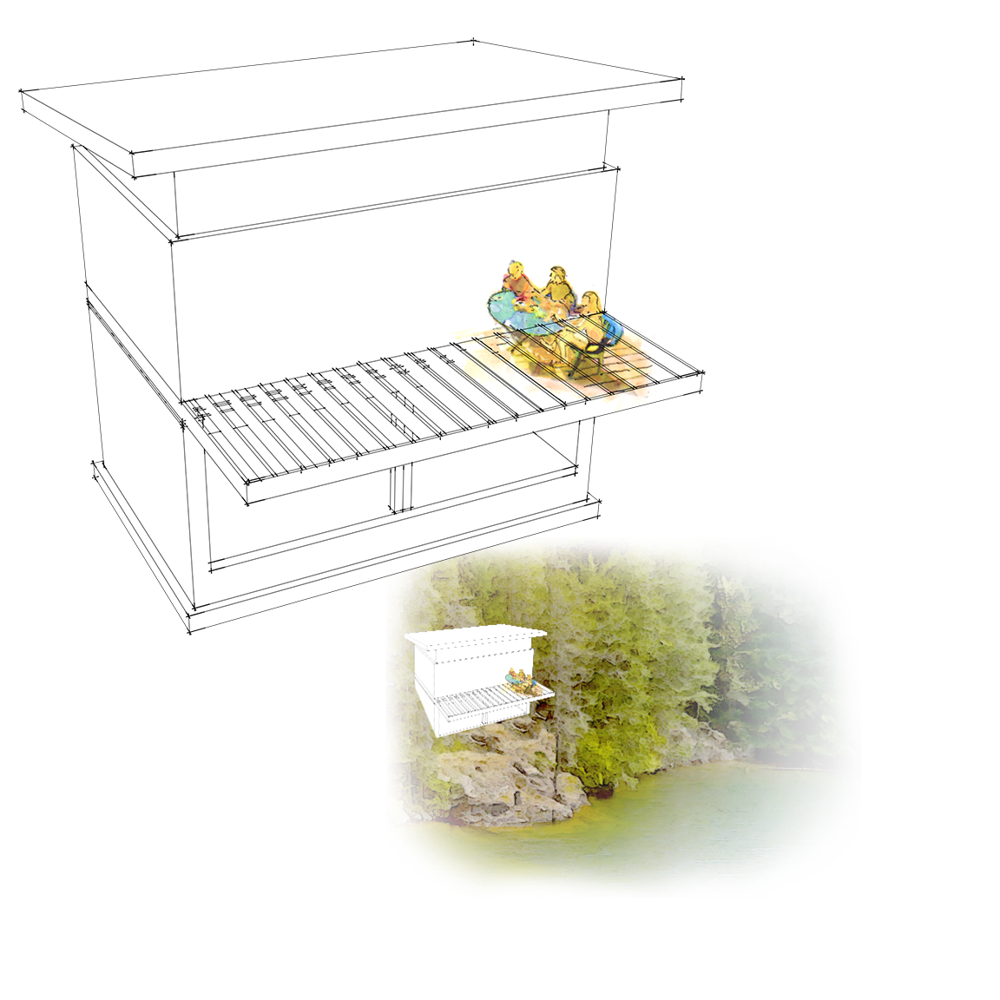
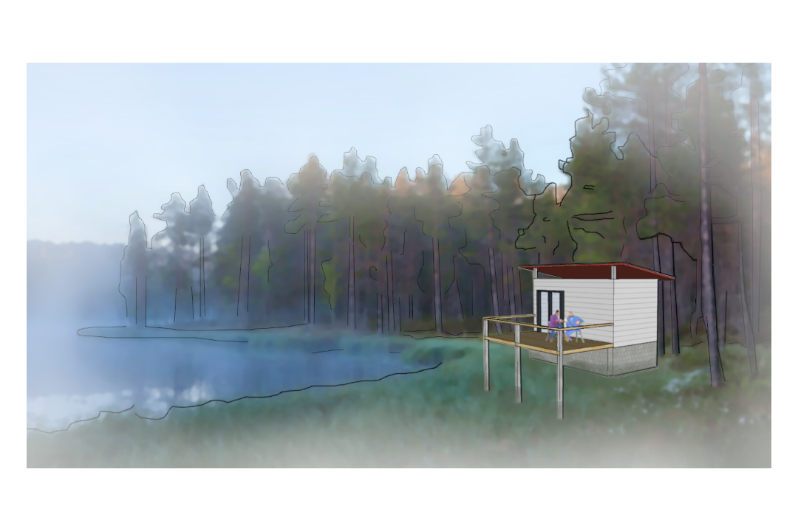
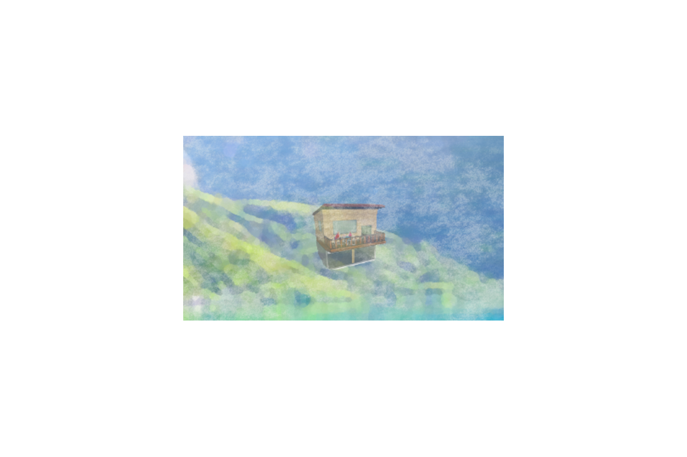
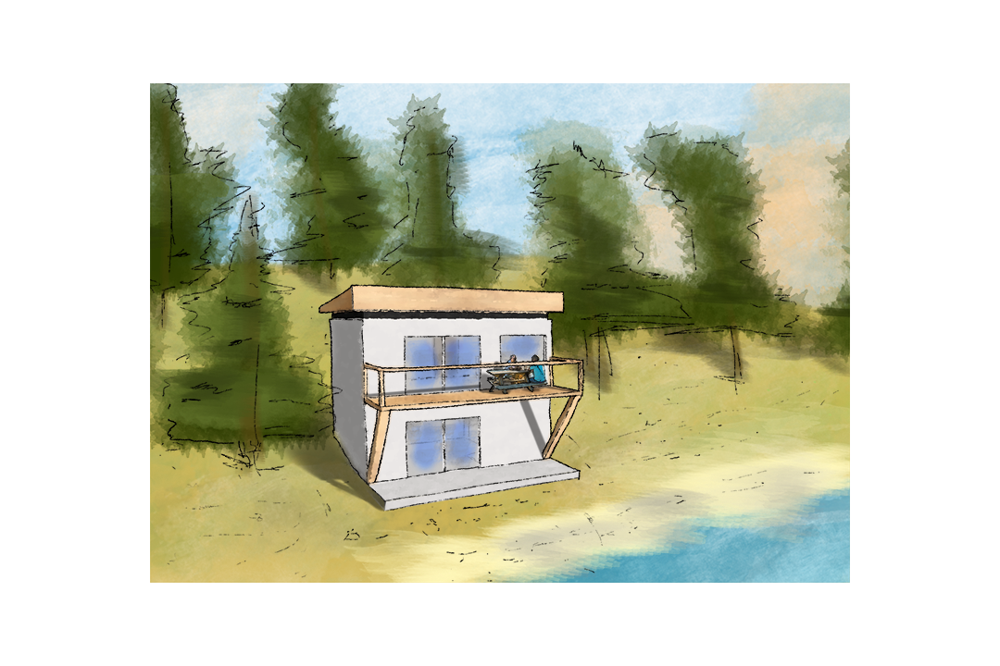

[Today\s Agenda](221114-5_agenda.html)

## Exercise Twenty. Rendered Exterior Perspective

Figure 3.6 Exercise Twenty. Rendered Exterior Perspective

### Introduction

The Rendered Exterior Perspective builds on the lessons we learned while discovering your personal rendering style in Exercise Nineteen. Like before this exercise has several steps and intermediate deadlines. The final drawing will be a rendered exterior perspective of the project. Exercise Nineteen gave us a chance to develop some actors for our scene and to explore our rendering style. The goal of both assignments is to build up a watercolor-inspired illustration of our project.

## Student Examples

