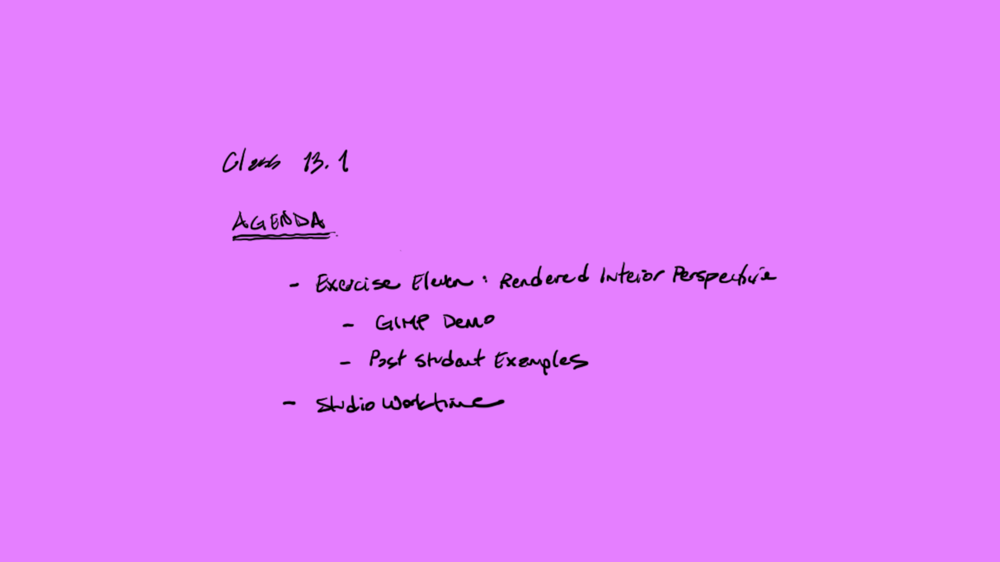

taco ditto

[AE1013](ae1013/)

<iframe height="420" width="640" allowfullscreen frameborder=0 src="https://echo360.org/media/615d5710-e67e-4fdf-80a6-dfc9a19a6aac/public?autoplay=false&automute=false"></iframe>

<!-- remove

-->
