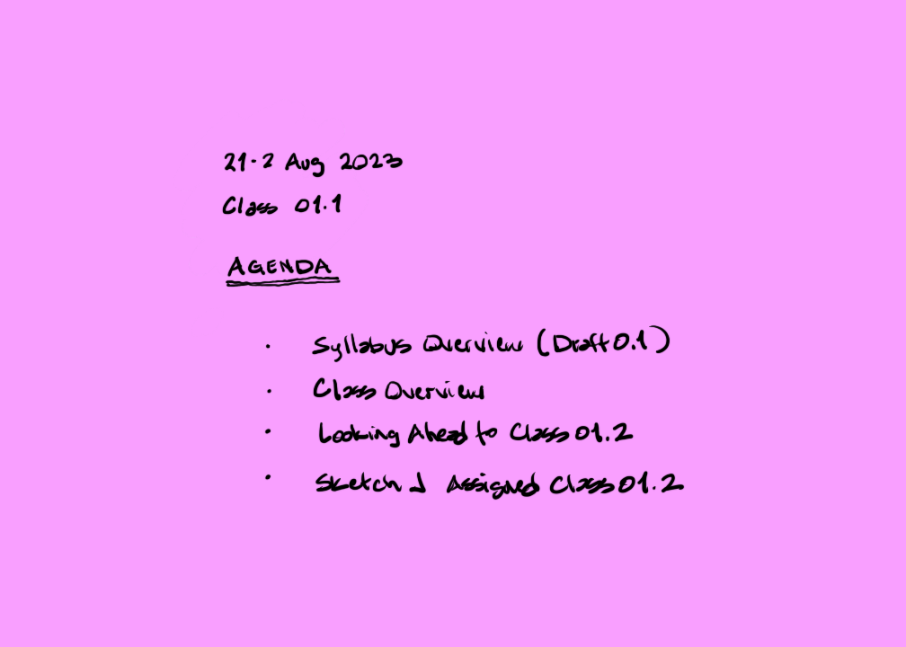

## Welcome Back

- What's the difference between Skills 1 and 2?
    - Electronic Portfolio = Composite Presentation Board
    - 3 cr. hrs. vs. 4.
    - Predominance of color illustration
    - More digital workflows

- The role of the textbook

- Deadlines are more critical

## Begin with the End in Mind

