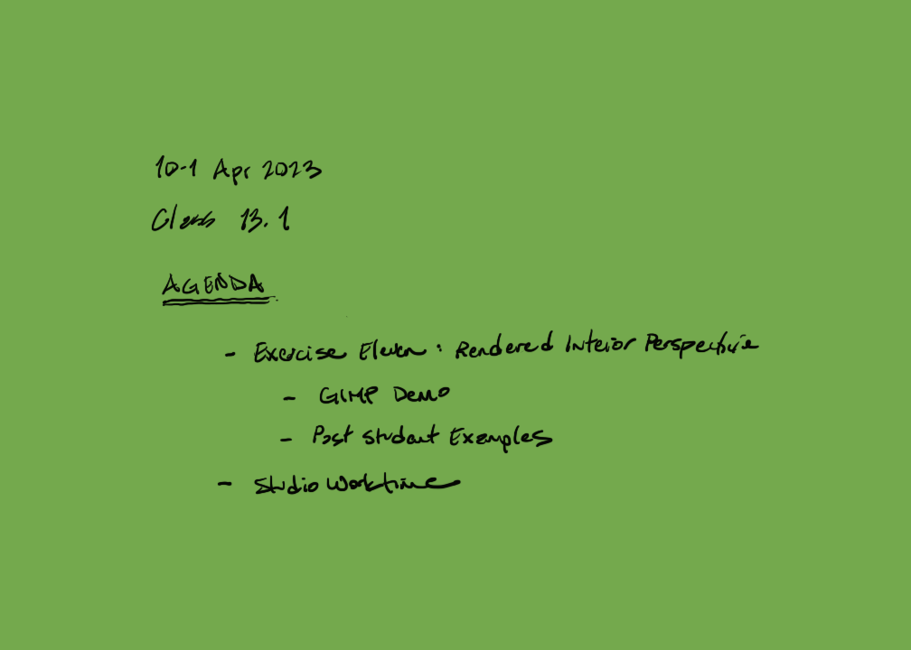
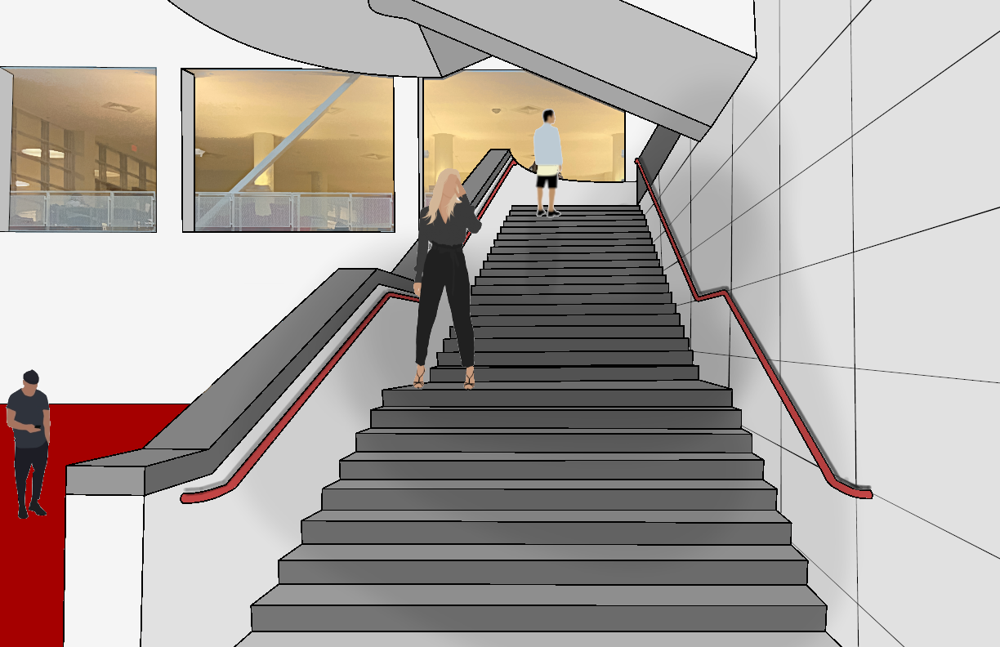
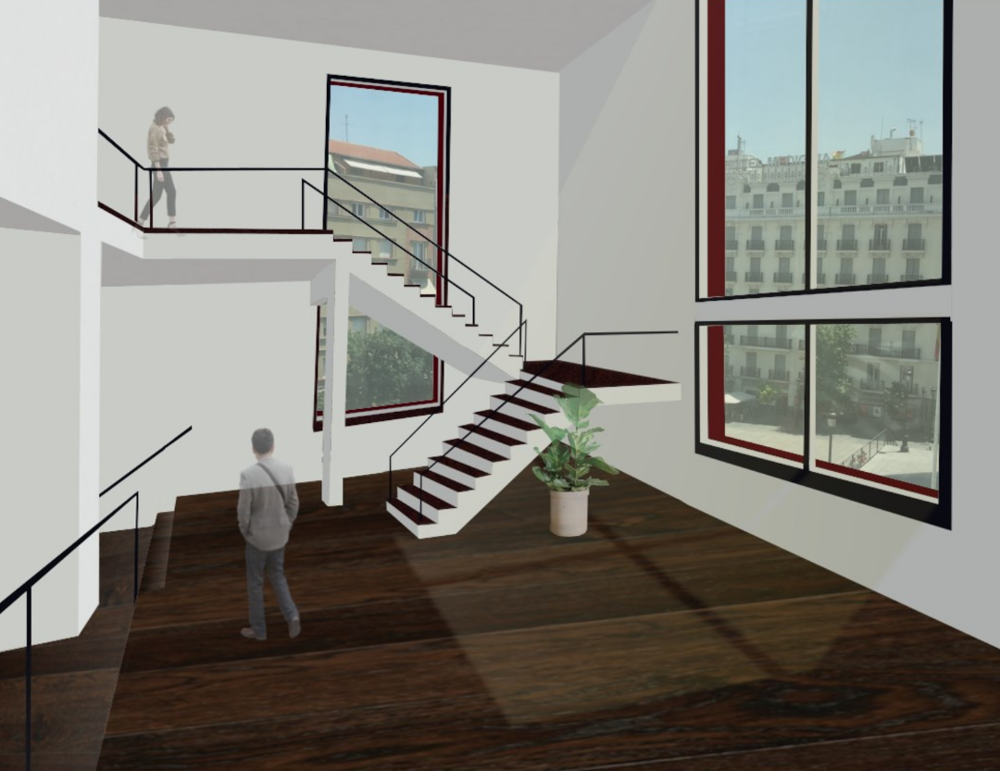
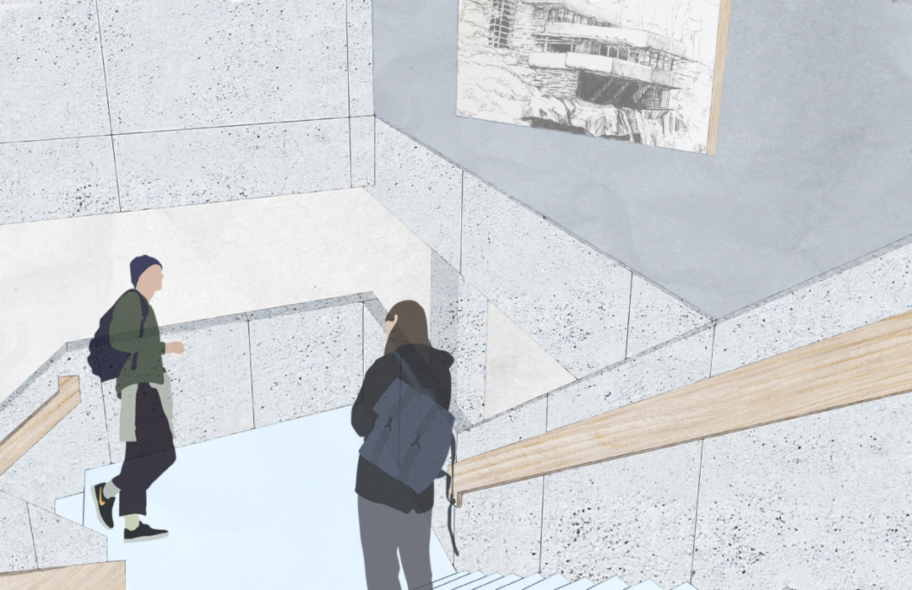

### Exercise Eleven. Rendered Interior Perspective. Hybrid Drawing

#### Introduction

Figure 6.2.1: Exercise Eleven. Rendered Interior Perspective. Hybrid Drawing

Create a rendered perspective view of an interior space that expresses
the unique character of a space through scale, materiality, and light.
Use freehand perspective drawing techniques combined with raster
graphics to complete the drawing. The drawing may be a one-, two-, or
three-point perspective. It must be of an interior space.

#### Learning

This assignment module contributes to the following design learning
outcomes, which finish the sentence "As a successful student in this
course, I am now able..."

-   ... to analyze and accurately represent an interior perspective view
    of an existing space.

-   ... to render light, color, and materials both by traditional hand
    drawn techniques and contemporary raster graphics painting.

#### Scenario

> Unlike the painter or sculptor who can produce finished, realized
> works from the very beginning...the designer must be content with
> drawings and scale models until the happy day when a client is ready
> to underwrite realization of a design project. Drawings and renderings
> become a kind of intermediary end-product...as the best realization
> available short of actual construction. (Pile 1967, 1)

Interior perspectives are a fundamental skill for architectural
rendering. Computer modeling has made constructing interior perspectives
somewhat easier and has introduced new opportunities for creativity.
Computer rendering packages can analyze and simulate interior lighting
conditions which can aid the renderer in producing realistic views.
Rendering options now include traditional hand drawn painting techniques
along with raster image editing and painting. Exercise Eleven provides
some practice in combining the traditional and the digital. The exercise
proceeds from a good line drawing of an interior perspective that may
not even be evident in the final rendering, depending on your choices.
Nonetheless, the fundamentals of the perspective and good planning for
where you want the eye of the viewer to focus attention are all an
important first step.

#### Materials

-   Drawing paper, either physical or digital

-   Pen, pencil, and possibly watercolor paint

-   Raster graphics painting program (e.g., GIMP and Photoshop)

#### Steps

1.  Select an interior space. The space can be from an art museum or any
    interior space with an *important* and large volume gathering area.

2.  Create a full-scale mockup of the view. Adjust the composition as
    you see fit.

3.  On 11\" x 17\" (279mm x 432mm) paper, draw a freehand perspective
    using the simple built-up drawing technique to create the
    perspective. The final drawing should be very accurate in terms of
    detail, include excellent line quality, and have a clear hierarchy
    of line weights.

4.  Scan and import the hand drawing into photoshop. Render the
    perspective using your choice of raster image editing tools and/ or
    hand rendered graphics. The drawing must include scale figures,
    representative materials/ surfaces, and a representation of light in
    the space.

5.  Concepts and skills include freehand drawing, perspective,
    illustrative sketching, line weight, raster graphics, collage,
    composition, rendering techniques, two-dimensional documentation of
    three-dimensional space The final drawing will be assessed on
    completeness of the assignment, composition of the drawing, and
    creativity in expression.

#### Tips

1.  It may be creative for you to consider a collage approach that at
    first is rough in quality.

2.  You may choose to use an underlay technique, drafting tools, or
    simply continue to draw on top of a lightly drawn armature.

#### Criteria

  DLO               Advanced (4 pts)                                                                                                                                                                                                                                  Proficient (3 pts)                                                                                                                                                           Developing (2 pts)                                                                                                                                                         Beginner (1 pt)                                                                                                                               
  ----------------- ------------------------------------------------------------------------------------------------------------------------------------------------------------------------------------------------------------------------------------------------- ---------------------------------------------------------------------------------------------------------------------------------------------------------------------------- -------------------------------------------------------------------------------------------------------------------------------------------------------------------------- --------------------------------------------------------------------------------------------------------------------------------------------- --
  Craft             Illustrator demonstrates exemplary attention to work product and excellence.                                                                                                                                                                      Illustrator demonstrates good attention and care towards work product.                                                                                                       Illustrator completes work, but the product seems rushed to completion.                                                                                                    Illustrator demonstrates attention towards work product, but work quality is                                                                  
  Rendering         Illustrator uses tone value to represent the interplay of light on volumetric forms. Image is controlled and evokes both power and subtlety. Image is descriptive and/or symbolic and supports compositional goals.                               Illustrator\'s tone value work demonstrates several professional attributes. Rendering style does not distract the viewer and generally supports compositional objectives.   Illustrator\'s use of tone value is somewhat effective. Rendering style is consistent and competent. There are some non-contributing attributes.                           Illustrator attempts to use tone value descriptively. Rendering is inconsistent and lacks attention to craft.                                 
  Technical         Modeler observes and analyzes object data and translates it to a meaningful electronic model representation. Professional conventions are followed, inclusive of view selection, accurate translation of field notes and light source selection   Modeler observes and analyzes object data and translates it to a meaningful electronic model. Most professional conventions are followed, and some information is missing.   Modeler is challenged to observe and analyze field sketch correctly in the electronic model. Few professional conventions are followed, and some information is missing.   Modeler attempts to observe and analyze field sketch and representation is inconsistent. Professional drawing conventions are not followed.   
  Professionalism   Student completes the work on time. Work demonstrates exemplary attention to learning objectives.                                                                                                                                                 Student completes the work on time and demonstrates a good work ethic.                                                                                                       Student generally completes the work at a minimum level of expectation.                                                                                                    Student is missing parts of the work and makes a plan for completion of the remaining assignment.                                             

#### Related Assignment

-   Exercise Eight. Rendered Section. Hybrid Drawing

### Student Examples

