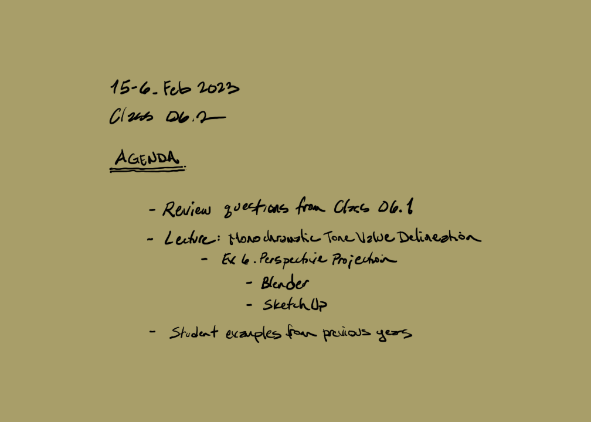
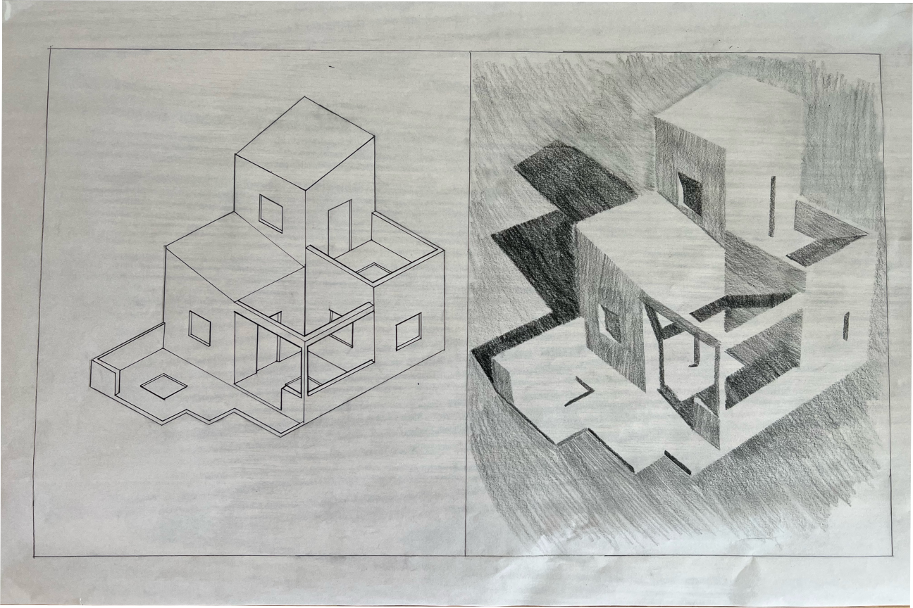
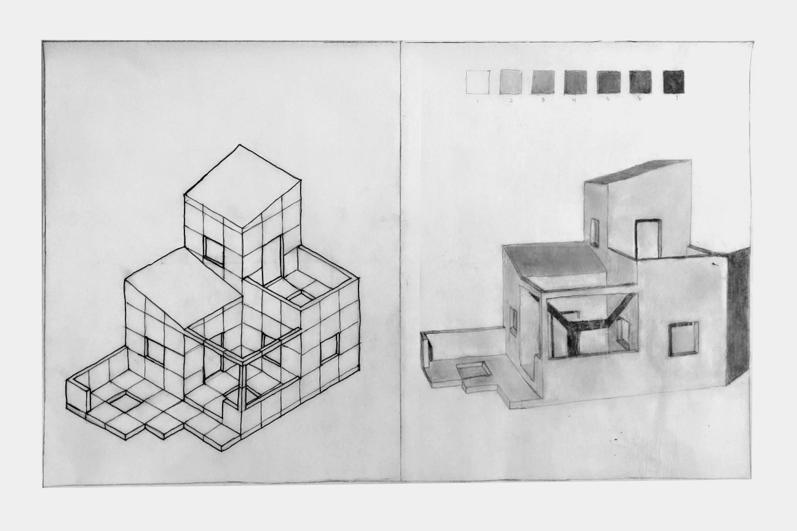
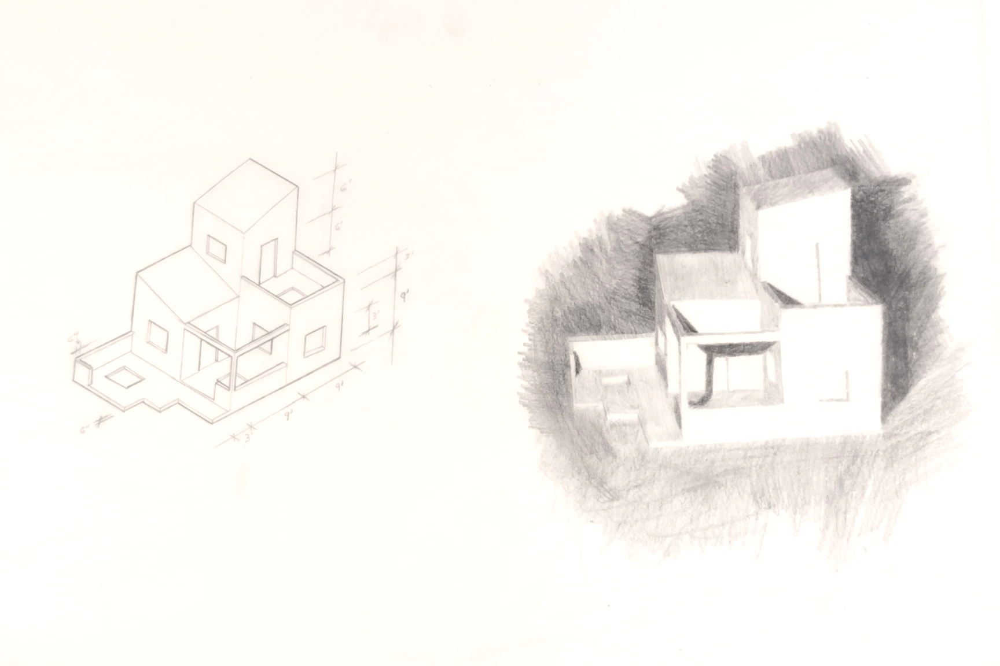

## Exercise Six. Perspective Projection and Tone Value Render of a Small Guest House

### Introduction

A "perspective" is a non-orthographic three-dimensional drawing, and the
view often resembles what we observe and can photograph. The perspective
view we are going to draw uses an electronic model method, which can be
contrasted to a mathematical analog method we will learn later. In a
perspective, parallel lines converge to vanishing points. These drawings
are useful throughout all phases of the visualization process of design
and are easily constructed using varying methods.

Figure 4.4: Exercise Six. Perspective Projection and Tone Value Render
of a Small Guest House

### Learning

This assignment module contributes to the following design learning
outcomes, which finish the sentence "As a successful student in this
course, I am now able..."

-   ... to analyze a field sketch of a built environment condition and
    synthesize that information by modeling the conditions in a
    three-dimensional visioning program.

-   ... to transform parameters within an electronic computer model and
    simulate the influence of highlight, shade, and shadow.

-   ... to visualize the built environment in a tone-value rendering
    using dry media techniques.

As mentioned in Exercise Five Axonometric Projection Contour Model of a
Small Guest House, electronic modeling is an attractive and fun drawing
to make. It may take a significant amount of time to model every screw.
Thankfully, we only need to model the major forms of our guest house.

> Modeling with exact dimensions...is the best method.... You need to
> determine the level of detail that should be included in your
> models.... Excessive detail is usually unnecessary, and it will slow
> you down. (Brightman 2013, 332--33)

A tone-value rendering maps shapes to at least three types: highlights,
shades, and shadows. Since tone-value is an important visual cue that
allows us to understand the representation of a three-dimensional object
on a two-dimensional surface, then it is a valuable image to describe
the form of an object. The relationships between light and dark are well
understood by the viewer because one encounters the interplay of light
and dark shapes on objects due to the influence of a light source, such
as the sun. This illusion works well unless the tone-values are
ambiguously mapped and show too little clear distinctions between the
implied planes. Therefore, when translating from observed
three-dimensional phenomena onto a two-dimensional surface, artists and
illustrators can confidently convey the shared experience we have moving
around in space and interacting with visual objects.

> The value key or tonality...is the first impression received and
> immediately engenders an emotional reaction irrespective of the
> subject matter or composition. It must be remembered that we react to
> light in a very primitive manner...the intensity of light reflected to
> the eye determines the primary emotional response. White, gray, or
> black surfaces reflect varying amounts of light, each creating a
> distinctly different mood in the observer. (Graves 1941, 129)

### Materials

-   Colored pencil (i.e., black.)

-   Trimble SketchUp

-   12x18 (305mm x 457mm) sheet

### Steps

1.  Begin by creating a simple model in SketchUp.

2.  Construct the model from the sketch provided and position the final
    point of view looking at the same corner as the sketch.

3.  Setup the shadow positions within the model to provide the most
    aesthetically pleasing interplay of sun-shade-shadow composition.

4.  After completing the model, print to letter-sized paper at a size
    roughly equivalent to your other drawing.

5.  Lay the 12"x18" (305mm x 457mm) vellum sheet over the printed model
    and render with a black colored pencil, using a tone-value method
    (i.e., no line work allowed!)

### Criteria

  DLO               Advanced (4 pts)                                                                                                                                                                                                                                  Proficient (3 pts)                                                                                                                                                           Developing (2 pts)                                                                                                                                                         Beginner (1 pt)                                                                                                                               
  ----------------- ------------------------------------------------------------------------------------------------------------------------------------------------------------------------------------------------------------------------------------------------- ---------------------------------------------------------------------------------------------------------------------------------------------------------------------------- -------------------------------------------------------------------------------------------------------------------------------------------------------------------------- --------------------------------------------------------------------------------------------------------------------------------------------- --
  Craft             Illustrator demonstrates exemplary attention to work product and excellence.                                                                                                                                                                      Illustrator demonstrates good attention and care towards work product.                                                                                                       Illustrator completes work, but the product seems rushed to completion.                                                                                                    Illustrator demonstrates attention towards work product, but work quality is                                                                  
  Rendering         Illustrator uses tone value to represent the interplay of light on volumetric forms. Image is controlled and evokes both power and subtlety. Image is descriptive and/or symbolic and supports compositional goals.                               Illustrator\'s tone value work demonstrates several professional attributes. Rendering style does not distract the viewer and generally supports compositional objectives.   Illustrator\'s use of tone value is somewhat effective. Rendering style is consistent and competent. There are some non-contributing attributes.                           Illustrator attempts to use tone value descriptively. Rendering is inconsistent and lacks attention to craft.                                 
  Technical         Modeler observes and analyzes object data and translates it to a meaningful electronic model representation. Professional conventions are followed, inclusive of view selection, accurate translation of field notes and light source selection   Modeler observes and analyzes object data and translates it to a meaningful electronic model. Most professional conventions are followed, and some information is missing.   Modeler is challenged to observe and analyze field sketch correctly in the electronic model. Few professional conventions are followed, and some information is missing.   Modeler attempts to observe and analyze field sketch and representation is inconsistent. Professional drawing conventions are not followed.   
  Professionalism   Student completes the work on time. Work demonstrates exemplary attention to learning objectives.                                                                                                                                                 Student completes the work on time and demonstrates a good work ethic.                                                                                                       Student generally completes the work at a minimum level of expectation.                                                                                                    Student is missing parts of the work and makes a plan for completion of the remaining assignment.                                             

### Related Assignments

-   Sketch D. Field Sketches of Two Exterior Elevations of Large
    Buildings

-   Exercise Five. Axonometric Projection Contour Model of a Small Guest
    House

-   Exercise Seven. Interior Construction Drawing. Floor Plan and
    Interior Elevations

### Student Examples

