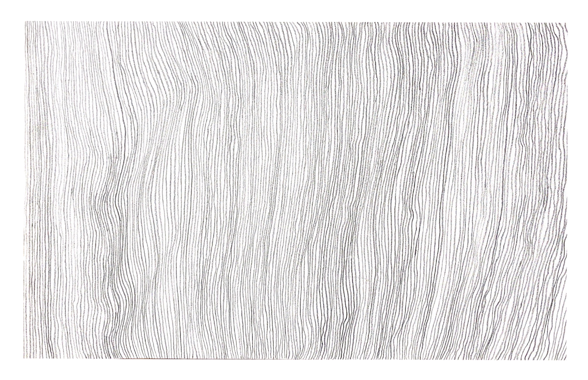
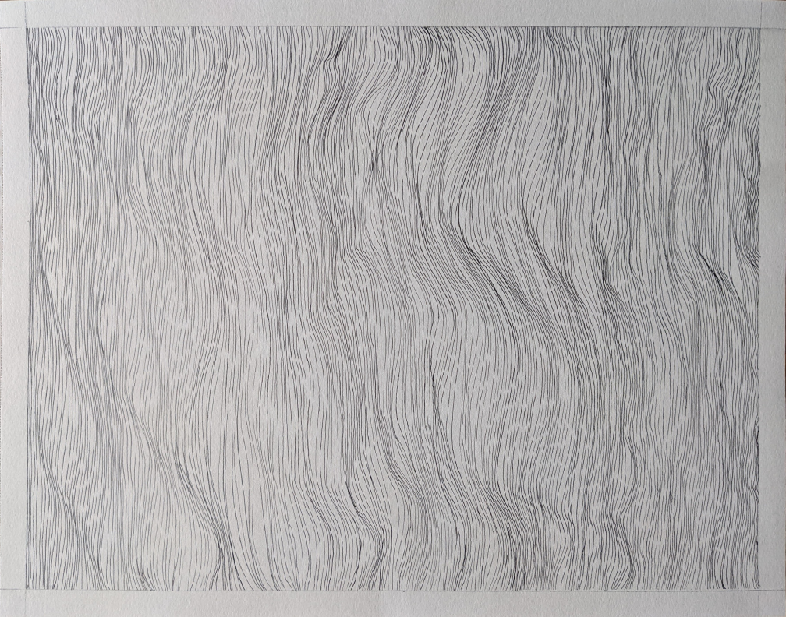
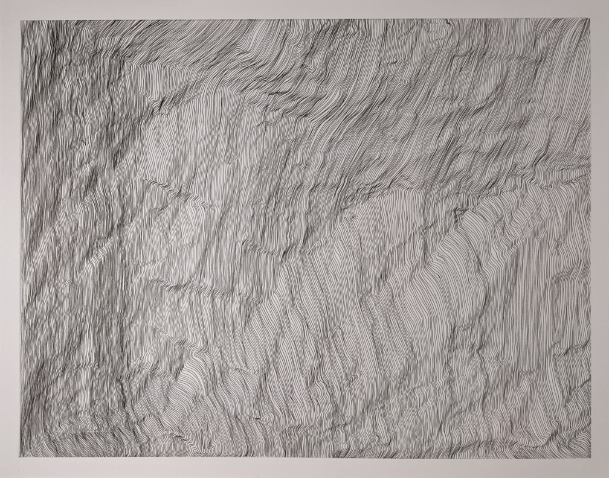

# Chapter Two: Line is the Shortest Distance

## Introduction

We learned early in our education that a line may be defined as the
shortest distance between two points. In Chapter Three we will expand
this discussion and derive something called a \*Cuboid Generalization
Analogy\*. In that discussion it is presupposed that a point has only
one meaningful attribute, its location in an x, y & z coordinate system.
A point has no dimension or mass. May we infer that a point has little
pragmatic meaning to us without its context or relationship to another
element?

On the other hand, a line has direction. Outside of the realm of pure
mathematics, it also has several useful qualities that we can propose
below in a discussion, "What is Line Quality?" Consider line as the
fundamental syllable we utter in this language called drawing.

## Volumes = Shapes: Transformations from a 3D world to a 2D page

Architectural drawing communicates a story about our shared spatial and
experiential world. The act of drawing is a snapshot that filters the
element of time and also filters the element of depth. Here is the magic
of a good drawing: it reinterprets experiential time, and space onto the
flat plane of the drawn surface not by surrendering to those reductions
in depth; rather, drawing has the potential to amplify those very
dimensions of time and space. How you ask?

The first transformation has to do with scene selection that is
evocative of our shared experiences about interacting with the built
environment. Let's lay this aside for the moment, knowing that this will
be covered in later chapters. The second transformation is obvious to
say and less obvious to represent convincingly. Three-dimensional
volumes are translated to shapes. Spheres are circles. Cubic volumes are
polygonal shapes. The principal is this: an image plane is implied
between the viewer and the viewed object(s). Lines, vertices and curves
project onto and intersect with the imaginary image plane. Drawing is
projection. The direct mechanical analogy here is a camera. The sensor
of the camera (e.g., either unexposed film or a CCD) is a physical image
plane that captures projected and reflected light.

This course in architectural illustration and design visioning is
concerned with these two transformations and challenge you to answer two
basic questions:

1.  Temporal: How do I communicate the experience and feeling of this
    built environment?

2.  Spatial: Can I invite the viewer to move around an imaginary
    three-dimensional construct?

The most common anxiety students have in this course revolves around the
fiction of inherent artistic ability. The fallacy of the natural-born
artist assumes that one cannot overcome the *head-start* that artistic
students enjoy. This view is too narrow. It underestimates both
the *time-on-task* that so-called *natural* artists have dedicated to
developing their skill in the past. It overestimates the extent to which
architectural drawing is *art*. Finally, it equates the act of
architectural illustration with artistic skill, which is also a too
narrow definition. For our purposes, may we suspend these preconceptions
for a moment and also separate the act of marking on a surface and the
deliberate recording of an image and idea? Trusting instead in your
ability to learn new things may make your success in this class more a
function of deliberate practice (within your control)
than *talent* (outside of your control).'

## Exercise One. Breathing Lines

### Introduction

Figure 2.2: Exercise One. Breathing Lines Example in Felt Tip Pen on
Bristol Board

This drawing is called breathing lines, because the simple exercise of
making marks should be no more stressful than breathing. There are just
two rules for this assignment. The first rule is that no line shall
cross another line. The second rule is that a line shall be consistent
in all respects. For example, each line shall have a consistent width.
Also, each line shall be consistent and unbroken from the top of the
page to the bottom of the page. The process for making this drawing
involves making a 1/2-inch border inside an 11\" x 14\" piece of paper.
Adhesive tape shall be placed along the top margin and along the bottom
margin. While doing the drawing it is helpful to breathe out
continuously and quietly as in the film that we saw with John
Franzen (Franzen 2015)

### Learning

This assignment module contributes to the following design learning
outcomes, which finish the sentence "As a successful student in this
course, I am now able..."

-   ... to control line weight and consistency (e.g., width, continuity
    and control)

-   ... to abstract a simple line exercise that evokes a complex
    topography.

### Scenario

Our sole focus in this assignment is to make the most consistent marks
on a page that we can. Working slowly and with purpose and care, we
allow the pen or pencil to glide from the top of the page margin to the
bottom in one continuous motion. We are free flowing in our mind and
body. The challenging part of drawing is not mark making; rather, it is
effective *seeing*.

It may surprise you that a contemporary understanding of the
phrase *Fine Art* has less to do with a quality of *Fineness*. It has
more to do with the finality of its purpose. Most definitions of fine
art have suggested the term derived from the French, *Beaux Arts*,
concerned with aesthetic beauty and implied agreeableness. Yet we know
that much important fine art of the last 75 years and more is neither
aesthetic nor beautiful, nor agreeable! Would you permit this author a
conceit of a complementary French translation of *Fin Arts*, or art that
is an end in and of itself? For guidance we can refer to scholarship
about the philosopher Immanuel Kant.

Works of fine art, Kant is saying, like products of "agreeable art"
(angenehme Kunst), are objects designed with a view to producing a
phenomenological and physiological effect in the spectator, namely the
sensation of pleasure. But unlike "agreeable art," a work of fine art is
produced in addition with a view to engendering a certain kind of
reflective activity in spectators ("the end of the art is that the
pleasure should accompany the representations ... considered as *modes
of cognition*") ... "advancing the culture of the mental powers in the
interests of social communication." (Haskins 1989, 44)

While beautiful architectural illustrations are compelling and may seem
unattainable at your current place in your studies, freeing yourself
from the yoke of misunderstanding about artistic limitations and about
the role of illustration in our profession will help relieve you of the
burden of anxiety surrounding our work in the studio. After you complete
this project, I hope you will agree with the simple proposition that you
can *draw* effectively, inasmuch as you can make *beautiful* marks on a
page. Then we can proceed with the challenge of helping you
to *see* more deliberately and to *translate* your vision effectively to
the page.

At times, you may be compelled to think of this as an *art* class. We
will discuss in later projects an alternative view of this studio
course. Architectural illustration borrows from artistic skills, from
graphic design, from psychology and sociology, as well as from computer
arts. We will engage theories of perception, of color and of persuasion.
For the present, let us accept the proposition that this is **NOT** an
art class. There, does your technically inclined brain feel more
comfortable? Good. Now let's learn some things together and find your
vision.

### Materials

-   Pencil or felt-tip pen (0.25 or 0.35mm)

-   11\" x 14\" (279x356mm) sheet

-   drafting tape

### Steps

1.  Select a good quality paper. For this assignment you may want to use
    something like Strathmore 300 Bristol with a Vellum Surface (270
    gsm.) As this is a heavier paper, you may find it is more
    comfortable to leave this not taped to your board.

2.  With a light pencil line measure a one-half inch (12mm) border
    around the sheet on all sides. Align and place drafting tape along
    the longer axis at the top of the page and at the bottom of the
    page.

3.  Selecting the thinnest pen that you are comfortable using place the
    pen nib down within the tape border area and draw the first line on
    the left border margin if you are right-handed and on the right
    border margin if you are left-handed. Draw on top of the pencil
    border line you have made. At the end of your first stroke continue
    beyond the margin of the tape and only lift your pen within the tape
    border margin. This minimizes the "wicking" effect of the pen on the
    paper and results in a precise and implied border.

4.  Continuing across the page make your next freehand line about 0.25mm
    or less away from the first line...as close as you dare without
    touching the previous line. Continue this process and welcome the
    small variations that begin to oscillate through your process.

5.  Take periodic breaks to keep your mind and eye fresh and attend to
    the consistency of the ink pen which may dry up over time.
    Introducing a new pen to finish the drawing next to "dry" lines
    could be too abrupt.

### Video

[JOHN FRANZEN EACH LINE ONE
BREATH](https://youtube.com/watch?v=MAexKq1qw6w)

Figure 2.2.1: Video Still. How to Draw the Breathing Lines Assignment

### Tips

-   It may be helpful to keep your drawing clean with the use of a scrap
    of tracing paper naturally adhered by the oils on the side of your
    palm.

-   This can also ease the uncomfortable feeling of friction that you
    may experience between your palm and the paper over time.

-   The most pleasing effect combines a combination of very closely
    spaced thin lines and an oscillation effect that suggests
    topographic maps of steep mountains.

### Criteria

  DLO               Advanced (4 pts)                                                                                                                                                                        Proficient (3 pts)                                                                                                                                                     Developing (2 pts)                                                                                                                           Beginner (1 pt)
  ----------------- --------------------------------------------------------------------------------------------------------------------------------------------------------------------------------------- ---------------------------------------------------------------------------------------------------------------------------------------------------------------------- -------------------------------------------------------------------------------------------------------------------------------------------- ---------------------------------------------------------------------------------------------------------
  Craft             Illustrator demonstrates exemplary attention to work product and excellence.                                                                                                            Illustrator demonstrates good attention and care towards work product.                                                                                                 Illustrator completes work, but the product seems rushed to completion.                                                                      Illustrator demonstrates attention towards work product, but work quality is
  Rendering         Illustrator uses line to hold the viewer\'s attention. Image is controlled and evokes both power and subtlety. Image is descriptive and/or symbolic and supports compositional goals.   Illustrator\'s line work demonstrates several professional attributes. Rendering style does not distract the viewer and generally supports compositional objectives.   Illustrator\'s use of line is somewhat effective. Rendering style is consistent and competent. There are some non-contributing attributes.   Illustrator attempts to use line descriptively. Rendering is inconsistent and lacks attention to craft.
  Professionalism   Student completes the work on time. Work demonstrates exemplary attention to learning objectives.                                                                                       Student completes the work on time and demonstrates a good work ethic.                                                                                                 Student generally completes the work at a minimum level of expectation.                                                                      Student is missing parts of the work and makes a plan for completion of the remaining assignment.

### Related Assignment

-   Exercise Two. One Hundred Lines

## Student Examples

