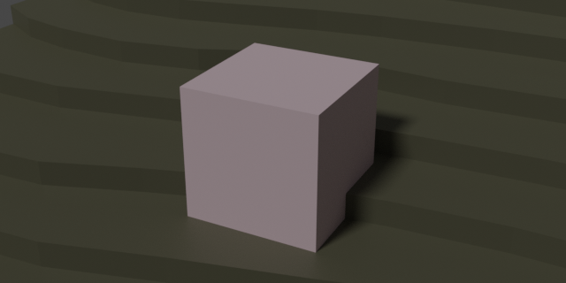

[Today\'s Agenda](220914-5_agenda.html)

Readings from (Inglert, 17-20)

## Exercise Fifteen. Electronic Site Contour Model and Three Proposed Places

Figure 1.3.4: Exercise Fifteen. Electronic Site Contour Model and Three
Proposed Places

### Introduction

This is the first of several component parts in the design and
representation of a workspace in a wooded setting. Below you can find a
\"Program Brief.\" The exercise begins with you drawing an electronic
model of the site plan at the right. Once this site has been
modeled, print a view as evidence of your learning and as a medium to
sketch your site location ideas. Import several trees, and other
entourage. You will find it useful to also model a 10 ft. cube (3m) as a
proxy object on the site situated where you believe a good location for
the workspace should be.

Experiment with at least three locations. Please refrain from modeling
your project. Rather, sketch a perspective view of a proposed workspace
located on the site by using the tracing method that we explored in
volume one (i.e., Exercise Ten. Contour Line Drawing of Eye-level
Perspective.) Only represent a form with a shed roof and refrain from
drawing windows, door openings, materials, or any other detail. Repeat
this step two more times. In all, you should propose three separate
formal ideas. Select one form from the three ideas and develop it into a
rendered design drawing. Provide a color study like the example above in
Figure 1.3.4: Exercise Fifteen. Electronic Site Contour Model and Three
Proposed Places.

### Scenario

Our project has a program description. You can modify some of the
specifics based on themes you would like to explore:

#### Program brief statement: My Drafting Room: A Workshop for Drawing

*Since the three friends \"moonlight\" as illustrators and model
builders, then a studio where they can meet clients, pinup work for
internal review and maintain a connection to the natural environment may
provide an ideal outlet to exercise creativity in a rejuvenating
setting.*

*While the lakeside site is a challenging, wooded and steeply sloping
grade, the moderate climate displays a full spectrum of seasonal
changes. The rationally cubic and vernacular form of the building sets
an appropriate feel to the rustic setting.*

*Since the entrepreneurs have secured startup funding that includes
their vision of a workshop in the woods, then the architectural budget
shall be closely managed in order that initial, operating and life cycle
costs are carefully controlled for sustainability of the enterprise.*

*Because the undisturbed site was selected for its experiential beauty,
a minimal access drive and a mechanical package concrete pad exist;
therefore, the formal studio envisions a one-time
\"construction-disturbance\" period. The interior may be adapted in the
future to accommodate changing workflow, and the professional staff
shall remain few.*

\<Insert Figure 1.3.5_sitePlanSketch\>

Figure 1.3.5: Site Plan Sketch

In *Exercise Fourteen. Physical Paper Model of Formal Precedent* you
studied three-dimensional representation using a physical material,
paper. In this assignment you will build an electronic model. You will
continue to build more and more detail into this model through the rest
of the semester. The model will serve as a framework and scaffolding for
your design work. One caveat we should consider about electronic models
is that each revision can take a considerable amount of time to make. If
we construct our models from the very beginning with several best
practice ideas in mind, then it is beneficial to our working efficiency.
An electronic model can be both a great leveraging tool (i.e., reward)
for your productivity and an enormous time sink (i.e., risk) that takes
valuable resources away from your prime directive, to design a spatial
intervention that \"improves\" the existing condition for the various
\"clients\" you serve (e.g., owner, user, visitor, nature, society,
etc.) One hedge against this kind of risk to your productivity and flow
of design ideas is the use of a hybrid digital-analog process.

### Learning

This assignment module contributes to the following design learning
outcomes, which finish the sentence "As a successful student in this
course, I am now able..."

-   "... make a complex electronic model of an architectural system,
    apply materials, textures, and lighting sources, and output a
    photorealistic rendering of the scene."

### Materials

-   Electronic Modeling Program (e.g., SketchUp and Blender)

-   Site Plan Sketch

-   Tracing paper

-   Colored pencils and felt-tip markers

### Steps

1.  Download the provided sketch of the site plan.

2.  In SketchUp or Blender, import the file of type \"jpeg.\" Move the
    jpeg to a layer of its own (i.e., image.) Blender does not use the
    layer concept. It is useful to use *Collection* in the same way to
    organize your file.

3.  Size the image using the graphic scale, as demonstrated in studio.

4.  Using the Freehand command in SketchUp (Grease Pencil in Blender,)
    build up a \"layer cake\" of topographic lines, placing each on its
    own layer (e.g., 00, 02, 04, \..., 36.)

5.  \"Push-pull\" the \"topos\" to the correct height. Choosing three
    different locations on the site, place one 10\' cube, move it around
    to the three locations and save each view.

6.  Print each of the three views for your use in the next step.

7.  Using a tracing paper overlay method, sketch each perspective view.

### Tips

1.  The exercise is designed to focus decision making. Several
    simplifications have been described (e.g., proxy cube, three
    locations, etc.) These moves can be more complex and involve several
    more iterations in a professional office. That may be a good choice
    for you to repeat several iterations.

2.  In Exercise Sixteen you are provided with a design for the
    mechanical package concrete pad that has been standardized to a
    given geometry. This may not conform to your design. As you develop
    more electronic modeling skills, you are easily able to modify the
    pad so that it logically supports your design.

### Criteria

  ----------------- -------------------------------------------------------------------------------------------------------------------------------------------------------------------------------------------------------------------- -------------------------------------------------------------------------------------------------------------------------------------------------------------------------------------- ----------------------------------------------------------------------------------------------------------------------------------------------------- ------------------------------------------------------------------------------------------------------------------------------------------------ --
  DLO               Advanced (4 pts)                                                                                                                                                                                                     Proficient (3 pts)                                                                                                                                                                     Developing (2 pts)                                                                                                                                    Beginner (1 pt)                                                                                                                                  
  Craft             Illustrator demonstrates exemplary attention to work product and excellence.                                                                                                                                         Illustrator demonstrates good attention and care towards work product.                                                                                                                 Illustrator completes work, but the product seems rushed to completion.                                                                               Illustrator demonstrates attention towards work product, but work quality is                                                                     
  Rendering         Illustrator uses line to hold the viewer\'s attention. Image is controlled and evokes both power and subtlety. Image is descriptive and/or symbolic and supports compositional goals.                                Illustrator\'s line work demonstrates several professional attributes. Rendering style does not distract the viewer and generally supports compositional objectives.                   Illustrator\'s use of line is somewhat effective. Rendering style is consistent and competent. There are some non-contributing attributes.            Illustrator attempts to use line descriptively. Rendering is inconsistent and lacks attention to craft.                                          
  Technical         Illustrator observes and analyzes object data and translates it to a meaningful graphic representation. Professional conventions are followed, inclusive of line weight, orthographic and dimensional information.   Illustrator observes and analyzes object data and translates it to a meaningful graphic representation. Most professional conventions are followed, and some information is missing.   Illustrator is challenged to observe and analyze object data correctly. Few professional conventions are followed, and some information is missing.   Illustrator attempts to observe and analyze object data and representation is inconsistent. Professional drawing conventions are not followed.   
  Professionalism   Student completes the work on time. Work demonstrates exemplary attention to learning objectives.                                                                                                                    Student completes the work on time and demonstrates a good work ethic.                                                                                                                 Student generally completes the work at a minimum level of expectation.                                                                               Student is missing parts of the work and makes a plan for completion of the remaining assignment.                                                
  ----------------- -------------------------------------------------------------------------------------------------------------------------------------------------------------------------------------------------------------------- -------------------------------------------------------------------------------------------------------------------------------------------------------------------------------------- ----------------------------------------------------------------------------------------------------------------------------------------------------- ------------------------------------------------------------------------------------------------------------------------------------------------ --

### Related Assignments

-   Sketch J. Watercolor Storyboard of Twelve Site Context Vignettes

-   Exercise Fourteen. Physical Paper Model of Formal Precedent

-   Exercise Sixteen. An Aerial Flyover Animation of Your Selected Place

<!-- save for later

## Student Examples

-->
