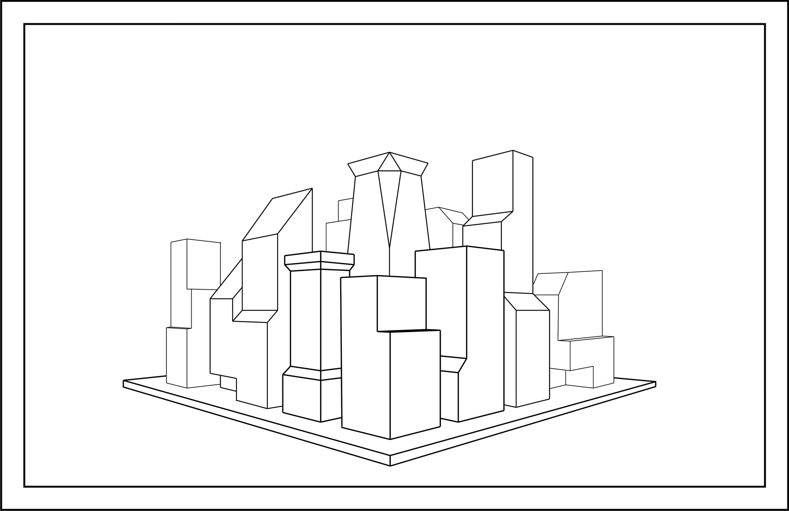

[Inkscape Border Setup Drawing](images/250121.021.png)

<iframe height="240" width="320" allowfullscreen frameborder=0 src="https://echo360.org/media/03d01614-f914-48d2-85d4-13ca6b6fab36/public?autoplay=false&automute=false"></iframe>

5 Tricks to Make Your Drawings Look 3D

<!-- comment for Class 02-2

<iframe height="240" width="320" allowfullscreen frameborder=0 src="https://echo360.org/media/85718dd6-98ea-4ef9-be06-d60e576ff833/public?autoplay=false&automute=false"></iframe>

end comment -->
