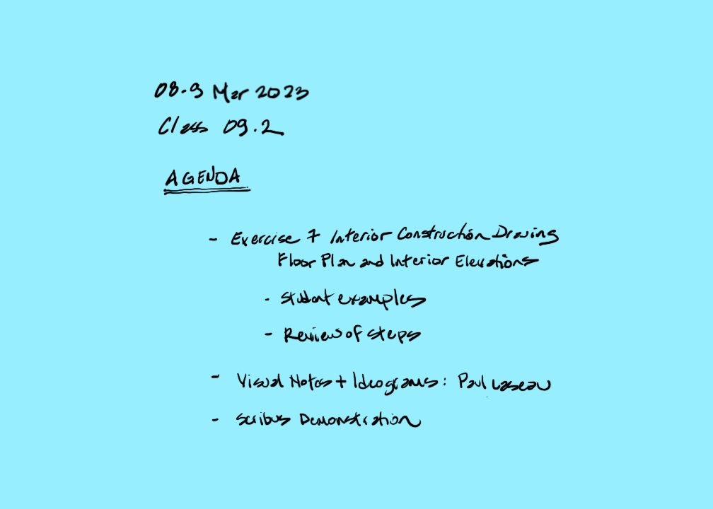
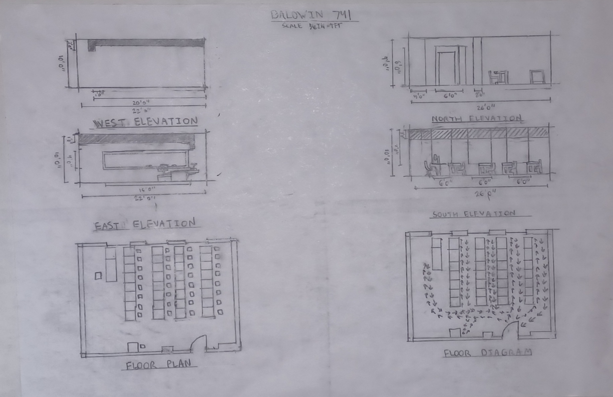
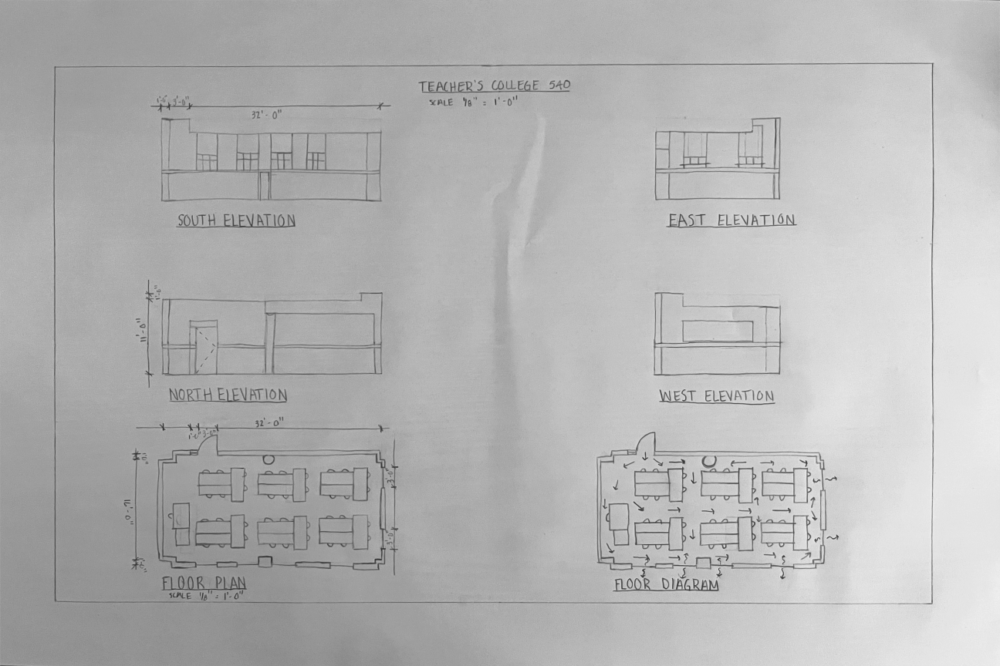
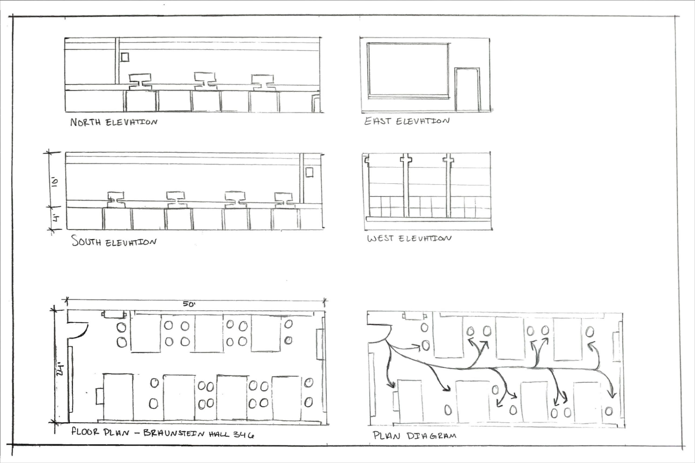
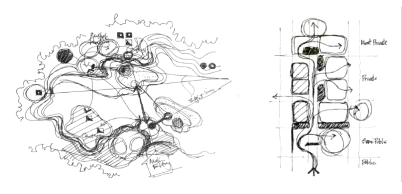
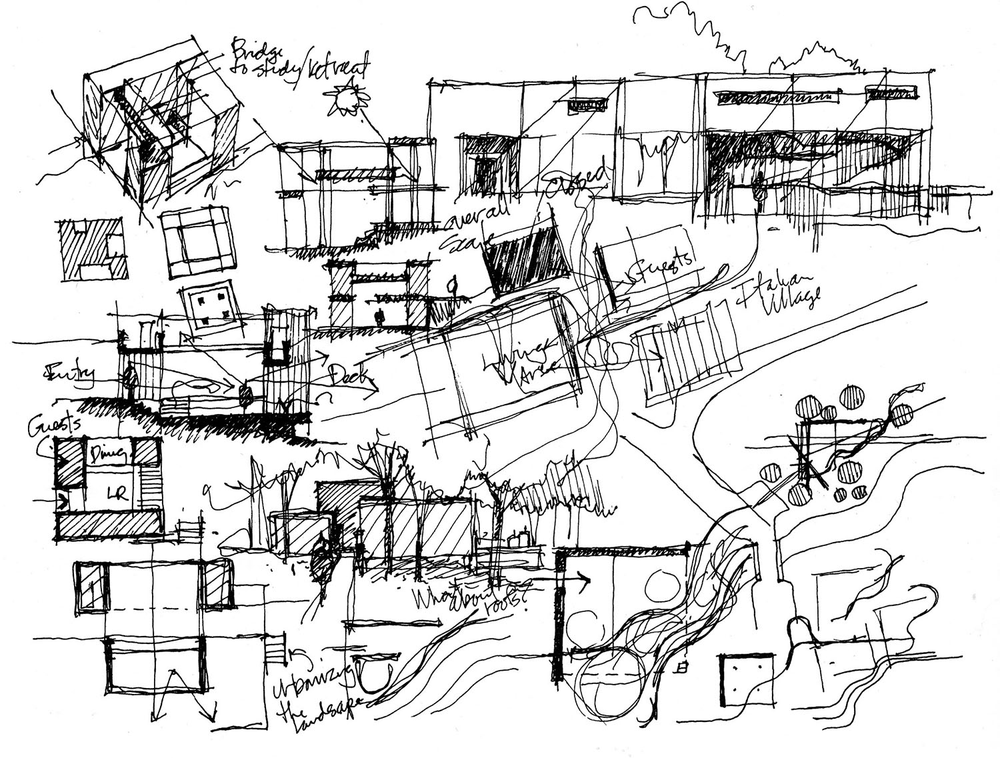
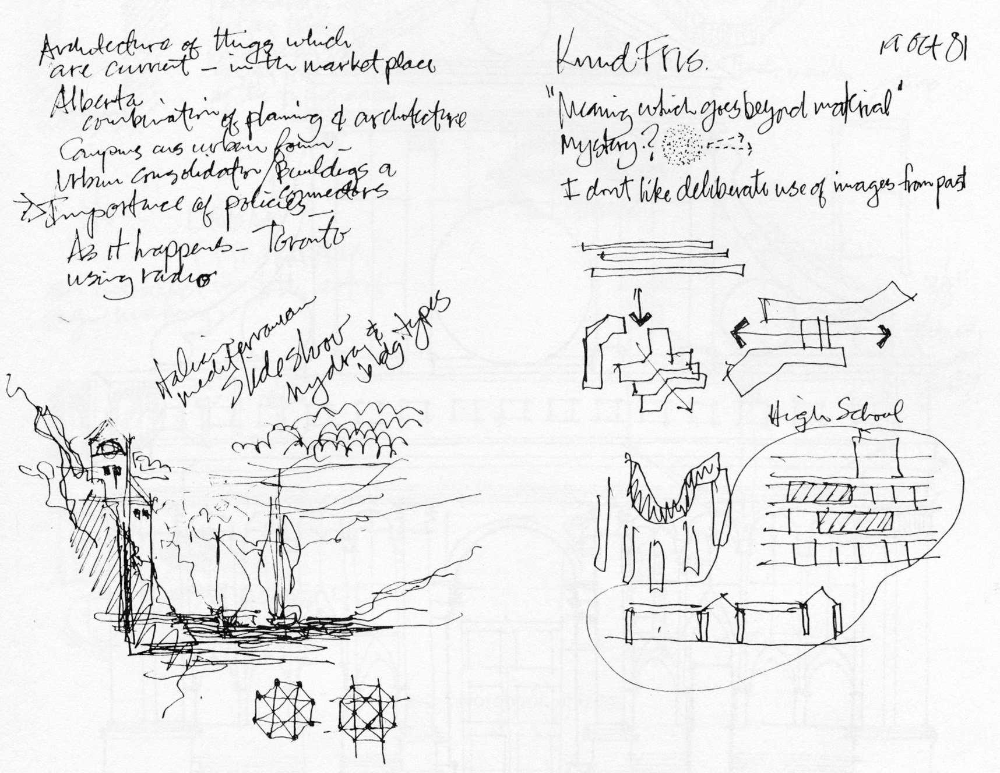

### Exercise Seven. Interior Construction Drawing. Floor Plan and Interior Elevations

Figure 5.2.2: Exercise Seven. Interior Construction Drawing. Floor Plan
and Interior Elevations

#### Materials

-   Pencil

-   Architect's scale

-   Grid paper and triangles

-   Arch B, 12\" x 18\" (A3, 297mm x 420mm) sheet

#### Steps

1.  Plan for a vellum drafting sheet size of Arch C which is 12"x18" (A3, 297mm x 420mm). The drawing scale is 1/8"=1'-0" or 1:96 (1:100 in SI units.)

2.  Acquire a grid underlay guide of four cells per inch. Be aware that some engineering grids use five cells per inch, and this is less helpful. The Imperial system of measurement is based on multiples of 4, and the metric system (SI units) are based on multiples of 10.  Therefore, if working in SI units find millimeter grid paper.

3.  Draw a 0.9mm border line located one inch (25mm) from each edge.  This yields a drawing area that is 10" x 16" (i.e., for A3 it is 247mm x 370mm) available for each of six images. Alignment of these images is important for an organized and professional composition.  Observe that most rooms are wider in one direction than the other; and since there is a requirement for two floor plan type drawings the wider dimension most likely runs along the x-axis. Therefore, most compositions favor a three row and two column organization.  Divide the available drawing area, such that each cell has a column width of 8" (185mm) and a row height of 3.33" (99mm.)

4.  A good rule of thumb for many of the drawings that we do is to proceed from the general to the specific. The most general geometric description for our plans, elevations and sections is a bounding rectangle (i.e., what are the outer limits in terms of width and height of the object we are drawing.) Begin by locating each bounding box. Refer to Figure 5.2.2 for information about allowing room for dimensioning and titles.

5.  As you add detail for each drawing think of this entire process in three steps or phases: first, mapping phase, layout sheet for all drawings and block in individual cell layouts; second, construction phase, build appropriate detail of each drawing; third, render phase, add linework for clarification as well as dimensions and notes and captions.

#### Tips

1.  Refer to Figure 5.2.2: Exercise Seven. Interior Construction Drawing. Floor Plan and Interior Elevations for a good example of
    how to organize and coordinate plans and interior elevations.

2.  Laseau (Laseau (1989), 164-9) illustrates what he calls *ideagrams*.

3.  Since this assignment is a "sketch" drawing instead of a "drafted" work, then you may benefit from using a tracing grid and guide. The scale of each cell grid at 1/8"=1'-0" would be 2 feet per cell. If using metric units, then you may use millimeter grid paper, and the 1:100 scale would be one meter per cell.

4.  If using an alternate method of creating a template sheet in a vector drawing program like Inkscape, print the output from the vector program as a PDF. When using Acrobat Reader's "poster" feature, it is critical that you print to a scale of 100% (i.e., NOT, "to fit.")

#### Related Assignments

-   Exercise Four. Hand Drafting an Orthographic Multi-view Projection
    of Complex Chair

-   Sketch C. Field Sketches of Floor Plans of Five Large Rooms

-   Sketch E. Field Sketches of Two Interior Elevations of Large Rooms

### Student Examples

### Visual Notes and Ideograms: Paul Laseau

