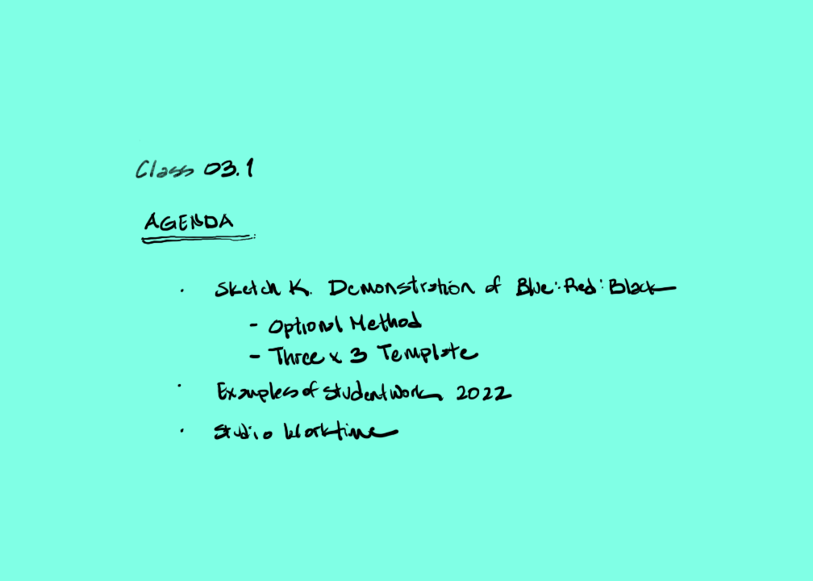
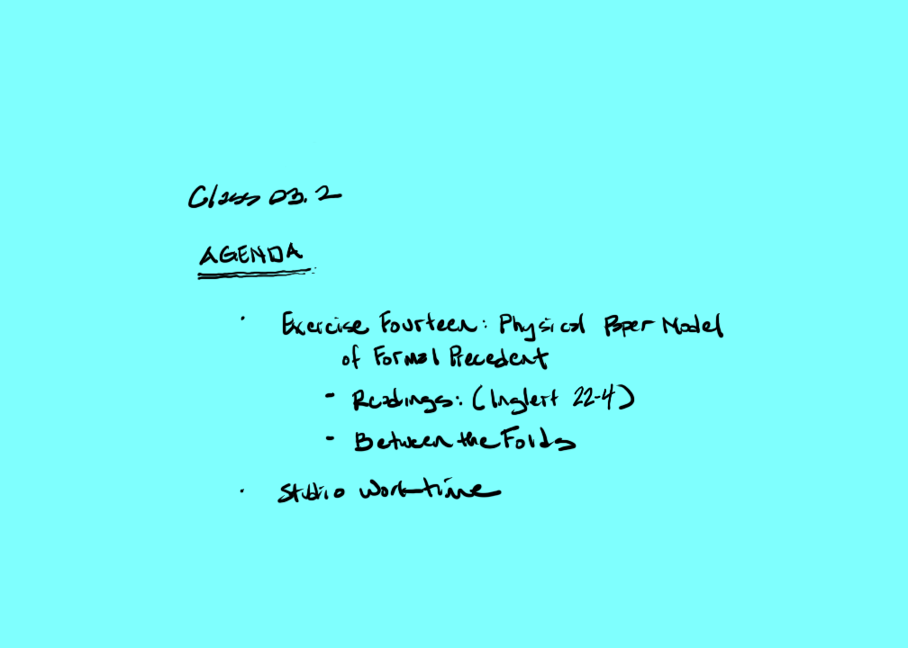
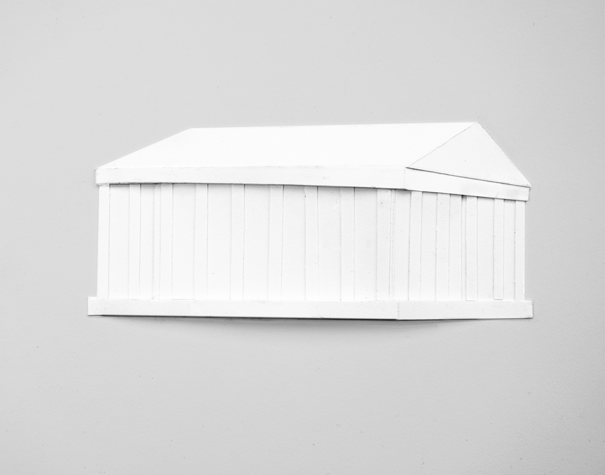

[Current Draft of Syllabus](syllabusDraft.html)

[AE1013](ae1013/)

<iframe height="240" width="320" allowfullscreen frameborder=0 src="https://echo360.org/public/media/dc0725d9-2b70-4a36-9c8a-289a3c722ac9?autoplay=false&automute=false"></iframe>

<iframe height="240" width="320" allowfullscreen frameborder=0 src="https://echo360.org/media/727902b2-1d0e-4749-8176-7174913fd3ba/public?autoplay=false&automute=false"></iframe>

<iframe height="240" width="320" allowfullscreen frameborder=0 src="https://echo360.org/media/10580e30-2938-4fa0-bff0-0375ea5ba990/public?autoplay=false&automute=false"></iframe>

[Sketch K Examples in zip file](images/sketchK.zip)

[Exercise Fourteen. Physical Paper Model of Formal Precedent Examples in zip file](images/Ex14_Physical_Paper_Model.zip)
