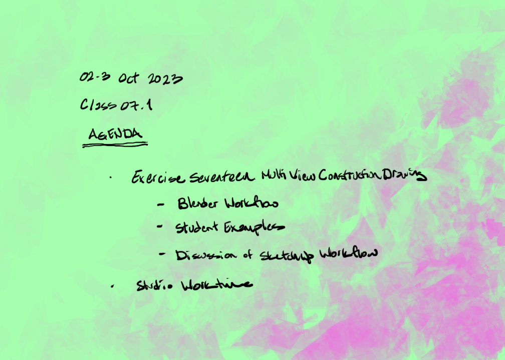
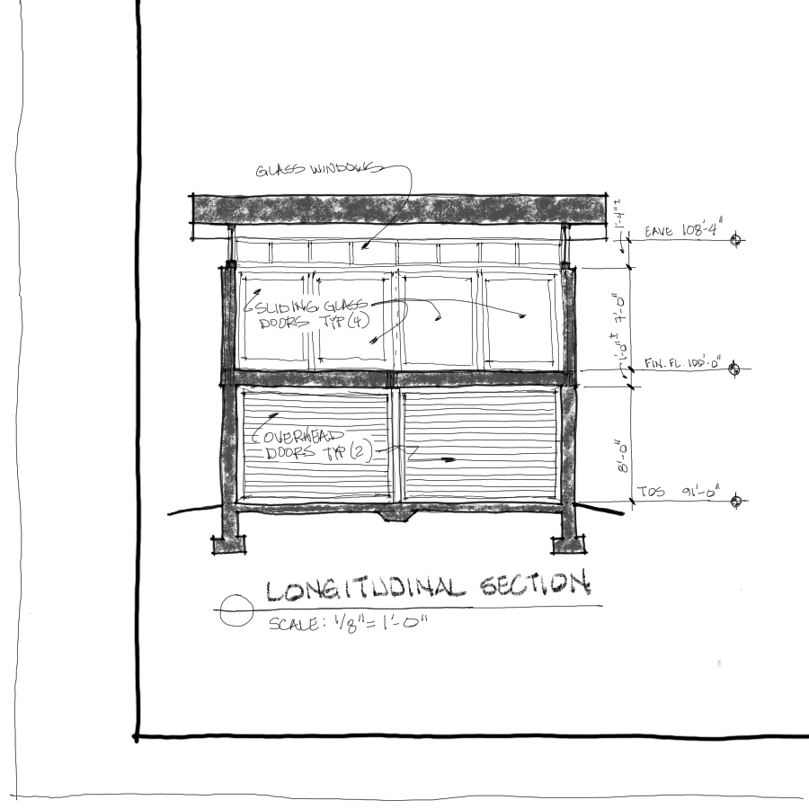
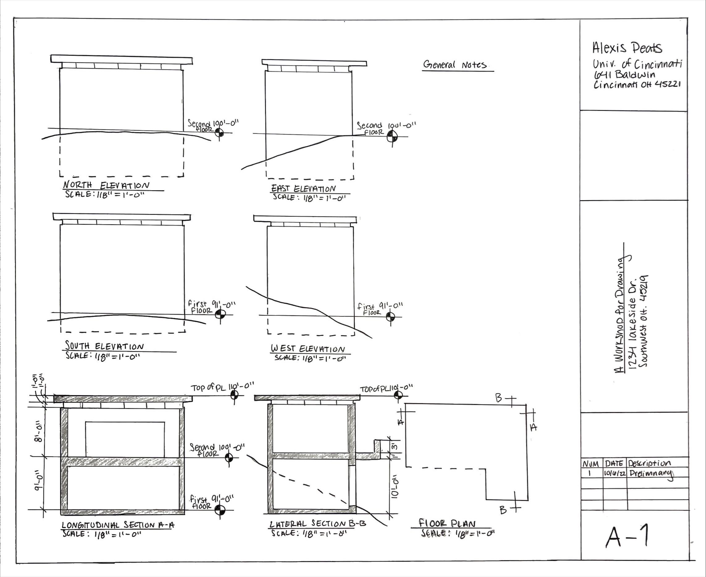

## Exercise Seventeen. Multi-view Construction Drawing

Figure Exercise Seventeen. Multi-view Construction Drawing

### Introduction

Up to this point in the project, you have been designing in three-dimensional views whether on sketching paper or in the model. This assignment will focus on refining several design elements. The design refinements shall be represented in seven orthogonal views each drawn at 1/8"=1'-0" (i.e. 1:96.) Provide one plan section, which is cut approximately 3'-4" (1m) above the finish floor grade. Provide four elevations. Provide one longitudinal section (i.e. cut along the north-south axis.) Provide one lateral section (i.e. cut along the east-west axis.) Consider that these drawings must be presentation quality and shall be shown to a client. Compose all drawings together on a single sheet as demonstrated during class.

### Learning

This assignment module contributes to the following design learning outcomes, which finish the sentence "As a successful student in this course, I am now able..."

> ... to analyze the built environment and apply measured drawing skills that include plans and elevations, illustrating line quality, drawing notation and dimensioning.

### Scenario

The most ubiquitous idea about what architects and engineers *do* is that we draw *plans*. While this is not all we do, it is definitely an important service that we provide. Therefore you are encouraged to prioritize this skill set and learn to appreciate how important the process of making construction drawings is to everyone involved in making the built environment. A multi-view construction drawing is the preferred representation for documenting existing conditions and design intentions for new architecture. We have discussed the several advantages that include showing proportional relationships between elements, recording accurate measurements and standardizing a language for communicating ideas between designers and constructors. Trained professionals and skilled constructors share an expertise in visualizing how the design gets assembled together by making sense of multi-view drawings.

Students in architecture and engineering schools everywhere learn a consistent approach to making multi-view drawings. Trade apprentices learn how to interpret these construction drawings and realize the design ideas in built form. Learning how to design and construct architecture and the built environment depends on this shared understanding. Consistency and efficiency are the primary qualitative objectives of multiview drawings and the shared reasons for dedicating so much time and effort to learning about construction drawings.

Therefore you can be assured that your arduous practice in making combined with a focused attention to detail, consistency and excellence will serve you well in your profession. There are several limitations to using multi-view drawings with our clients. It is useful to remember that your own appreciation of construction drawing was learned over several exercises in class and experiences in the office. Our clients as a rule are not expert at reading multi-view drawings. In this way it is helpful to remember the distinct purposes of a design drawing versus a documentation drawing. We share our ideas about the envisioned experiences with our clients with evocative and sometimes emotionally exciting design drawings. We document our design intentions with precision and clarity to constructors to make those ideas *concrete* in reality.

### Materials

* Mechanical Pencils (0.25mm), (0.5mm) and (0.7mm)
* Architect's scale
* 12x18 sheet
* 1:12 Grid Paper
* Field Sketches

### Steps

1. In a 3D graphics modeling software (e.g., Blender, SketchUp, etc.) use a section plane tool to setup the three sections. Remember to move the section planes after placing them (i.e., two separate commands.) Add "scene" views for convenience.
1. Export the view to a file - (i.e., "Export - 2D Graphic - PDF file." Set options, so that image scale is 1" in image and 96" in model (i.e., 1/8"=1'-0".)
1. Assemble all individual PDF files (i.e., seven orthogonal views) onto an 18" x 24" blank page in a desktop publishing program (i.e., Scribus,) using the Insert Image Frame - Get Image commands. Size the image frames (i.e., crop) and align to a grid.
1. In Adobe Acrobat Reader DC, print using the poster option. Verify tile size = 100%. This may yield six separate sheets.
1. Arrange individual sheets on drafting desk and tape together being careful to align precisely. Lay vellum over the top and block out all drawing and title block lines in pencil.
1. Draw each drawing to the current level of design. Carefully letter the drawing number in the title block as well as your name. Include the following data on its own submission line: "1.  (today's date) Preliminary Drawing Submittal".
1. Photograph or scan this work for upload to the content management system (i.e., 1728 px X 1296 px. @ 72 dpi.) Save as a png file before uploading with the following naming convention: "Ex17_LastnameF.png."

### Tips

Up to this point in the project, you have been designing in three-dimensional views whether on sketching paper or in the model. This exercise will focus on refining several design elements. The design refinements shall be represented in seven orthogonal views each drawn at 1/8"=1'-0" (i.e., 1:96.) Provide one plan section, which is cut approximately 3'-4" (one meter) above the first floor grade. Provide four elevations. Provide one longitudinal section (i.e., cut along the north-south axis.) Provide one lateral section (i.e., cut along the east-west axis.) Consider that these drawings must be presentation quality and shall be shown to a client. Compose all drawings together on a single sheet as demonstrated during studio.

### Criteria

  ----------------- -------------------------------------------------------------------------------------------------------------------------------------------------------------------------------------------------------------------- -------------------------------------------------------------------------------------------------------------------------------------------------------------------------------------- ----------------------------------------------------------------------------------------------------------------------------------------------------- ------------------------------------------------------------------------------------------------------------------------------------------------ --
  DLO               Advanced (4 pts)                                                                                                                                                                                                     Proficient (3 pts)                                                                                                                                                                     Developing (2 pts)                                                                                                                                    Beginner (1 pt)                                                                                                                                  
  Craft             Illustrator demonstrates exemplary attention to work product and excellence.                                                                                                                                         Illustrator demonstrates good attention and care towards work product.                                                                                                                 Illustrator completes work, but the product seems rushed to completion.                                                                               Illustrator demonstrates attention towards work product, but work quality is                                                                     
  Rendering         Illustrator uses line to hold the viewer\'s attention. Image is controlled and evokes both power and subtlety. Image is descriptive and/or symbolic and supports compositional goals.                                Illustrator\'s line work demonstrates several professional attributes. Rendering style does not distract the viewer and generally supports compositional objectives.                   Illustrator\'s use of line is somewhat effective. Rendering style is consistent and competent. There are some non-contributing attributes.            Illustrator attempts to use line descriptively. Rendering is inconsistent and lacks attention to craft.                                          
  Technical         Illustrator observes and analyzes object data and translates it to a meaningful graphic representation. Professional conventions are followed, inclusive of line weight, orthographic and dimensional information.   Illustrator observes and analyzes object data and translates it to a meaningful graphic representation. Most professional conventions are followed, and some information is missing.   Illustrator is challenged to observe and analyze object data correctly. Few professional conventions are followed, and some information is missing.   Illustrator attempts to observe and analyze object data and representation is inconsistent. Professional drawing conventions are not followed.   
  Professionalism   Student completes the work on time. Work demonstrates exemplary attention to learning objectives.                                                                                                                    Student completes the work on time and demonstrates a good work ethic.                                                                                                                 Student generally completes the work at a minimum level of expectation.                                                                               Student is missing parts of the work and makes a plan for completion of the remaining assignment.                                                
  ----------------- -------------------------------------------------------------------------------------------------------------------------------------------------------------------------------------------------------------------- -------------------------------------------------------------------------------------------------------------------------------------------------------------------------------------- ----------------------------------------------------------------------------------------------------------------------------------------------------- ------------------------------------------------------------------------------------------------------------------------------------------------ --

### Related Assignments

* Exercise Fifteen. Electronic Site Contour Model and Three Proposed Places
* Sketch L. Exploded Perspective of Found Mechanical Object
* Sketch M. Exploded Axonometric of Project Design

## Student Examples

<!-- save for later

## Advanced Orthographic Techniques

Two advanced orthographic techniques we explore are exploded perspective and exploded axonometric drawings. Product designers often make use of exploded assemblies to explain who parts and pieces are assembled. Another use for exploded drawings is do-it-yourself furniture that comes flat-packed (i.e., IKEA.)

Whenever it is important to understand how an assembly is constructed (i.e., conceptual understanding, maintenance or assembly instructions, etc.) it can be helpful to show the components exploded and with connecting diagrammatic lines. Since product designers and manufacturers have found this drawing useful and our clients are familiar with this kind of diagram, then it is natural that architects and engineers use exploded drawings to show how buildings and components are assembled.

Therefore when it is useful to explain how your project's parts and pieces come together in a whole, you will definitely find an exploded three-dimensional diagram helpful. Unless your assembly is too simple or too complex, then this type of drawing is useful. Simple constructs need no deconstruction into parts. Overly complex assemblies may be too difficult to diagram without confusing the viewer. It is also worth noting that animations can serve the functions of exploded *static* drawings. Animations are often developed such that the time variable tracks the order of operations needed to construct architecture. Let's first start with a fixed and suspended view of all the components **exploded**. Exploded axonometrics and perspectives are most useful during the schematic design phase as the project starts to become complex and before it becomes *complicated*.

### Exploded Drawings: Axonometric and Perspective

As you will read in Sketch L. Exploded Perspective of Found Mechanical Object and Sketch M. Exploded Axonometric of Project Design, there are at least two three-dimensional constructs we can use. We have learned that creating an axonometric drawing is sometimes made easier by the use of an isometric template. While we have learned the basics of the perspective method, it can be challenging and time consuming. We instead use an electronic modeling process.  Another method we have not yet learned is making a direct obversation sketch in multiple stages and with the use of tracing paper. The object is drawn and redrawn like peeling back the layers of an onion (i.e., onion-skin paper!) until all the sub components have been mapped. Then the individual layers are shifted in the x-, y- or z-axis to diagram the exploded spatial relationships of one component to another. Since we are using our design for our project, and we have already begun to electronically model it as a part of our design process, then the obvious choice would be to skip using an isometric grid paper, continue developing our perspective view inside the computer as we are working, and then switch to a parallel view to print our project as an exploded axonometric.

## Sketch L. Exploded Perspective of Found Mechanical Object

\<Insert Figure 2.4.1\>

Figure Sketch L. Exploded Perspective of Found Mechanical Object

### Introduction

Para line or perspective drawings may be enhanced when objects are split apart along the vertical and horizontal axes and connected by the use of either dashed lines or light projection lines. The goal of this sketchbook assignment is to make a single drawing that shows individual modular parts that make up an assembly. The drawing should illustrate how the individual modules are grouped together in an assembly. In this sketch find a familiar object (e.g. lamp, piece of furniture, machine, toy, etc.), which has between 15 or 30 parts. Analyze how the object would be disassembled. Construct either a Para line or perspective drawing in an expanded or exploded view. You may have transparency in the elements. The final drawings should be in felt-tip pen on sketchbook paper. Color is optional.

### Learning

This assignment module contributes to the following design learning outcomes, which finish the sentence "As a successful student in this course, I am now able..."

> ... to analyze systems of assembly and construction and diagram an abstract three-dimensional model.

### Scenario

Exploded perspective drawings used to be less common than exploded isometrics due to the challenge of constructing the perspective system manually. With electronic modeling we are given choices on how to best reflect our exploded assembly. In the next two sketch assignments we will gain experience in both methods. For Sketch L. Exploded Perspective of Found Mechanical Object we will use a several overlays of tracing paper and a perspective method from direct observation. Unlike Exercise Five, this time we will both be *constructing* and *deconstructing* our found mechanical object.

An exploded perspective drawing diagrams formal relationships and construction assembly. As such, it implies a fourth dimension of time. It is an imaginary construct. The value of this type of drawing is in the narrative the designer can tell about how the analyzed individual elements are synthesized together into a wholistic system. Since the drawing analyzes and deconstructs an assembly, then some assumptions about hidden elements may be inferred; unless, you are willing to physically decompose the object! In this case, there may be some advantage to selecting an object to analyze that you would be willing to discard when finished.

### Materials

* Sketchbook
* Pen
* Wet or dry color media

### Steps

1. Select a familiar object (e.g. lamp, piece of furniture, machine, toy, etc.), which has between 15 or 30 parts. Analyze how the object would be disassembled.
1. Begin by sketching quick thumbnails in your sketchbook of how you imagine the various pieces are assembled.
1. Tape a piece of transluscent sketch paper to the drawing board and draw a perspective of the main body.
1. Place another piece of sketch paper over the first and draw the next piece. First in the correct place as if you had X-ray vision.
1. Move this *overlay* either down, up or over as you see appropriate.
1. Tear off another piece of overlay paper and repeat the previous step with an additional element of the assembly. Repeat this process until there are several *displaced* tracing overlays on top of each other.
1. When you have completed the decomposition, then trace the overall exploded perspective you imagined. Render with line work and color as you see necessary to keep the parts clear and articulated. Draw dashed connecting lines between elements to show how each is connected.

### Tips

* Tracing paper has a corollary to the digital world. You may enjoy doing this sketch in a raster image editing program. Think of the tracing overlays in the steps above as *layers* in your digital drawing.
* Color serves a function beyond describing materials. It can be used to bring clarity to a busy drawing by grouping like components and color coding them as subsets.

### Criteria

  ----------------- -------------------------------------------------------------------------------------------------------------------------------------------------------------------------------------------------------------------- -------------------------------------------------------------------------------------------------------------------------------------------------------------------------------------- ----------------------------------------------------------------------------------------------------------------------------------------------------- ------------------------------------------------------------------------------------------------------------------------------------------------ --
  DLO               Advanced (4 pts)                                                                                                                                                                                                     Proficient (3 pts)                                                                                                                                                                     Developing (2 pts)                                                                                                                                    Beginner (1 pt)                                                                                                                                  
  Craft             Illustrator demonstrates exemplary attention to work product and excellence.                                                                                                                                         Illustrator demonstrates good attention and care towards work product.                                                                                                                 Illustrator completes work, but the product seems rushed to completion.                                                                               Illustrator demonstrates attention towards work product, but work quality is                                                                     
  Rendering         Illustrator uses line to hold the viewer\'s attention. Image is controlled and evokes both power and subtlety. Image is descriptive and/or symbolic and supports compositional goals.                                Illustrator\'s line work demonstrates several professional attributes. Rendering style does not distract the viewer and generally supports compositional objectives.                   Illustrator\'s use of line is somewhat effective. Rendering style is consistent and competent. There are some non-contributing attributes.            Illustrator attempts to use line descriptively. Rendering is inconsistent and lacks attention to craft.                                          
  Technical         Illustrator observes and analyzes object data and translates it to a meaningful graphic representation. Professional conventions are followed, inclusive of line weight, orthographic and dimensional information.   Illustrator observes and analyzes object data and translates it to a meaningful graphic representation. Most professional conventions are followed, and some information is missing.   Illustrator is challenged to observe and analyze object data correctly. Few professional conventions are followed, and some information is missing.   Illustrator attempts to observe and analyze object data and representation is inconsistent. Professional drawing conventions are not followed.   
  Professionalism   Student completes the work on time. Work demonstrates exemplary attention to learning objectives.                                                                                                                    Student completes the work on time and demonstrates a good work ethic.                                                                                                                 Student generally completes the work at a minimum level of expectation.                                                                               Student is missing parts of the work and makes a plan for completion of the remaining assignment.                                                
  ----------------- -------------------------------------------------------------------------------------------------------------------------------------------------------------------------------------------------------------------- -------------------------------------------------------------------------------------------------------------------------------------------------------------------------------------- ----------------------------------------------------------------------------------------------------------------------------------------------------- ------------------------------------------------------------------------------------------------------------------------------------------------ --

### Related Assignments

* Sketch M. Exploded Axonometric of Project Design

## Sketch M. Exploded Axonometric of Project Design

\<Insert Figure 2.5.1\>

Figure Sketch M. Exploded Axonometric of Project Design

### Introduction

Just as in Sketch L. Exploded Perspective of Found Mechanical Object, we will use an exploded drawing to describe how an assembly of separate systems is constructed. In thi sketch we use what we learned from the found object and apply the lessons to our design project. Analyze your studio project into systems modules. Suggested systems are structural, envelope, roof, etc.) Construct either a Para line or perspective drawing in an expanded or exploded view. You may have transparency in the elements. The final drawings should be in felt-tip pen on sketchbook paper. Color is optional.

### Learning

This assignment module contributes to the following design learning outcomes, which finish the sentence "As a successful student in this course, I am now able..."

> ... to analyze systems of assembly and construction and diagram an abstract three-dimensional model.

### Scenario

Para line is a phrase often associated with specialized three-dimensional diagram drawings. We first encountered a para line 3D drawing in Exercise Five.  Axonometric Projection Contour Model of a Small Guest House. We used an isometric grid to easily measure and construct an image that illustrated three descriptive sides of a guest house. The isometric was an approximation of what our eyes see that also afforded us the advantages of a measured drawing. The exploded isometric is advantageous prior to the electronic modeling phase due to the ease of constructing the drawing. For Sketch M. Exploded Axonometric of Project Design we will again use an isometric grid, and this can be done manually as a hand drawing or automatically in the computer.

### Materials

* Electronic modeling program
* Digital raster image editing program
* Isometric grid or parallel projection mode

### Steps

1. Model your project in the electronic modeling program of your choice (e.g., SketchUp, Blender, etc.)
1. Duplicate the file and set aside the original, because this assignment will be destructive to your model.
1. Taking the advantages of the program such as layering, color-coding and grouping begin to order your project into meaningful building systems.
1. Pull the systems apart for individual systems parallel to all three axes (e.g., x-, y-, and z-axis.)
1. Remember to place line segments that connect the vertices to each other for the reviewer to reassemble your project in the imagination.

### Tips

* The default mode in computer modeling programs is usually perspective mode. This assignment is a parallel projection and isometric presentation. It is useful to work from the beginning in the final isometric mode.
* Electronic image editing programs allow you to more easily include graphic notes and symbols not often available in the electronic modeling program. It can also help to make your drawings look more presentable.

### Criteria

  ----------------- -------------------------------------------------------------------------------------------------------------------------------------------------------------------------------------------------------------------- -------------------------------------------------------------------------------------------------------------------------------------------------------------------------------------- ----------------------------------------------------------------------------------------------------------------------------------------------------- ------------------------------------------------------------------------------------------------------------------------------------------------ --
  DLO               Advanced (4 pts)                                                                                                                                                                                                     Proficient (3 pts)                                                                                                                                                                     Developing (2 pts)                                                                                                                                    Beginner (1 pt)                                                                                                                                  
  Craft             Illustrator demonstrates exemplary attention to work product and excellence.                                                                                                                                         Illustrator demonstrates good attention and care towards work product.                                                                                                                 Illustrator completes work, but the product seems rushed to completion.                                                                               Illustrator demonstrates attention towards work product, but work quality is                                                                     
  Rendering         Illustrator uses line to hold the viewer\'s attention. Image is controlled and evokes both power and subtlety. Image is descriptive and/or symbolic and supports compositional goals.                                Illustrator\'s line work demonstrates several professional attributes. Rendering style does not distract the viewer and generally supports compositional objectives.                   Illustrator\'s use of line is somewhat effective. Rendering style is consistent and competent. There are some non-contributing attributes.            Illustrator attempts to use line descriptively. Rendering is inconsistent and lacks attention to craft.                                          
  Technical         Illustrator observes and analyzes object data and translates it to a meaningful graphic representation. Professional conventions are followed, inclusive of line weight, orthographic and dimensional information.   Illustrator observes and analyzes object data and translates it to a meaningful graphic representation. Most professional conventions are followed, and some information is missing.   Illustrator is challenged to observe and analyze object data correctly. Few professional conventions are followed, and some information is missing.   Illustrator attempts to observe and analyze object data and representation is inconsistent. Professional drawing conventions are not followed.   
  Professionalism   Student completes the work on time. Work demonstrates exemplary attention to learning objectives.                                                                                                                    Student completes the work on time and demonstrates a good work ethic.                                                                                                                 Student generally completes the work at a minimum level of expectation.                                                                               Student is missing parts of the work and makes a plan for completion of the remaining assignment.                                                
  ----------------- -------------------------------------------------------------------------------------------------------------------------------------------------------------------------------------------------------------------- -------------------------------------------------------------------------------------------------------------------------------------------------------------------------------------- ----------------------------------------------------------------------------------------------------------------------------------------------------- ------------------------------------------------------------------------------------------------------------------------------------------------ --

### Related Assignments

* Sketch L. Exploded Perspective of Found Mechanical Object
* Exercise Seventeen. Multi-view Construction Drawing

## References

save for later -->

<!-- save for later

## Student Examples

save for later -->
