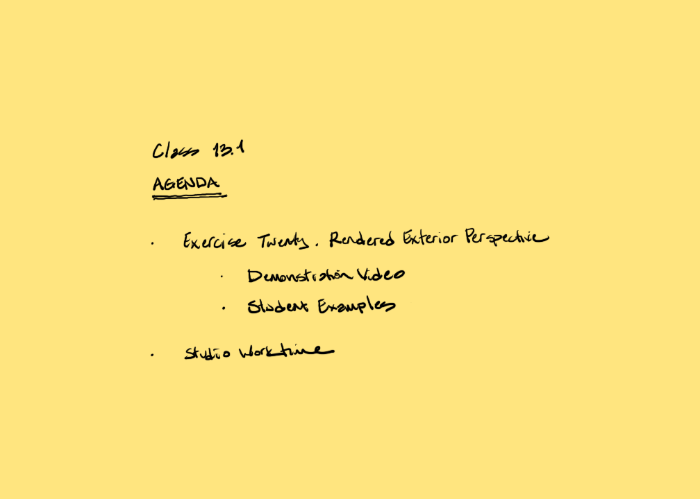

[AE1013](ae1013/)

<iframe height="420" width="640" allowfullscreen frameborder=0 src="https://echo360.org/media/1229c29f-f3f5-4e2f-8080-f745496beb06/public?autoplay=false&automute=false"></iframe>

<!-- remove

-->
