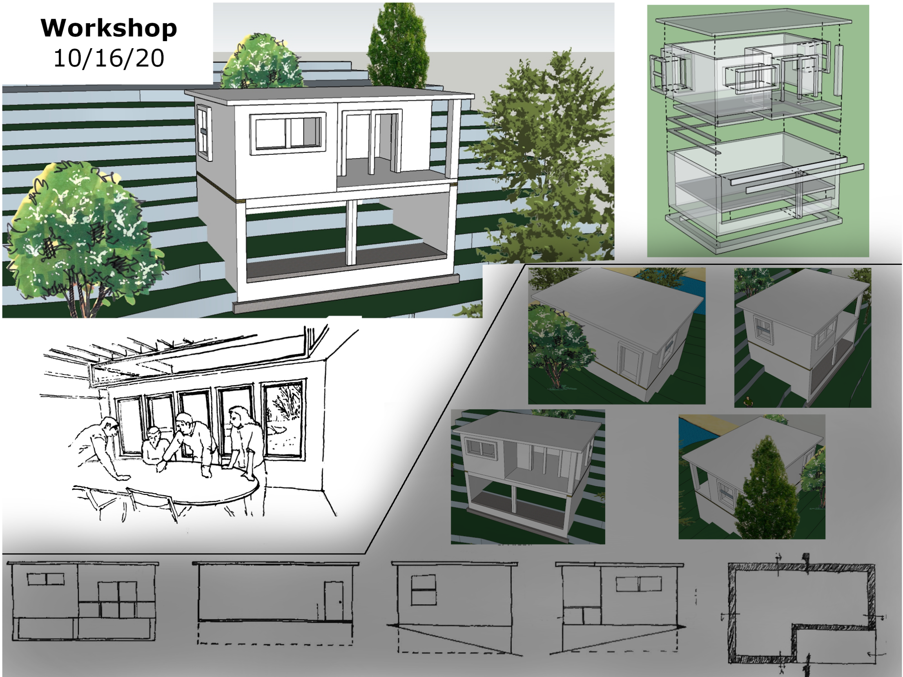
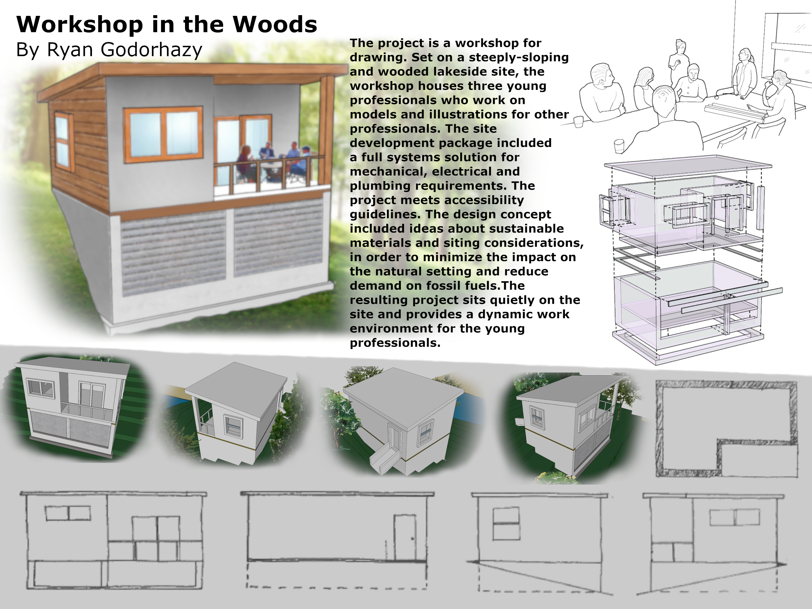
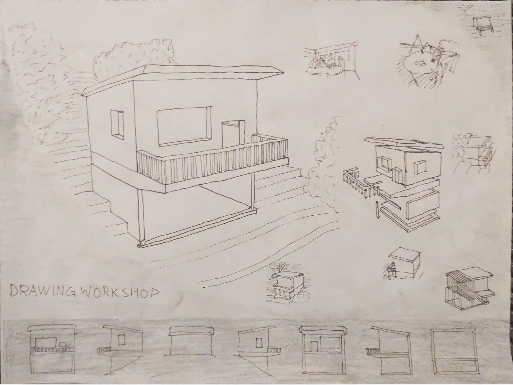
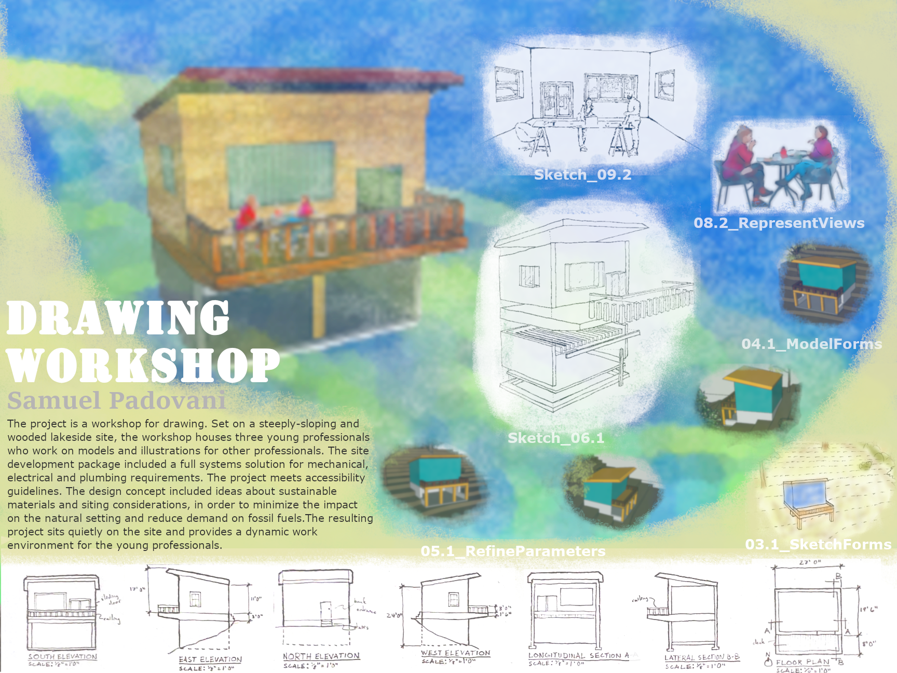
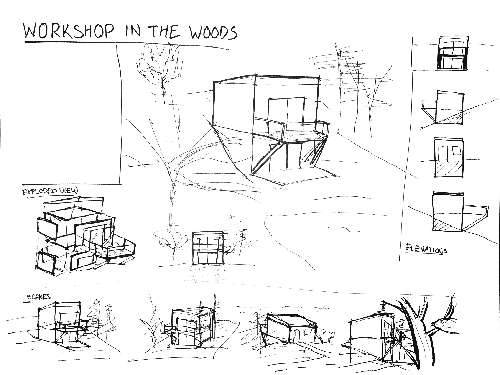
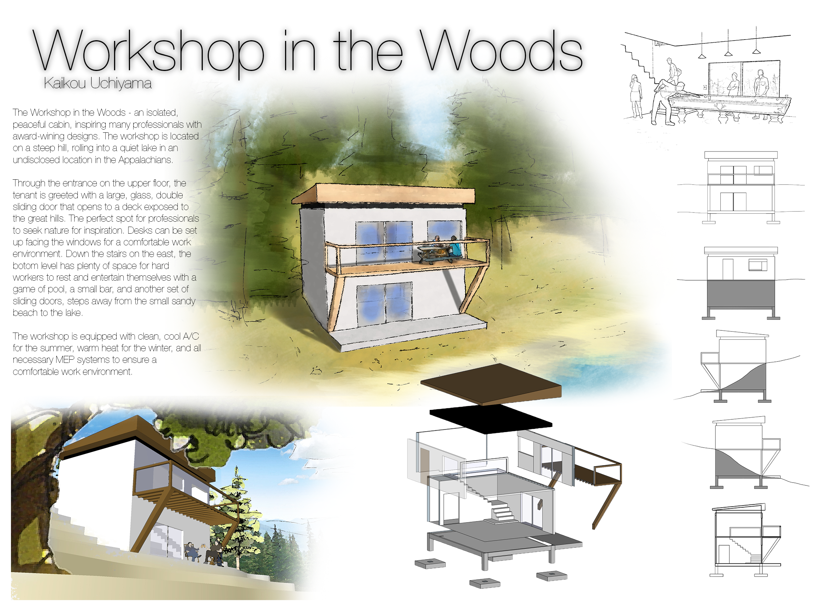

[Today\s Agenda](221121-2_agenda.html)

## Exercise Twenty-two. Final Presentation Board

Figure 4.1 Exercise Twenty-two. Final Presentation Board

### Steps

1.  Create a new file directory for the project. Create a subfolder called images and copy all your project raster files (e.g., .png, .jpg, \*.pdf, etc.) to the images folder.

2.  Open the digital tool of your choice (e.g., Photoshop, GIMP, InDesign, Scribus, etc.) and quickly sketch the main composition ideas. Create a new blank image with the following parameters, 32" X 24" landscape format (i.e., 4608px X 3456px @ 144 dpi.)

3.  One immediate idea that you can explore is to begin by making all images in a square format of equal sizes, organized on the board.  Then scale some images larger than others, to develop your hierarchical composition and create important contrasts. After this basic layout is tested, then reconsider the aspect ratio and determine if some images may benefit from another ratio besides square (e.g., 2:1, 3:4, 1.68:1, etc.)

4.  During this entire process, it is important to make check prints to verify the artistic and technical moves you make. It is very easy to get lost in the multi-scalar world of the screen. You may find when viewing a check print that you made some obvious mistakes, which otherwise stay hidden in the screen view.

5.  Now it's time to get down into the weeds. As we've seen with examples like the KRob competition (Dallas 2022) and the blog of Alex Hogrefe (see Exercise Nineteen in the previous chapter) the success of a digital composite drawing is often accomplished when the compositional idea is minimalist and clear (i.e., not complicated.) Much time should be devoted to the blending of images with backgrounds, the disciplined use of a color palette and the careful consideration of text and captions, etc. These technical considerations require significant experimentation and patience.

6.  Print a final check set at half-scale and make revision notes by hand with a red pen or pencil. A student skips this step at his/her peril.

7.  Upload the final image:

-   Portable Document Format (PDF) file only.

-   File dimensions shall be 2304px X 1728 @ 72 dpi. This means that you must format a custom-sized sheet in your program and print to that size (i.e., not fit to 8-1/2 X 11, letter size.) If you need help with this, then make sure you ask early enough so that your submission will not be late.

-   Please, no late submissions! Deadlines are a fact of life for you, and your clients will not be as flexible as your professor has been ;-)

### Tips

1.  There are several ways to make a composition board. Choose the methods you feel are best for you. The entire project could be done, as in the past, on an illustration board and by hand. Likewise, one could begin and end entirely in a digital painting in GIMP. In the two volumes of your book, the author has advocated for a hybrid process that mixes many different media and leverages the strengths of each.

2.  Because our final output is designed for the screen, this resolution and size specified above represent a workspace, which is double the size. If your computer complains or runs too slowly, then you may want to work at full size, which is 2304px X 1728 @ 72 dpi.)

3.  Only the foolhardy would keep this large file in one place. If you remember nothing else from this text, remember that digital work shall be backed up early and often. A suggested method: 1.) a working copy on your hard drive; 2.) an archive of your working directory each day to external thumb drive or other device; 3.) an automated continuous backup to the cloud (e.g., iCloud, Dropbox, OneDrive, etc.) There really is no excuse for a lost or corrupted file. Professionals backup their work, amateurs blame their computer.

### Related Assignments

-   Sketch J. Watercolor Storyboard of Twelve Site Context Vignettes

-   Sketch K. Formal Precedent Study. Thumbnail Sketch to Contour
    > Drawing.

-   Exercise Fourteen. Physical Paper Model of Formal Precedent

-   Exercise Fifteen. Electronic Site Contour Model and Three Proposed
    > Places

-   Exercise Sixteen. An Aerial Flyover Animation of Your Selected Place

-   Exercise Seventeen. Multi-view Construction Drawing

-   Sketch L. Exploded Perspective of Found Mechanical Object

-   Sketch M. Exploded Axonometric of Project Design

-   Exercise Eighteen. Designing the Composite Drawing

-   Exercise Nineteen. Discovering a Rendering Style with Entourage

-   Sketch N. Interior Perspective Vignette

-   Exercise Twenty. Rendered Exterior Perspective

