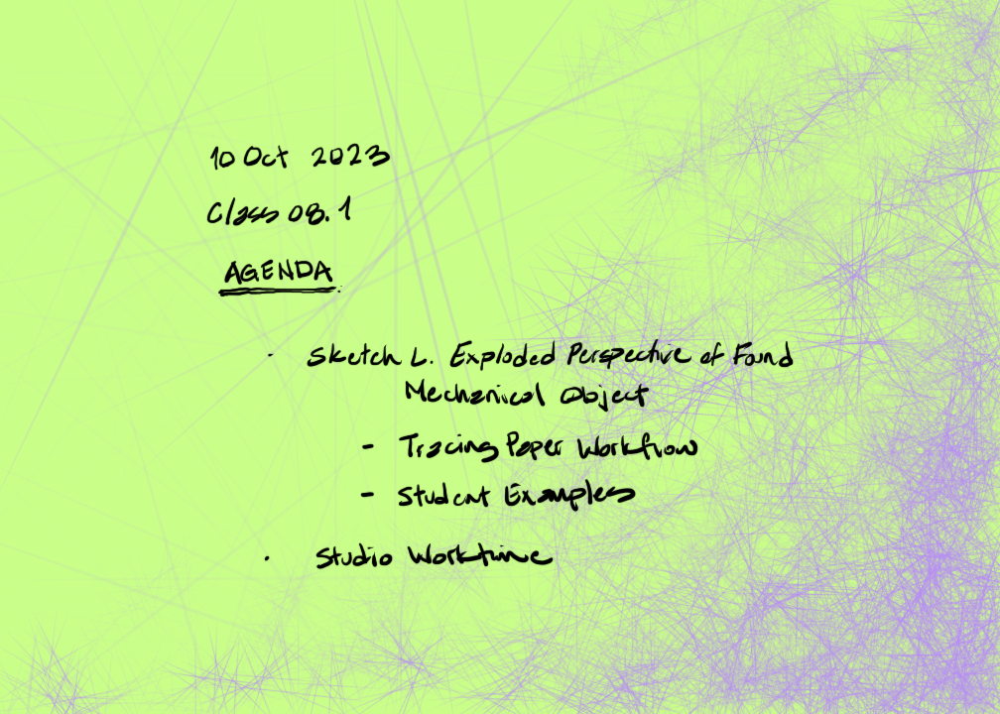
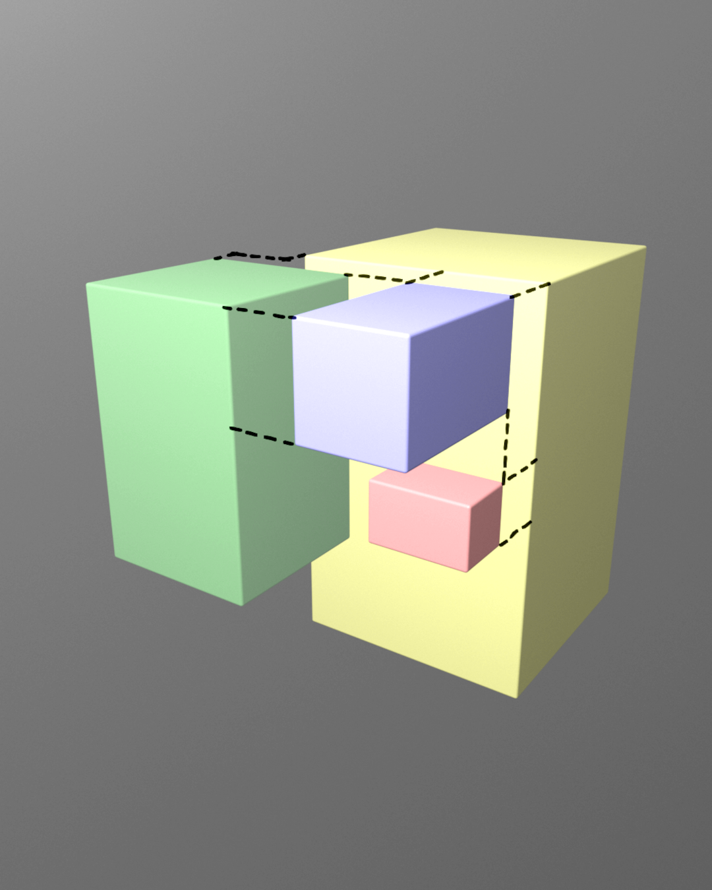
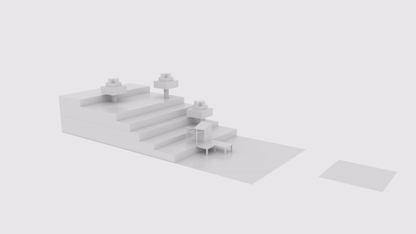
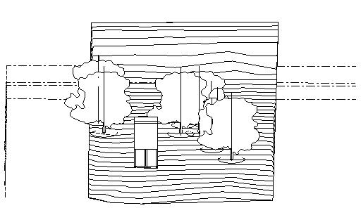

## Student Examples

<!-- save for later

## Sketch M. Exploded Axonometric of Project Design

Figure Sketch M. Exploded Axonometric of Project Design

### Introduction

Just as in Sketch L. Exploded Perspective of Found Mechanical Object, we will use an exploded drawing to describe how an assembly of separate systems is constructed. In thi sketch we use what we learned from the found object and apply the lessons to our design project. Analyze your studio project into systems modules. Suggested systems are structural, envelope, roof, etc.) Construct either a Para line or perspective drawing in an expanded or exploded view. You may have transparency in the elements. The final drawings should be in felt-tip pen on sketchbook paper. Color is optional.

### Learning

This assignment module contributes to the following design learning outcomes, which finish the sentence "As a successful student in this course, I am now able..."

> ... to analyze systems of assembly and construction and diagram an abstract three-dimensional model.

### Scenario

Para line is a phrase often associated with specialized three-dimensional diagram drawings. We first encountered a para line 3D drawing in Exercise Five.  Axonometric Projection Contour Model of a Small Guest House. We used an isometric grid to easily measure and construct an image that illustrated three descriptive sides of a guest house. The isometric was an approximation of what our eyes see that also afforded us the advantages of a measured drawing. The exploded isometric is advantageous prior to the electronic modeling phase due to the ease of constructing the drawing. For Sketch M. Exploded Axonometric of Project Design we will again use an isometric grid, and this can be done manually as a hand drawing or automatically in the computer.

### Materials

* Electronic modeling program
* Digital raster image editing program
* Isometric grid or parallel projection mode

### Steps

1. Model your project in the electronic modeling program of your choice (e.g., SketchUp, Blender, etc.)
1. Duplicate the file and set aside the original, because this assignment will be destructive to your model.
1. Taking the advantages of the program such as layering, color-coding and grouping begin to order your project into meaningful building systems.
1. Pull the systems apart for individual systems parallel to all three axes (e.g., x-, y-, and z-axis.)
1. Remember to place line segments that connect the vertices to each other for the reviewer to reassemble your project in the imagination.

### Tips

* The default mode in computer modeling programs is usually perspective mode. This assignment is a parallel projection and isometric presentation. It is useful to work from the beginning in the final isometric mode.
* Electronic image editing programs allow you to more easily include graphic notes and symbols not often available in the electronic modeling program. It can also help to make your drawings look more presentable.

### Criteria

  ----------------- -------------------------------------------------------------------------------------------------------------------------------------------------------------------------------------------------------------------- -------------------------------------------------------------------------------------------------------------------------------------------------------------------------------------- ----------------------------------------------------------------------------------------------------------------------------------------------------- ------------------------------------------------------------------------------------------------------------------------------------------------ --
  DLO               Advanced (4 pts)                                                                                                                                                                                                     Proficient (3 pts)                                                                                                                                                                     Developing (2 pts)                                                                                                                                    Beginner (1 pt)                                                                                                                                  
  Craft             Illustrator demonstrates exemplary attention to work product and excellence.                                                                                                                                         Illustrator demonstrates good attention and care towards work product.                                                                                                                 Illustrator completes work, but the product seems rushed to completion.                                                                               Illustrator demonstrates attention towards work product, but work quality is                                                                     
  Rendering         Illustrator uses line to hold the viewer\'s attention. Image is controlled and evokes both power and subtlety. Image is descriptive and/or symbolic and supports compositional goals.                                Illustrator\'s line work demonstrates several professional attributes. Rendering style does not distract the viewer and generally supports compositional objectives.                   Illustrator\'s use of line is somewhat effective. Rendering style is consistent and competent. There are some non-contributing attributes.            Illustrator attempts to use line descriptively. Rendering is inconsistent and lacks attention to craft.                                          
  Technical         Illustrator observes and analyzes object data and translates it to a meaningful graphic representation. Professional conventions are followed, inclusive of line weight, orthographic and dimensional information.   Illustrator observes and analyzes object data and translates it to a meaningful graphic representation. Most professional conventions are followed, and some information is missing.   Illustrator is challenged to observe and analyze object data correctly. Few professional conventions are followed, and some information is missing.   Illustrator attempts to observe and analyze object data and representation is inconsistent. Professional drawing conventions are not followed.   
  Professionalism   Student completes the work on time. Work demonstrates exemplary attention to learning objectives.                                                                                                                    Student completes the work on time and demonstrates a good work ethic.                                                                                                                 Student generally completes the work at a minimum level of expectation.                                                                               Student is missing parts of the work and makes a plan for completion of the remaining assignment.                                                
  ----------------- -------------------------------------------------------------------------------------------------------------------------------------------------------------------------------------------------------------------- -------------------------------------------------------------------------------------------------------------------------------------------------------------------------------------- ----------------------------------------------------------------------------------------------------------------------------------------------------- ------------------------------------------------------------------------------------------------------------------------------------------------ --

### Related Assignments

* Sketch L. Exploded Perspective of Found Mechanical Object
* Exercise Seventeen. Multi-view Construction Drawing

## References

save for later -->

<!-- save for later

## Student Examples

save for later -->
