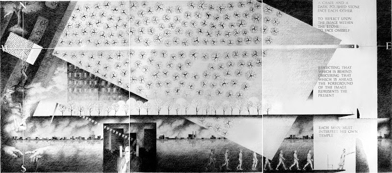
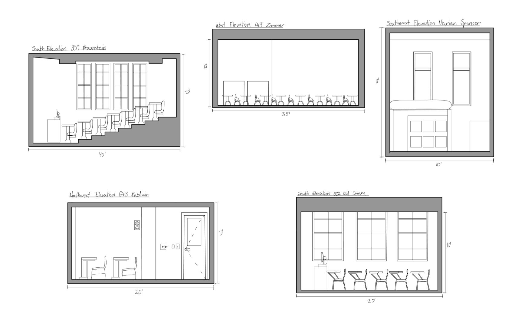
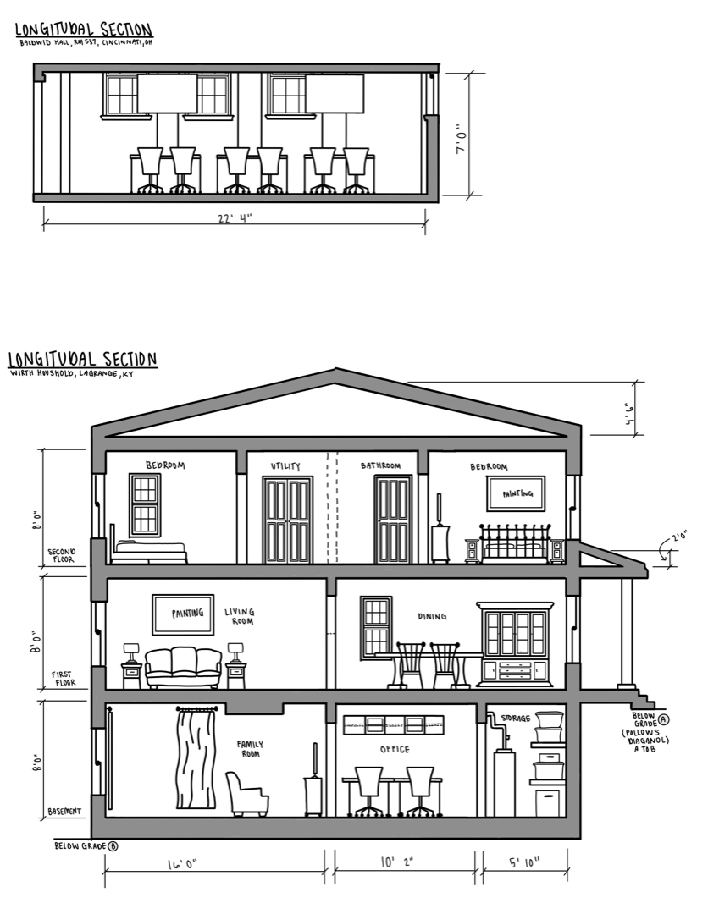
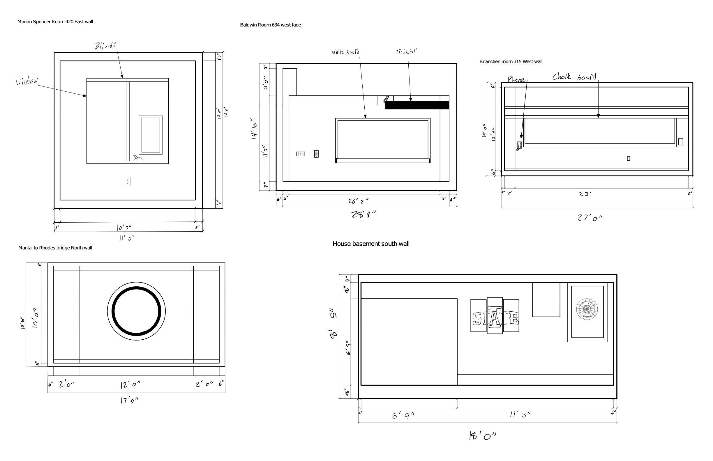

[AE1013](ae1013/)

<iframe height="420" width="640" allowfullscreen frameborder=0 src="https://echo360.org/media/9261810b-1060-4d5e-8819-8272858ae3eb/public?autoplay=false&automute=false"></iframe>

<!-- remove

<iframe height="420" width="640" allowfullscreen frameborder=0 src="https://echo360.org/media/094db54a-e008-41db-8708-9ab17adefeb3/public?autoplay=false&automute=false"></iframe>

-->
