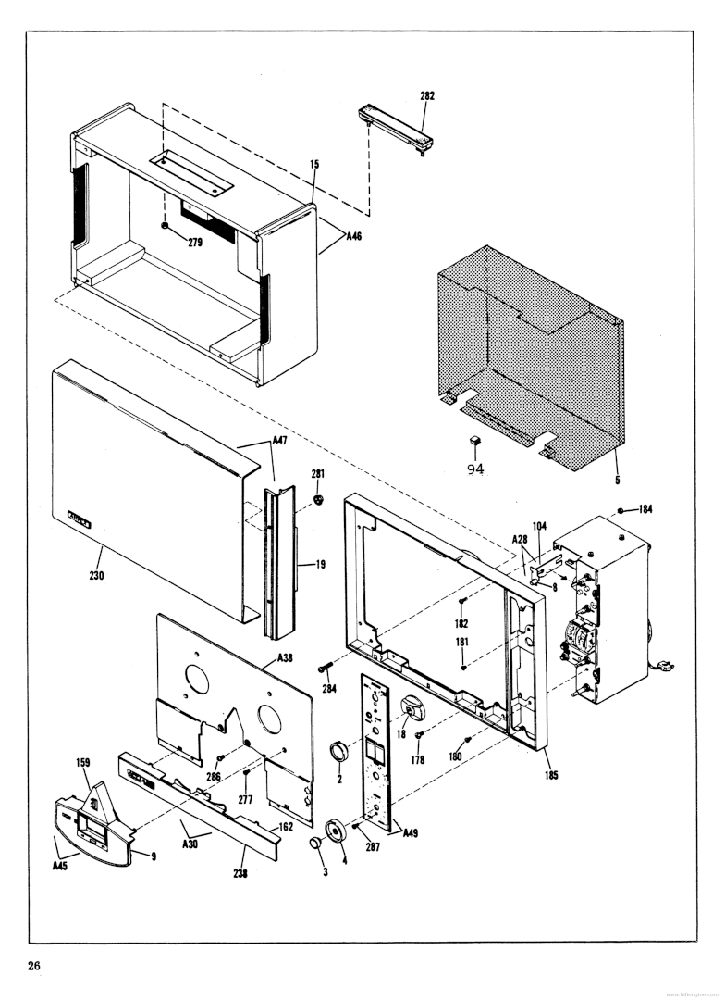
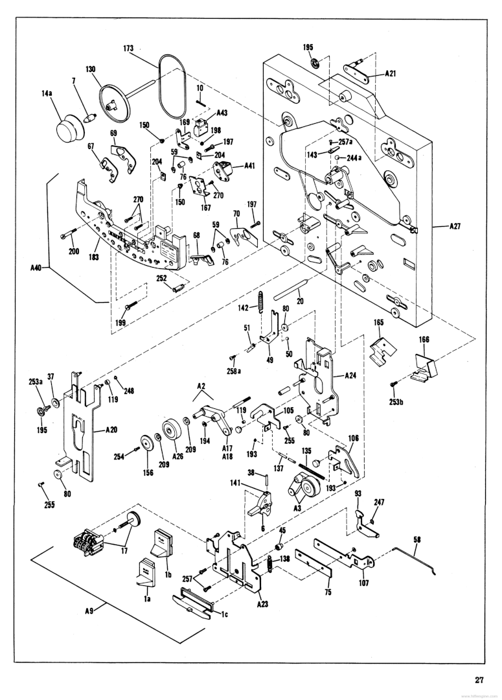

[Today\'s Agenda](221005-6_agenda.html)

## Advanced Orthographic Techniques

Two advanced orthographic techniques we explore are exploded perspective
and exploded axonometric drawings. Product designers often make use of
exploded assemblies to explain who parts and pieces are assembled.
Another use for exploded drawings is do-it-yourself furniture that comes
flat-packed (i.e., IKEA.)

Whenever it is important to understand how an assembly is constructed
(i.e., conceptual understanding, maintenance, or assembly instructions,
etc.) it can be helpful to show the components exploded and with
connecting diagrammatic lines. Since product designers and manufacturers
have found this drawing useful and our clients are familiar with this
kind of diagram, then it is natural that architects and engineers use
exploded drawings to show how buildings and components are assembled.

Therefore, when it is useful to explain how your project's parts and
pieces come together in a whole, you will find an exploded
three-dimensional diagram helpful. Unless your assembly is too simple or
too complex, then this type of drawing is useful. Simple constructs need
no deconstruction into parts. Overly complex assemblies may be too
difficult to diagram without confusing the viewer. It is also worth
noting that animations can serve the functions of exploded *static*
drawings. Animations are often developed such that the time variable
tracks the order of operations needed to construct architecture. Let's
first start with a fixed and suspended view of all the components
**exploded**. Exploded axonometric and perspective drawings are most
useful during the schematic design phase as the project starts to become
complex and before it becomes *complicated*.

### Exploded Drawings: Axonometric and Perspective

As you will read in Sketch L. Exploded Perspective of Found Mechanical
Object and Sketch M. Exploded Axonometric of Project Design, there are
at least two three-dimensional constructs we can use. We have learned
that creating an axonometric drawing is sometimes made easier using an
isometric template. While we have learned the basics of the perspective
method, it can be challenging and time consuming. We instead use an
electronic modeling process. Another method we have not yet learned is
making a direct observation sketch in multiple stages and with the use
of tracing paper. The object is drawn and redrawn like peeling back the
layers of an onion (i.e., onion-skin paper!) until all the subcomponents
have been mapped. Then the individual layers are shifted in the x-, y-
or z-axis to diagram the exploded spatial relationships of one component
to another. Since we are using our design for our project, and we have
already begun to electronically model it as a part of our design
process, then the obvious choice would be to skip using an isometric
grid paper, continue developing our perspective view inside the computer
as we are working, and then switch to a parallel view to print our
project as an exploded axonometric.

## Sketch L. Exploded Perspective of Found Mechanical Object

Figure Sketch L. Exploded Perspective of Found Mechanical Object

### Introduction

Para line or perspective drawings may be enhanced when objects are split
apart along the vertical and horizontal axes and connected using either
dashed lines or light projection lines. The goal of this sketchbook
assignment is to make a single drawing that shows individual modular
parts that make up an assembly. The drawing should illustrate how the
individual modules are grouped together in an assembly. In this sketch
find a familiar object (e.g., lamp, piece of furniture, machine, toy,
etc.), which has between 15 or 30 parts. Analyze how the object would be
disassembled. Construct either a Para line or perspective drawing in an
expanded or exploded view. You may have transparency in the elements.
The final drawings should be in felt-tip pen on sketchbook paper. Color
is optional.

### Learning

This assignment module contributes to the following design learning
outcomes, which finish the sentence "As a successful student in this
course, I am now able..."

> ... to analyze systems of assembly and construction and diagram an
> abstract three-dimensional model.

### Scenario

Exploded perspective drawings used to be less common than exploded
isometrics due to the challenge of constructing the perspective system
manually. With electronic modeling we are given choices on how to best
reflect our exploded assembly. In the next two sketch assignments we
will gain experience in both methods. For Sketch L. Exploded Perspective
of Found Mechanical Object we will use a several overlays of tracing
paper and a perspective method from direct observation. Unlike Exercise
Five, this time we will both be *constructing* and *deconstructing* our
found mechanical object.

An exploded perspective drawing diagrams formal relationships and
construction assembly. As such, it implies a fourth dimension of time.
It is an imaginary construct. The value of this type of drawing is in
the narrative the designer can tell about how the analyzed individual
elements are synthesized together into a wholistic system. Since the
drawing analyzes and deconstructs an assembly, then some assumptions
about hidden elements may be inferred; unless you are willing to
physically decompose the object! In this case, there may be some
advantage to selecting an object to analyze that you would be willing to
discard when finished.

### Materials

-   Sketchbook

-   Pen

-   Wet or dry color media

### Steps

1.  Select a familiar object (e.g., lamp, piece of furniture, machine,
    toy, etc.), which has between 15 or 30 parts. Analyze how the object
    would be disassembled.

2.  Begin by sketching quick thumbnails in your sketchbook of how you
    imagine the various pieces are assembled.

3.  Tape a piece of translucent sketch paper to the drawing board and
    draw a perspective of the main body.

4.  Place another piece of sketch paper over the first and draw the next
    piece. First in the correct place as if you had X-ray vision.

5.  Move this *overlay* either down, up, or over as you see appropriate.

6.  Tear off another piece of overlay paper and repeat the previous step
    with an additional element of the assembly. Repeat this process
    until there are several *displaced* tracing overlays on top of each
    other.

7.  When you have completed the decomposition, then trace the overall
    exploded perspective you imagined. Render with line work and color
    as you see necessary to keep the parts clear and articulated. Draw
    dashed connecting lines between elements to show how each is
    connected.

### Tips

-   Tracing paper has a corollary to the digital world. You may enjoy
    doing this sketch in a raster image editing program. Think of the
    tracing overlays in the steps above as *layers* in your digital
    drawing.

-   Color serves a function beyond describing materials. It can be used
    to bring clarity to a busy drawing by grouping like components and
    color coding them as subsets.

### Criteria

  DLO               Advanced (4 pts)                                                                                                                                                                                                     Proficient (3 pts)                                                                                                                                                                     Developing (2 pts)                                                                                                                                    Beginner (1 pt.)                                                                                                                                 
  ----------------- -------------------------------------------------------------------------------------------------------------------------------------------------------------------------------------------------------------------- -------------------------------------------------------------------------------------------------------------------------------------------------------------------------------------- ----------------------------------------------------------------------------------------------------------------------------------------------------- ------------------------------------------------------------------------------------------------------------------------------------------------ --
  Craft             Illustrator demonstrates exemplary attention to work product and excellence.                                                                                                                                         Illustrator demonstrates good attention and care towards work product.                                                                                                                 Illustrator completes work, but the product seems rushed to completion.                                                                               Illustrator demonstrates attention towards work product, but work quality is                                                                     
  Rendering         Illustrator uses line to hold the viewer\'s attention. Image is controlled and evokes both power and subtlety. Image is descriptive and/or symbolic and supports compositional goals.                                Illustrator\'s line work demonstrates several professional attributes. Rendering style does not distract the viewer and generally supports compositional objectives.                   Illustrator\'s use of line is somewhat effective. Rendering style is consistent and competent. There are some non-contributing attributes.            Illustrator attempts to use line descriptively. Rendering is inconsistent and lacks attention to craft.                                          
  Technical         Illustrator observes and analyzes object data and translates it to a meaningful graphic representation. Professional conventions are followed, inclusive of line weight, orthographic and dimensional information.   Illustrator observes and analyzes object data and translates it to a meaningful graphic representation. Most professional conventions are followed, and some information is missing.   Illustrator is challenged to observe and analyze object data correctly. Few professional conventions are followed, and some information is missing.   Illustrator attempts to observe and analyze object data and representation is inconsistent. Professional drawing conventions are not followed.   
  Professionalism   Student completes the work on time. Work demonstrates exemplary attention to learning objectives.                                                                                                                    Student completes the work on time and demonstrates a good work ethic.                                                                                                                 Student generally completes the work at a minimum level of expectation.                                                                               Student is missing parts of the work and makes a plan for completion of the remaining assignment.                                                

### Related Assignment

-   Sketch M. Exploded Axonometric of Project Design
<!-- Save for next lecture

## Student Examples

-->
