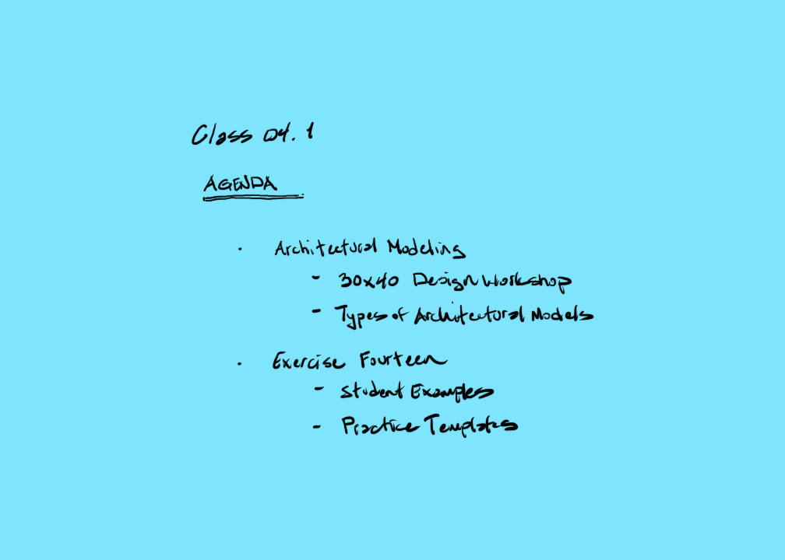

[Current Draft of Syllabus](syllabusDraft.html)

[AE1013](ae1013/)

<iframe height="240" width="320" allowfullscreen frameborder=0 src="https://echo360.org/media/3c1888d4-d1f0-4cd1-8f99-e309fe86196b/public?autoplay=false&automute=false"></iframe>

[Exercise Fourteen. Physical Paper Model of Formal Precedent Examples in zip file](images/Ex14_Physical_Paper_Model.zip)
