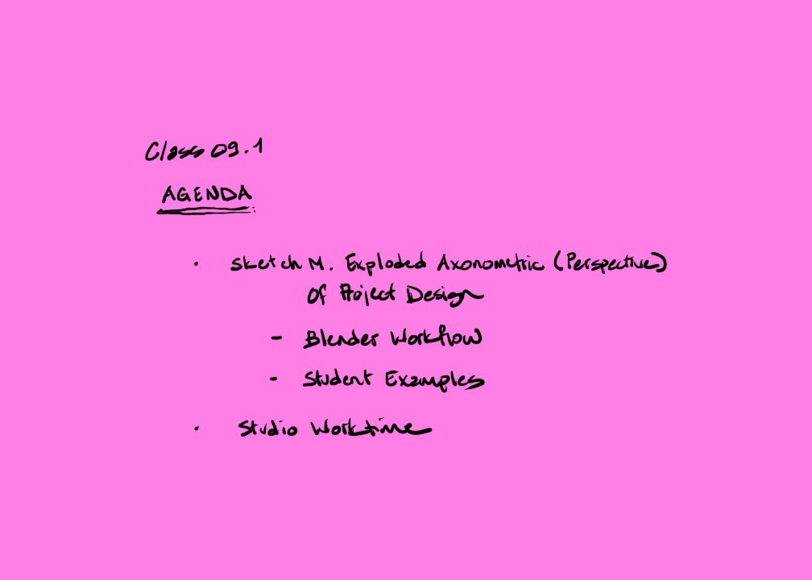
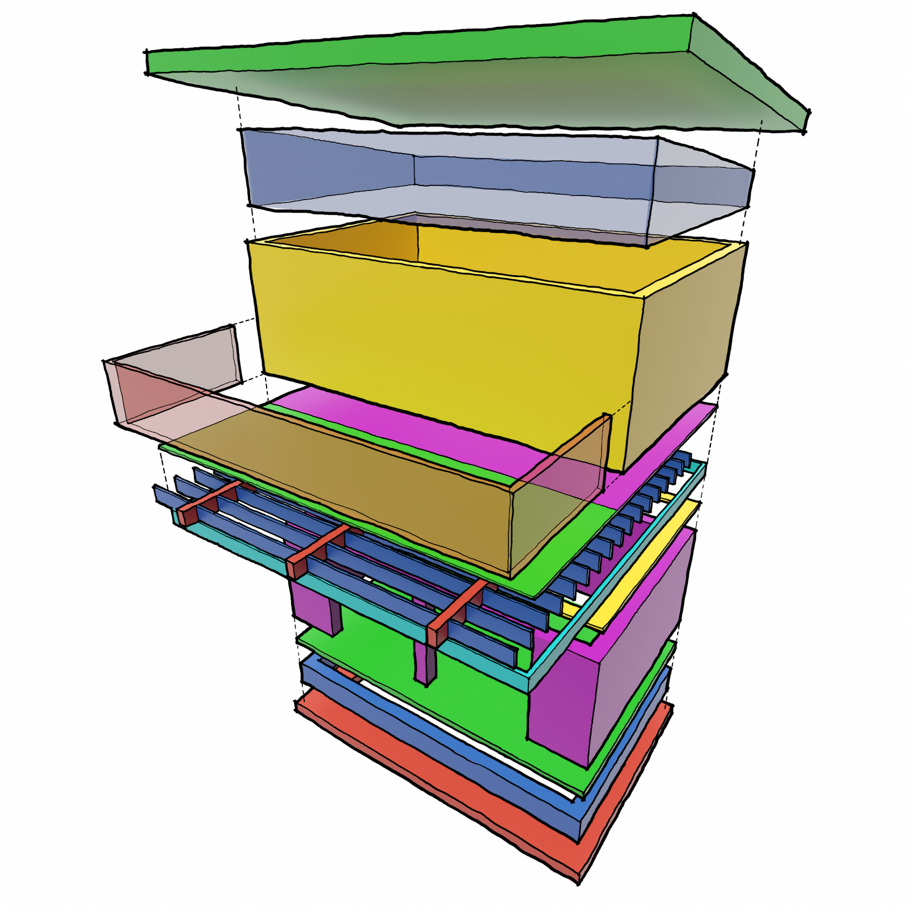
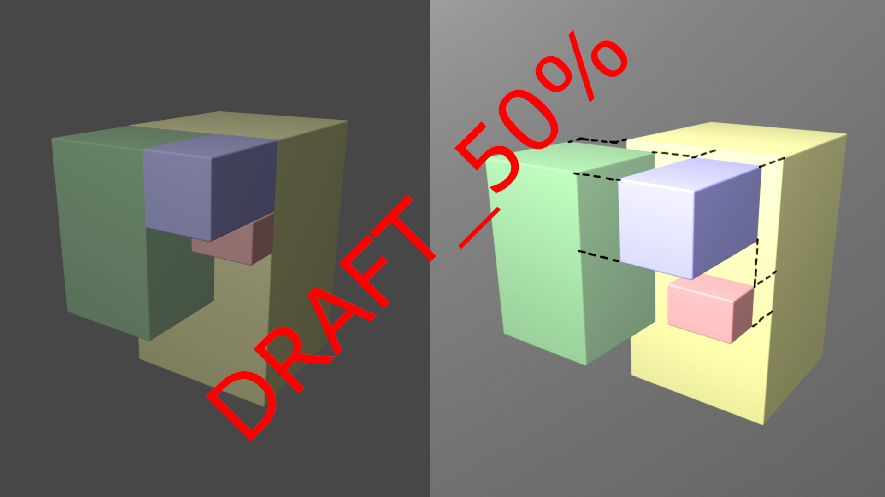

[Current Draft of Syllabus](syllabusDraft.html)

[AE1013](ae1013/)

<iframe height="420" width="640" allowfullscreen frameborder=0 src="https://echo360.org/public/media/b0fde83e-2166-4f40-8123-bbc04d070fe1?autoplay=false&automute=false"></iframe>

[Sketch M. Examples in zip file](images/sketchM_examples.zip)
