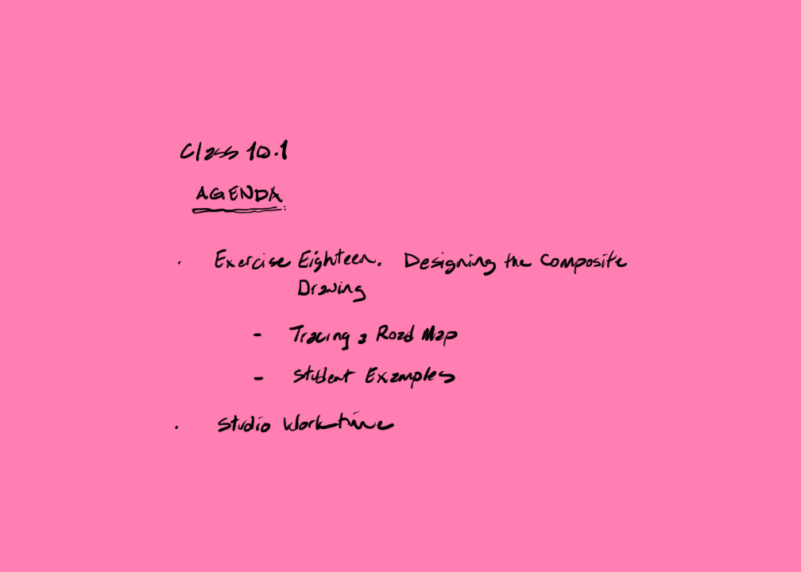
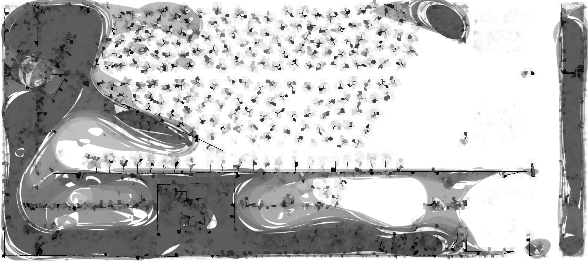

[Current Draft of Syllabus](syllabusDraft.html)

[AE1013](ae1013/)

## Professional Examples

<iframe height="420" width="640" allowfullscreen frameborder=0 src="https://echo360.org/media/2674b259-b5df-439e-aa8b-0d2c31f08902/public?autoplay=false&automute=false"></iframe>

[Exercise Eighteen Examples](images/Ex18.zip)
