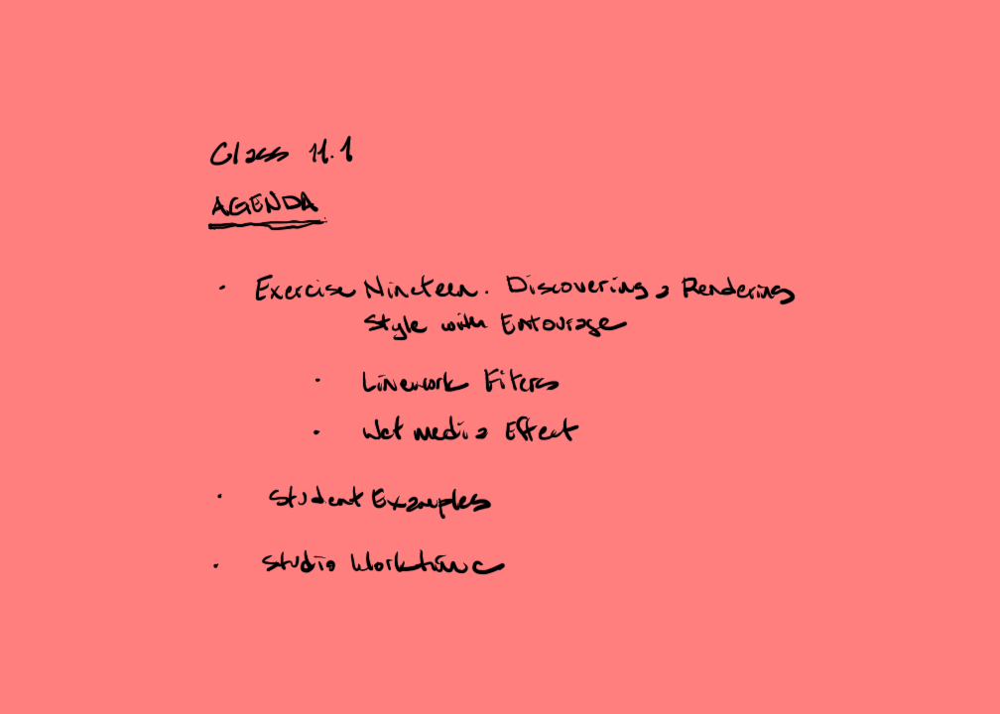

[Current Draft of Syllabus](syllabusDraft.html)

[AE1013](ae1013/)

<iframe height="420" width="640" allowfullscreen frameborder=0 src="https://echo360.org/media/e3141cdb-86ca-4d2e-b9bd-888429cc3d85/public?autoplay=false&automute=false"></iframe>

[Exercise Nineteen Examples](images/Ex19.zip)
