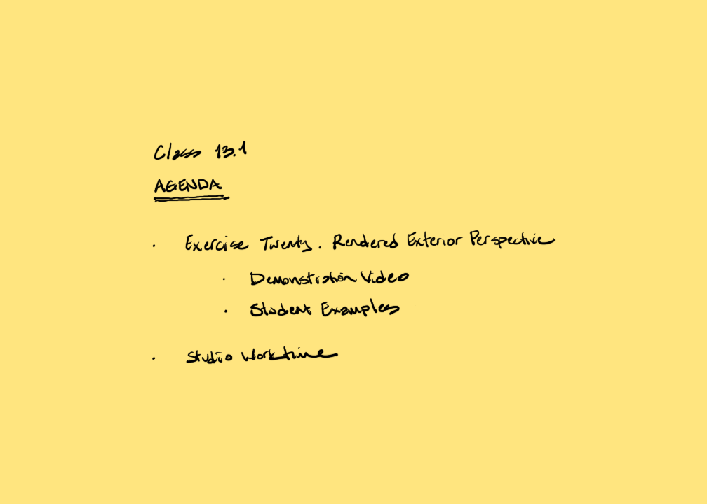

[Current Draft of Syllabus](syllabusDraft.html)

[AE1013](ae1013/)

<iframe height="420" width="640" allowfullscreen frameborder=0 src="https://echo360.org/public/media/fc8a0af0-7e75-412d-81d4-9457792f49ce?autoplay=false&automute=false"></iframe>

[Exercise Twenty Examples](images/Ex20.zip)
