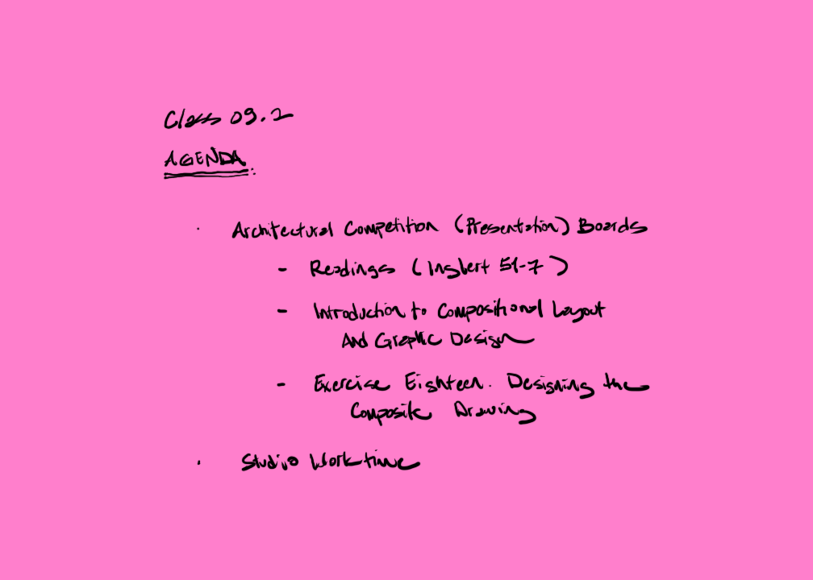

[Current Draft of Syllabus](syllabusDraft.html)

[AE1013](ae1013/)

<iframe height="420" width="640" allowfullscreen frameborder=0 src="https://echo360.org/media/370bd3a5-89d7-42ec-9437-c6ebb1b4a8e1/public?autoplay=false&automute=false"></iframe>

[Exercise Eighteen Examples](images/Ex18.zip)
