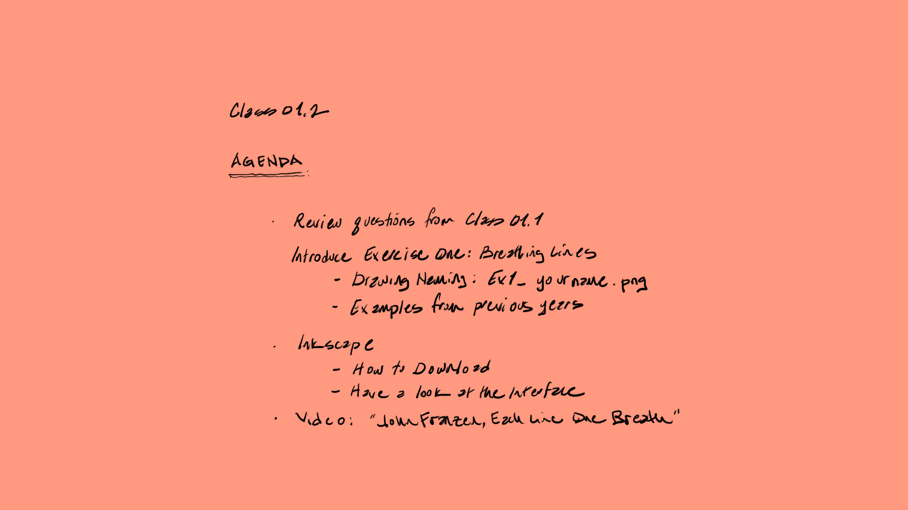

[Frequently Asked Questions: FAQ](FAQ.html)

<iframe height="420" width="640" allowfullscreen frameborder=0 src="https://echo360.org/media/dc8e3da0-65c0-4fee-a90a-a2070bdf890a/public?autoplay=false&automute=false"></iframe>

[Exercise One Examples](images/Assignment_01.zip)

[Link to Inkscape.org](https://inkscape.org/)

<iframe height="420" width="640" allowfullscreen frameborder=0 src="https://echo360.org/media/ed2a534f-2628-472e-9fd9-d15ee7664de6/public?autoplay=false&automute=false"></iframe>

[LinkedIn Learning Inkscape Tutorial](https://www.linkedin.com/learning/inkscape-essential-training-9975138/what-is-inkscape)
