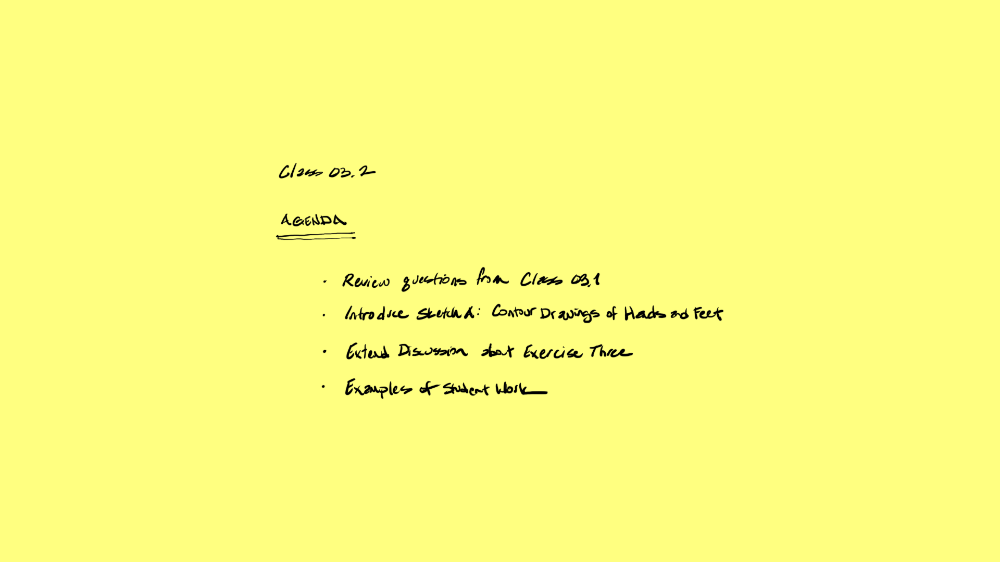
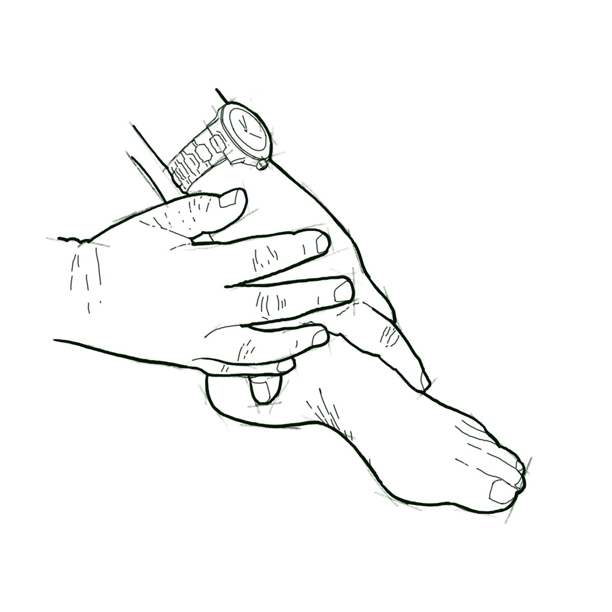

[Frequently Asked Questions: FAQ](FAQ.html)

<iframe height="420" width="640" allowfullscreen frameborder=0 src="https://echo360.org/media/cfc54c6e-398a-4aeb-85c7-b2c1af50f6a1/public?autoplay=false&automute=false"></iframe>

[Sketch A Examples](images/sketchA.zip)

