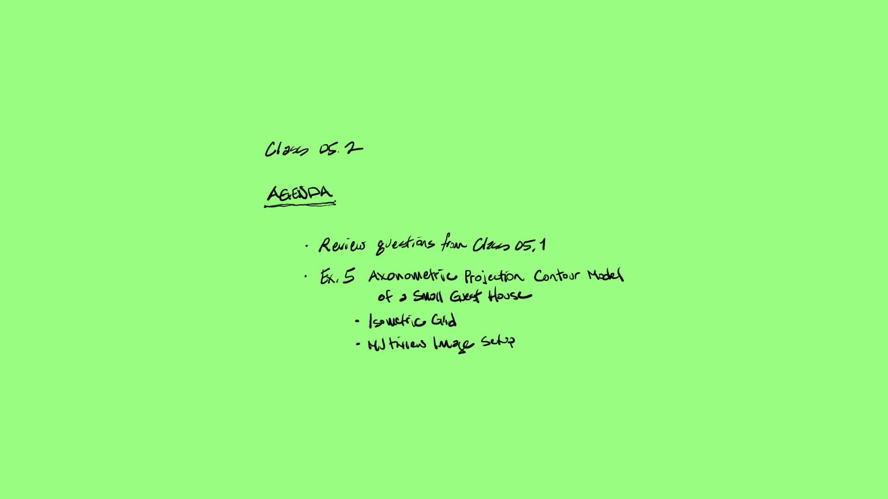
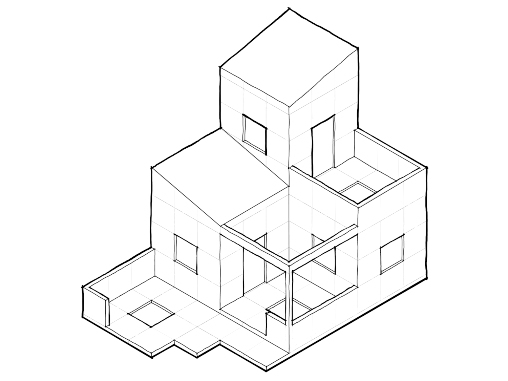

[Frequently Asked Questions: FAQ](FAQ.html)

<iframe height="420" width="640" allowfullscreen frameborder=0 src="https://echo360.org/media/71e7c186-eddd-4898-954d-6d323cf01649/public?autoplay=false&automute=false"></iframe>

<iframe height="420" width="640" allowfullscreen frameborder=0 src="https://echo360.org/media/f22ae21e-cea9-4821-aa64-9a11d73992b9/public?autoplay=false&automute=false"></iframe>

[Exercise Five Examples](images/ExerciseFive.zip)
