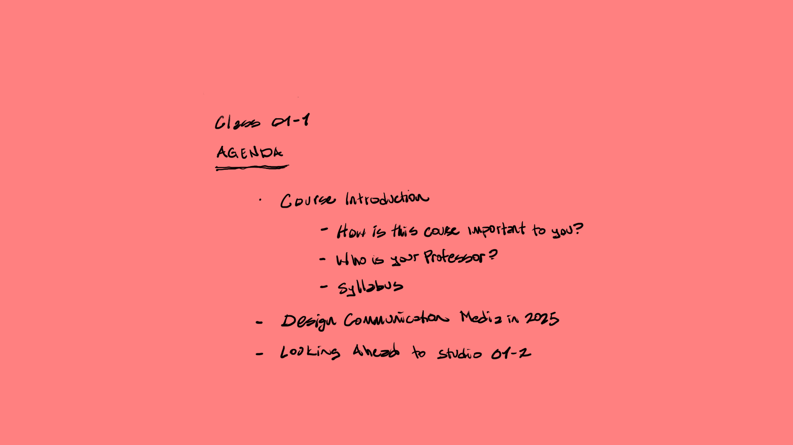
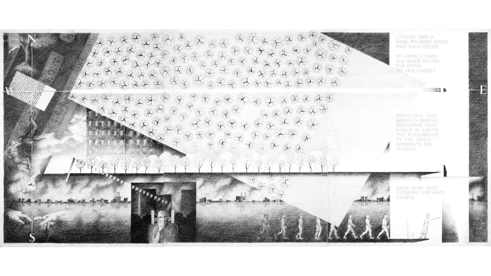

[Current Draft of Syllabus](https://uc.simplesyllabus.com/en-US/doc/8kj28ygd0/2026-Fall-AE-1013-%2820%29-001-%2820561%29-Architectural-Engineering-Skills-1?mode=view)

[Frequently Asked Questions: FAQ](FAQ.html)

<!-- 

[Exercise Twenty-two Examples](images/Ex22.zip) -->
