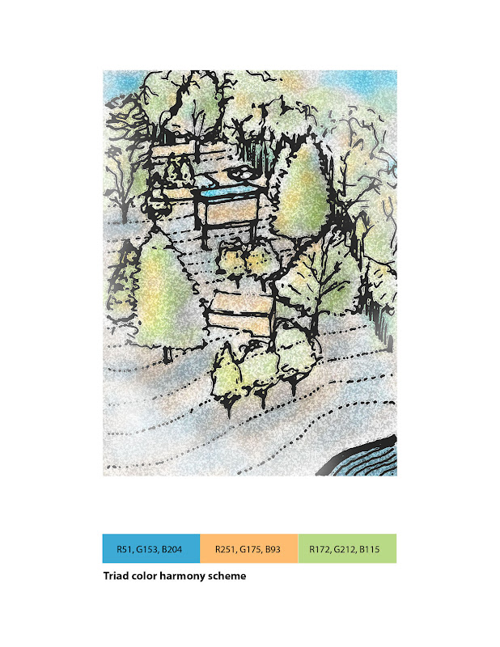

[Current Draft of Syllabus](syllabusDraft.html)

[AE1013](ae1013/)

[Exercise Fifteen. Electronic Site Contour Model and Three Proposed Places Examples in zip file](images/Ex15_examples.zip)

<ul>
    <li><a class="inline_disabled" href="https://einglert.github.io/images/fig_1-12_sitePlan.png" target="_blank" rel="noopener">Site Plan Sketch</a></li>
    <li><a title="Adobe Color Wheel" href="https://color.adobe.com/create/color-wheel" target="blank">Adobe Color Wheel</a></li>
    <li><a class="inline_disabled" title="Link" href="https://www.youtube.com/playlist?list=PLCEd_GxDZzgfZrE7YNaaXGEXXnPPQUpmy" target="_blank" rel="noopener">SketchUp Exercise 15 Playlist</a></li>
</ul>
