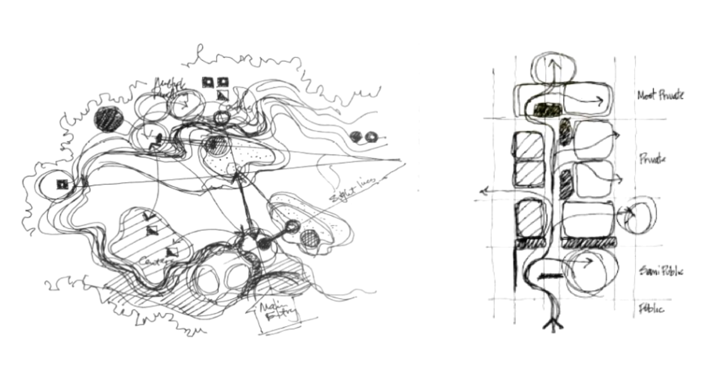

[Today\'s Agenda](220323_agenda.html)

## Images of Architectural Diagrams

* { width=90% }
* { width=90% }

## Articles about Architectural Diagramming

* [Analyzing Architecture through Diagrams](http://www.cccarchitecture.org/analyzing-architecture-through-diagrams)
* [Reading Architecture: How "Looking" Becomes "Making" Through Techniques of Analysis](https://www.archdaily.com/955579/reading-architecture-how-looking-becomes-making-through-techniques-of-analysis)
* [Pointless Diagrams by Josh Lewandowski](https://www.dezeen.com/2013/09/30/pointless-diagrams-by-josh-lewandowski/)
* [Understanding Architectural Diagrams](https://www.archisoup.com/studio-guide/architectural-diagrams)

