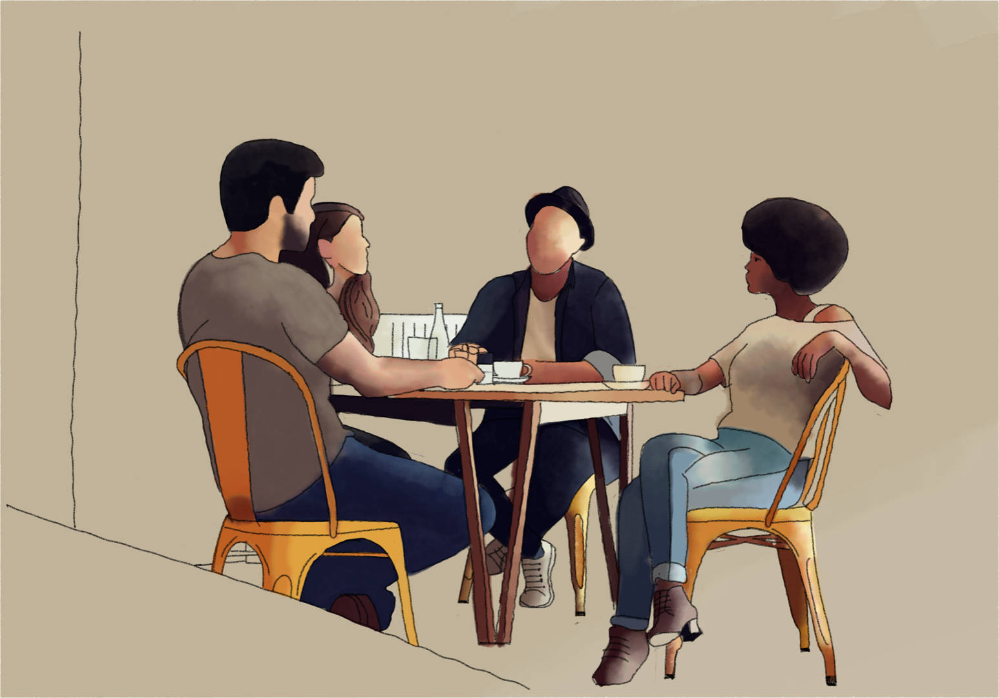

[AE1013](ae1013/)

<!-- remove

<iframe height="420" width="640" allowfullscreen frameborder=0 src="https://echo360.org/media/95346a12-d8b0-4e93-a541-70ccf7413fee/public?autoplay=false&automute=false"></iframe>

-->
