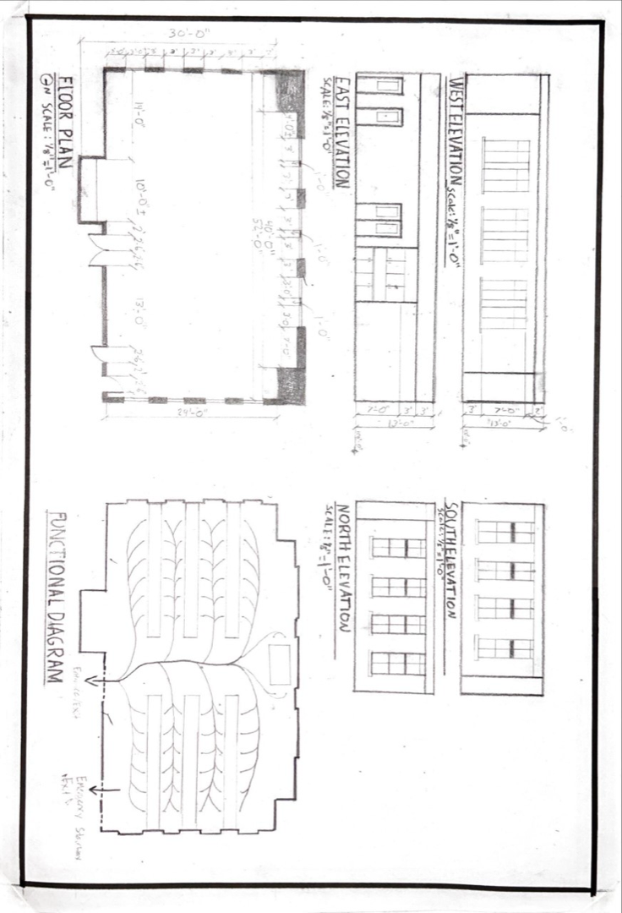
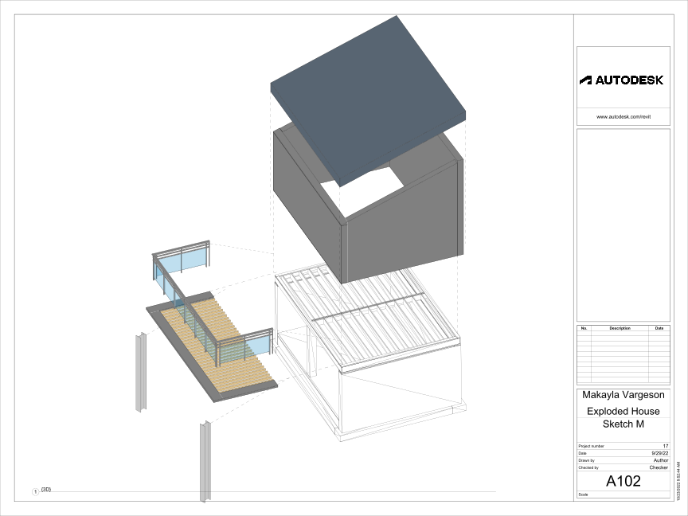

nose toes

[AE1013](ae1013/)

<iframe height="420" width="640" allowfullscreen frameborder=0 src="https://echo360.org/media/a4d422c8-516e-41d5-9be1-966969e00a41/public?autoplay=false&automute=false"></iframe>

<!-- remove

<iframe height="420" width="640" allowfullscreen frameborder=0 src="https://echo360.org/media/86a58a11-5245-4259-a701-af4b097ced70/public?autoplay=false&automute=false"></iframe>

-->

