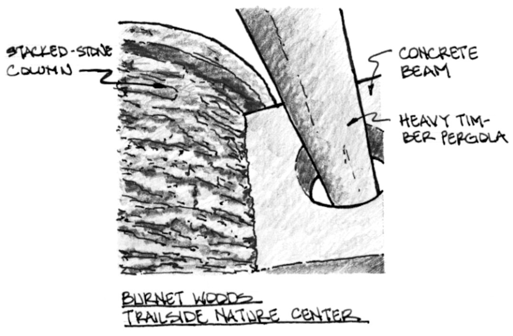

shell toad

[AE1013](ae1013/)

<!-- remove

<iframe height="420" width="640" allowfullscreen frameborder=0 src="https://echo360.org/media/4284d4be-d929-41ff-8ee4-a8274d0f0bd5/public?autoplay=false&automute=false"></iframe>

-->

