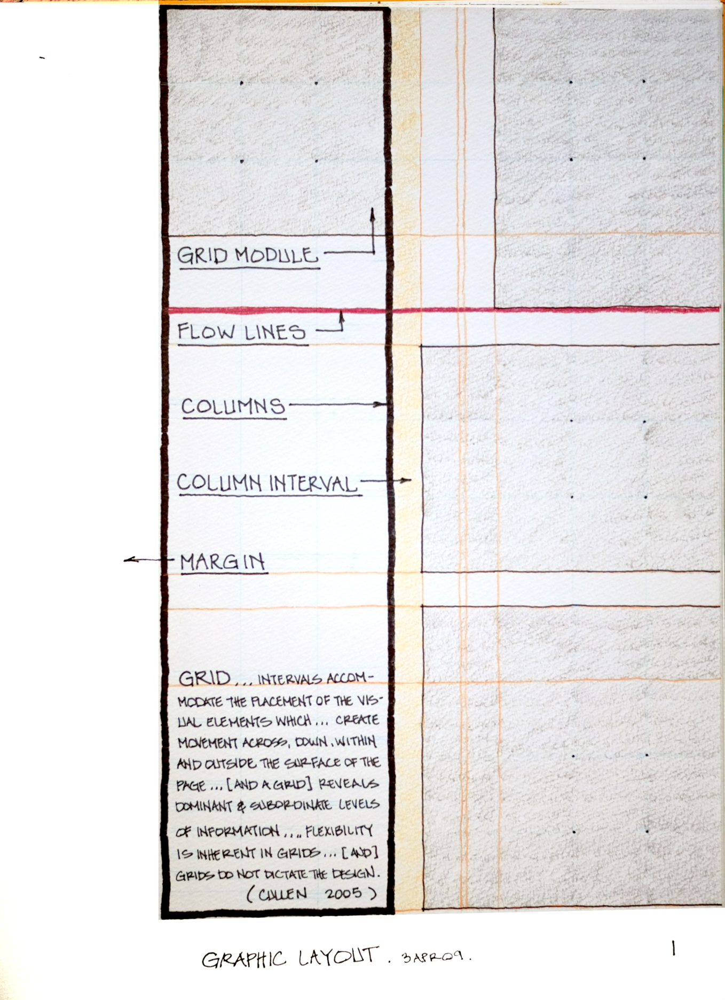

## Historical Role of Architectural Competitions on the Profession

The Architectural Presentation Board has roots in the Ecole des Beaux-Arts in Paris. The *Ecole* as it will be referenced here was a rational system of eductation for architects, and the school's roots go back to the mid 17th century France. In common understanding it is most closely associated with Neoclassicism and historical architectural style. Contemporary architecture is largely disassociated with classically-inspired formalism, ornamentation, and planning principles. The influence of 20th century Bauhaus teachings and **Modernism** are more influential in today's schools and ultimately in professional practice. Nonetheless, the influence of the Beaux-Arts teachings, and in particular, the role of the Paris Prize and architectural competitions in general persist and dominate the way architects present work.

> The design competition, a concept fundamental in architectural training and practice then and now, was spawned at the Paris academy and practiced there, essentially intact, until the French Revolution. In 1819 the academy was reorganized and renamed the Ecole nationale superieure des Beaux-arts...[, and] drew students not just from France and Europe, but also from the United States. [@blatteau2008, xi-xii]

Since the design ideas supporting an architectural project are complex, a singular drawing is not enough to tell the story of the design. We can imagine that the several drawings developed over the process of coalescing ideas together into a synthesized and wholistic concept when presented altogether in one view offer a rich tableau for viewers. The relationships between the drawings come into focus, due to our ability to *take-in* the depth and breadth of image all at once. The viewer may lean in close to inspect details of the main entrance on the floor plan, for example, and then step back again to recognize that the street-level perspective of the entry sequence supports the many decisions that comprise the shape and size of that entry. Stepping back again, the graphically unified second and third boards of the overall composition blend together so seamlessly that the site plan and sections seem to weave in and out of the background and give a satisfying context and grounding to the project. At least, this is the goal of the competition board!

To what degree will your composite board support your ideas about your design. If you concentrate too much on the graphic *prettiness* will that distract from your ideas and seem superfluous? Conversely, if you are too structurally regimented in the grid-like layout that your drawings seem to be *islands* amongst themselves, refusing to talk with one another. This too can diminish your good architectural ideas that you have worked so hard to realize. If you instead give careful attention to the messaging created by your graphic decisions, insure that you have defined an appropriate hierachy of elements, and balanced the multivariate images into a wholistic reading, then you will enjoy your viewers attention and appreciation for your work.

## Introduction to Compositional Layout and Graphic Design

> The competition layout is characterized by considerable variation in the scale of drawings and the squeezing together, overlapping and layering of graphic information within the format. Such layouts are carefully orchestrated, being reminiscent of how an artist might plan an abstract composition. Indeed, the assembly of a series of multi-view fragments into the frozen dynamic of a large and complex layout has obvious roots in Cubism and Constructivism. [@uddin1997, 3]

Graphic design as a discipline is more sophisticated and complex than can be comprehensively appreciated by most architecture and engineering students and professionals. There are several heuristics and *rules* that are commonplace and useful to know. Do you know what is meant by the *rule of thirds*? Have you heard of the *Golden Rectangle*? What is meant by balance? Why should we avoid placing subjects *exactly* in the middle of the page? The answer to these very good questions are easily answered by most trained professionals, because at some point we have been critiqued on our drawings and board presentations. We have been given the very basic competencies about graphic design.

Jim Krause [@krause2004, 6-7] wrote a graphic designers guide to effective *compositions*, dynamic *components*, and creative *concepts* that he called his "Three Cs." A review of the table of contents reveals several of the concepts we will explore in Exercise Eighteen below and excerpted in part here:
* Composition (e.g., Harmony, Emphasis, Flow, etc.)
* Components (e.g., Images, Color, Typography, etc.)
* Concepts (i.e., Theme)

The context of our presentation boards makes these abstract ideas more concrete. Imagine that you have over twenty separate images (components) of drawings that you have made over the course of the semester. All are related to your project design. Some may be out of date with your current iteration, yet that does not make them obsolete. Your professors are definitely interested in your process! You will likely be given some kind of size constraint to assemble your drawings within...a border, inside which lives your presentation ideas. A common size for an illustration board is 30"x 40" (i.e., 760x1000 mm.) You will need to describe each drawing with a caption and possibly a text description block (components) that involves some consistency with the typography. Color and tone values(components) give your design ideas and theme (concepts) a kind of glue and background atmosphere. Speaking of glue, tools such as harmony and hierarchy (composition) are important to give your drawings a kind of flow (composition) that can liberate your ideas from beyond the bounds of your composition board! 

## Exercise Eighteen. Designing the Composite Drawing

Figure 3.1 Exercise Eighteen. Designing the Composite Drawing

### Introduction

> First you must gather the *data* ... *construct* the perspective [and] *illustrate* the final drawing .... [@leggittjim2010, 11]

> ...all architectural drawings [reading] as one drawing instead of a series of individual drawings representing segments of the building ... [resulting in] a dynamic and effective presentation of the total design. [@uddin1997, 3]

> ...space provides visual contrast and contributes to an effective ordering system. The empty compositional space brings the visual elements alive...and must be considered a dominant element... . Space is needed in all compositions...[, and] provides pathways...that lead the eye through the design, while directing the visual focus toward the positive areas ... . [@cullen2005, 78]  

This assignment asks you to explore a compositional language of harmony of parts to the whole and effective contrast, balance, order and unity of parts. This assignment helps you to focus deliberate attention on composition principles that reinforce your intended design message.  Remember the following steps using the mnemonic acronym COMPOSE, which represents the keywords Collect, Order, Montage, Positive-negative, Overlay, Scale and Emphasize.

### Learning

This assignment module contributes to the following design learning outcomes, which finish the sentence "As a successful student in this course, I am now able..."

> ... to composite several individual drawings into an integrated presentation of the overall design.

### Scenario

Architects and engineers are well known for drawing all elements of the built environment (i.e., architecture.) We have discussed how there are at least two types of drawings for architecture. Documentation drawing describes a known phenomenon, whether it is an observational drawing of an existing condition or a working drawing for a construction project. Design drawing by contrast is almost always *propositional.* Design drawings imply a questioning and experimental interrogation of what could be...in several imagined and tentative futures. The strength of a design drawing can be measured in how well it serves to support a *story* about imaginative possibilities. Volume two of **Contemporary Practices in Architectural Drawing and Illustration** focuses on design drawing and especially on the design presentation with graphic media (e.g., drawings, video, photographs, etc.)

Since there are many methods for telling a story, the architect and engineer must know a little about the strengths and weaknesses each medium offers. When a business manager is tasked to present the financials for the group, the most common method the manager is likely to employ is a serialized slide deck (e.g., PowerPoint, Keynote, prepared video, etc.) One slide follows another and is tightly bound to a predetermined narrative often compelled to arrive at a deductive conclusion. It is a *telling* presentation style and not an *asking* one. Navigating back and forth between slides, revisiting concepts, and asking questions during someone's presentation is not easy and is sometimes discouraged. In a creative context, it is this author's personal opinion that there is no place for a serialized slide deck presentation. Since proposals *demand* critical attention, those who evaluate and interrogate design projects (i.e., clients, financial backers, your professors!, etc.) benefit most from a composite of several drawings and visual sets assembled together **geographically mapped** in the critique space that encourages reviewers to walk around, touch and engage with your ideas. This collection of drawings we can idiomatically refer to here as a **competition boards**.

Design drawing illustrates and illuminates your proposed architectural ideas, and the competition board is the most effective mode for telling your story. Whether these boards take the form of digital prints, multimedia video displays, or hand-drawn renderings directly on illustration board, there are several compositional considerations that we must learn to employ that are definitely going to make your proposals stronger. Unless you give careful consideration to how the different visual elements and varying drawings work cohesively and with artistic balance, then your design ideas may be conflated toward unintentional distractions and negative reactions to your designs that you worked so hard to create.

### Materials

* Medium (1.0 mm) black felt tip pen
* Thick (4.0 x 8.0 mm) gray chisel point felt tip pen
* "Sign pen" (2.0 mm) black felt tip pen
* Yellow or buff colored tracing paper (12" x 50')
* Drawing board or kitchen table
* Digital camera

### Steps

1.  Beginning with Exercise Fifteen. Electronic Site Contour Model and Three Proposed Places, we have been working on a series of drawings. The object we have drawn has been the same, "A Workshop for Drawing." **Collect** computer prints (i.e., data) of all of these drawings. Don't worry about scaling the prints for now. We will size each drawing after making some decisions about our composition.
2.  A composite drawing is an **Ordered** *visual set of information. [@chingJuroszek1998, 330] Because your composite ". . . presentation consists of more than a series of drawings . . . [, you] also require diagrams, graphic symbols, titles and text." [@chingJuroszek1998, 326] On a large table lay out all of your drawings, quickly hand letter titles and text and organize all information in *visual sets*. Using tracing paper, outline each set with a contoured two-dimensional closed shape.
3.  Your **Montage** combines disparate visual sets in order to form a unified composition. Experiment with various compositional ideas.  Draw several (i.e., no fewer than five) thumbnail sketches: each sketch includes all of your shape contours from the previous step at varying scales inside a rectangle measuring roughly 3" x 4" (75 x 100 mm.) Refer to the Tips section below for a listing of several compositional ideas.
4.  **Positive-negative** space is an important compositional decision, and therefore we should give this factor special consideration. Using tracing paper, overlay each of the montage thumbnail sketches and diagram a positive-negative space analysis of each compositional idea. Each diagram should illustrate a unified and balanced image.
5.  Select one of the thumbnail sketch compositions that you prefer. You will develop this idea for your composite drawing. Translate each shape contour (i.e., visual set) relative to your new one-half size mockup tracing paper sheet (i.e., 12" x 16") from the original 3" x 4" thumbnail sketch. Tone the positive-negative space on the front of the tracing paper using the gray felt tip pen.  **Overlay** the tracing paper mockup on copies of your drawings scaled to fit the visual sets; therefore, attach the drawings to the back of the tracing paper so that we can read your drawings through the tracing paper.
6.  Photograph your mockup on a table or pinned flat on a wall and download the digital file to a computer. From within your favorite image processing program (e.g., Photoshop and GIMP) **Scale** the image so that the "drawing" measures 24" x 32." (i.e., at 72 dpi the image would be 1728 x 2304 pixels.) Print the image at full scale.  This will result in several 8-1/2" x 11" sheets (i.e., 12 sheets when printed in "landscape" format.)
7.  Tape the computer prints together to form the full-sized base sheet (i.e., 24" x 32".) Overlay the vellum on the base sheet.  **Emphasize** the line work with a black felt tip pen and illustrate the final drawing with contours, textures and tones.

### Tips

1. Professor Ching [@chingJuroszek1998, 304-12] defines what he calls the "drawing field" (i.e., drawing subject, context, title, graphic scale & associated symbols.) He has the following suggestions:
-   Focal point should be off-center but not too close to field edge. Drawing with multiple centers of interest (i.e., visual sets) leads eye through and around field with a balance point (i.e., center of gravity) near center of the drawing field.
-   Eye follows lines of force established by visual sets -- avoid diagonal lines leading to the field corners and avoid placing two centers of interest close to opposite field edges; rather, establish concentric lines of force.
-   Lower dominant field emphasis leads to reading of stability and grounding. Upper dominant field emphasis leads to reading of levity and weightlessness. Avoid dividing field into equal halves. Viewer expects a left to right reading progression, and placing focus on right of field creates a tension. Allowing graphic elements to break drawing field enhances dynamic qualities.
-   Figure-ground relationships can be described by drawing size relative to field size. A "vignette" is created when a small drawing (i.e., figure) is situated in a large field (i.e., ground) emphasizing individuality. On a continuum where the drawing size increases and the field decreases relative to each other, the two begin to interact -- the background field can be read with a shape of its own. At the other end of the interaction scale from vignette is "ambiguous" figure-ground, where background field elements are read as "figures."
-   Graphic ordering principles (i.e., see Tip 2 from Professor Uddin below) can be used to promote a sense of order and unity. Ordering is a prioritizing of emphasis. The eye is attracted to exceptional size/proportion, contrasting/unusual shape, contrast and fine detail.
-   Balancing mixed drawings and elements (i.e., ordering elements: symmetric or asymmetric) involves harmonious equilibrium (i.e., selecting elements based on commonalities of size, shape tone, color, orientation and detail) between visual forces of weight, compression and tension.

2. Professor Uddin  [@uddin1997, 51-64] does not prescribe specific rules for composition, but he does refer to simple laws of arrangement:
* Frame of Reference/ Figure-ground                      
* Layout emphasis                                        
    - Dominant top
    - Dominant base
    - Dominant side
    - Horizontal
    - Vertical
    - Central focus      
    - Diagonal                                               
* Scale variation                                        
* Background                                             
* Design element                                         
* Presentation Motif                                     
    - Repetition
    - Radiation
    - Gradation
    - Concentration
    - Contrast
    - Anomaly
  Similarity                                             
* Grid                                                   

3. Professor Cullen [@cullen2005, 77] writes, "The harmonious integration of multiple factors plays a critical role when shaping the page. The designer must experiment and determine which factors effectively contribute to and define the ordered presentation of textual and visual information." She goes on to identify the following compositional factors: contrast, orientation, scale, quantity, linear elements, depth, perspective, position, color, graphic shapes, dimension, tension, typography, space and repetition. In her Layout Workbook, she provides several examples of structural grids. I have interpreted her descriptions in the following graphic:

Figure 3.2 Structural Grid for Compositional Layout

4. Lisa Kolber Inglert [@inglert1991] won second place in the Paris Prize in 1991 with this set of three presentation boards. The boards each measured 30" x 40" and were rendered in black colored pencil (i.e., Prismacolor.) 

### Criteria

  DLO               Advanced (4 pts)                                                                                                                                     Proficient (3 pts)                                                                                            Developing (2 pts)                                                        Beginner (1 pt)                                                                                     
  ----------------- ---------------------------------------------------------------------------------------------------------------------------------------------------- ------------------------------------------------------------------------------------------------------------- ------------------------------------------------------------------------- --------------------------------------------------------------------------------------------------- --
  Communication     Student demonstrates a professional communication aptitude                                                                                           Student demonstrates a competent level of communication skills                                                Student demonstrates a limited competency in communicating ideas          Student does not demonstrate competency in communicating ideas                                      
  Craft             Illustrator demonstrates exemplary attention to work product and excellence.                                                                         Illustrator demonstrates good attention and care towards work product.                                        Illustrator completes work, but the product seems rushed to completion.   Illustrator demonstrates attention towards work product, but work quality is inconsistent.          
  Composition       Illustrator demonstrates exemplary understanding of compositional principles from the reading and translates concepts to an excellent drawing plan   Illustrator demonstrates good attention of compositional principles from the reading and has a drawing plan   Illustrator demonstrates a few compositional principles                   Illustrator does not demonstrate competency of compositional principles                             
  Professionalism   Student completes the work on time. Work demonstrates exemplary attention to learning objectives.                                                    Student completes the work on time and demonstrates a good work ethic.                                        Student generally completes the work at a minimum level of expectation.   Student is missing parts of the work and makes a plan for completion of the remaining assignment.

### Related Assignments

* Exercise Fifteen. Electronic Site Contour Model and Three Proposed Places
* Sketch J. Watercolor Storyboard of Twelve Site Context Vignettes
* Exercise Nineteen. Discovering a Rendering Style with Entourage
* Exercise Twenty. Rendered Exterior Perspective

<!-- save for later

## Architectural Visualization and Rendered Perspective Drawings

We are most familiar with seeing in three dimensional space. While it is ultimately true that our world is projected onto the relatively flat surface of our retinas, our brains through experience translate this very easily to a three dimensional reality. What is less familiar, especially to our clients, is the orthographic projections we know as floor plans, building sections, axonometrics, etc. These orthgraphic drawings are good for professional and crafts people to share ideas and get things built. They are not so effective at convincing our clients to understand our designs. The most effective and perhaps easiest simulation we can give our clients is probably a scaled model. More on that below. In the future we may see more use of virtual reality simulations where our clients can walk amongst and within our designs. By far the most efficient mode to talk ideas with our client at the moment is an architectural visualization, such as a rendered perspective.

There are mathematical rules that govern perspective constructions. Since they are systematic and well understood, then they are also easy to teach students. Experience has shown that a more effective method is one, or both, of what Kirby Lockard called direct perspective and what we will learn below called the electronic modeling method. Direct perspective depends heavily on several overlays of transparent tracing paper...building ideas in iterations...never erasing...only overdrawing and refining.

> In sketching a perspective by this method, the structuring should follow this order. First, draw the horizon and some [human] figures. Then draw two tapering lines equally spaced above and below the horizon. These will be zero elevation or ground level and a ten-foot height, the horizon assumed to be at five-foot eye-level. It is easy then to make this ten-foot high plane one of the walls, say the back wall, of the space you are drawing. [@lockard1977, 14]

The electronic modeling method is described in detail in Exercise Twenty. Like the overlay direct perspective method, it makes use of layering. Other features of this electronic method include the ability to change the perspective via a virtural camera location. Finally, the electronic modeling method allows you to infinitely filter out elements to prepare your drawing for additional hand work if desired.

> Now imagine applying traditional hand-drawing principles to digital images, or manipulating a hand drawing digitally: the line between a hand-drawn work of art and an electronic image begins to blur. [@leggitt2010, 185]

## Exercise Nineteen. Discovering a Rendering Style with Entourage

<Insert Figure 3.1.5>

Figure 3.5 Exercise Nineteen. Discovering a Rendering Style with Entourage

### Introduction

Exercise Nineteen has several steps and intermediate deadlines. The final drawing will be a rendered exterior perspective of the project scene with people and a table suitable for an exterior perspective drawn in a future project. This first drawing will give us a chance to develop some actors for our scene and to explore our rendering style. The goal of the two exercises (Exercise Nineteen and Exercise Twenty ) is to build up a watercolor-inspired illustration of our project.

### Learning

This assignment module contributes to the following design learning outcomes, which finish the sentence "As a successful student in this course, I am now able..."

> ... to use mixed media to illustrate the overall design.

### Scenario

Watercolor has historically been a common architectural illustration medium. Goauche, an opaque verion of watercolor, was also common for illustrators. The significant majority of architectural presentation drawings and illustrations are made in a digital format. There are several very different methods for digital illustration, and there is significant overlap between these methods. The predominant two architectural illustration formats are computer rendering (e.g., path-tracing, ray-tracing, etc.) and digital painting (e.g., Photoshop, ProCreate, GIMP, etc.) We experiment with both modalities over the course of this book. For the moment we will focus on digital painting and collage and discuss how this can be combined with computer rendering yielding impressive results.

Digital painting and collage techniques borrow an aesthetic from traditional watercolor, goauche and other fluid medium traditions. When searching for online videos about architectural illustration, perusing student digital architectural portfolios or searching professional rendering firm catalogues, it is evident that the fluidity and abstraction available through applying traditional fluid medium techniques offers many advantages over computer rendering. Some of these include savings in resources of both time and expense (e.g., expensive computers dedicated solely to rendering, cloud-based rendering, etc.), abundance of reference images for emulation, abstraction attuned to the level of design, acceptance and enthusiasm of client response, and relative immediacy of brush emulations in digital painting software.

You will benefit greatly from this step of searching for a reference image, because you will analyze the values, edges, textures, colors and composition, and synthesize these discoveries into your own style. Wholesale invention is not encouraged here for the beginning student, rather it can be helpful to experiment with techniques that you can infer from masterful images. Copying is likewise not encouraged. The middle ground is to *discover* your own "style" through experimentation. In this exercise we start by collecting a photograph from balcony-level view of several people at a cafe table. We will manipulate this file by *bit-crushing* its resolution and fidelity (e.g., blurring, adding noise, texture, etc.), remapping the *color-grading* and adding saturation and transparency to each layer grouping in the digital image file. The goal is to create your rendering style that is loose, flowing, abstracted and exciting by working at this small scale. Ultimately, you will take these learned lessons and your new found rendering style and apply it to a repainting of a computer model output that will include your entourage (i.e., people and cafe table) on the deck of your design for a Workshop in the Woods.

Many may say that the future is solely the domain of a computer rendering output. Others may say that the traditional painterly ways are the most beautiful and appropriate. We will say to them, "Why should I choose, when I can do both, and at the same time with beautiful outcomes?"

### Materials

* A "borrowed" image from the internet of people (i.e., actors.)
* Digital image manipulation program (e.g., Photoshop, Gimp, etc.)
* Good quality drawing paper
* Water colors and brushes
* Digital camera or scanner

### Steps

1. Open saved file in image program. Use a layer mask to "brush" out the unusable parts of the image.
1. Experiment with filters and adjustments, in order to abstract the image effect. Here is a recipe you can use in GIMP:
     * Duplicate layer 2 times -> Colors -> Saturation (Scale 0.00)
     * On top two layers -> Colors -> Posterize (Posterize levels 7)
     * Dockable Dialogs -> Gradients -> (Choose gradient)
     * On top layer -> Colors -> Map -> Gradient Map -> (Change layer mode to LCh Color)
     * On layer below gradient -> Filters -> Artistic -> Waterpixels (Adjust parameters to taste)
     * Repeat with several layers and differing gradients
     * Master layer masking and modes
1. If you are feeling brave, print digital image to paper and use watercolors and a brush to disrupt and paint over the print of color shapes (i.e., make the colors run a bit,) and enhance line work over tracing
1. Enhance line work with pencil or felt-tip pen
1. Boost line work and saturation.

### Tips

In order to get started it can be helpful to search for reference images that you consider artistically successful. To get you started let's name a few rich resources to begin your search.
* Google search engine -> select "Image" tab
* Pinterest, Issuu, Instagram, Architizer, etc.
* Watercolor Artists
    - Thomas W. Schaller
    - Joseph Zbukvic
    - Alex Hillkurtz
    - Moh'd Bilbeisi
* Architectural Illustration
    - Visualizing Architecture by Alex Hogrefe
    - Jim Leggitt
    - Robert Becker

### Criteria

  DLO               Advanced (4 pts)                                                                                                                                                                                                                                  Proficient (3 pts)                                                                                                                                                           Developing (2 pts)                                                                                                                                                         Beginner (1 pt)                                                                                                                               
  ----------------- ------------------------------------------------------------------------------------------------------------------------------------------------------------------------------------------------------------------------------------------------- ---------------------------------------------------------------------------------------------------------------------------------------------------------------------------- -------------------------------------------------------------------------------------------------------------------------------------------------------------------------- --------------------------------------------------------------------------------------------------------------------------------------------- --
  Craft             Illustrator demonstrates exemplary attention to work product and excellence.                                                                                                                                                                      Illustrator demonstrates good attention and care towards work product.                                                                                                       Illustrator completes work, but the product seems rushed to completion.                                                                                                    Illustrator demonstrates attention towards work product, but work quality is                                                                  
  Rendering         Illustrator uses tone value to represent the interplay of light on volumetric forms. Image is controlled and evokes both power and subtlety. Image is descriptive and/or symbolic and supports compositional goals.                               Illustrator\'s tone value work demonstrates several professional attributes. Rendering style does not distract the viewer and generally supports compositional objectives.   Illustrator\'s use of tone value is somewhat effective. Rendering style is consistent and competent. There are some non-contributing attributes.                           Illustrator attempts to use tone value descriptively. Rendering is inconsistent and lacks attention to craft.                                 
  Technical         Modeler observes and analyzes object data and translates it to a meaningful electronic model representation. Professional conventions are followed, inclusive of view selection, accurate translation of field notes and light source selection   Modeler observes and analyzes object data and translates it to a meaningful electronic model. Most professional conventions are followed, and some information is missing.   Modeler is challenged to observe and analyze field sketch correctly in the electronic model. Few professional conventions are followed, and some information is missing.   Modeler attempts to observe and analyze field sketch and representation is inconsistent. Professional drawing conventions are not followed.   
  Professionalism   Student completes the work on time. Work demonstrates exemplary attention to learning objectives.                                                                                                                                                 Student completes the work on time and demonstrates a good work ethic.                                                                                                       Student generally completes the work at a minimum level of expectation.                                                                                                    Student is missing parts of the work and makes a plan for completion of the remaining assignment.                                             

### Related Assignments
* Sketch J. Watercolor Storyboard of Twelve Site Context Vignettes
* Exercise Twenty. Rendered Exterior Perspective

## Sketch N. Interior Perspective Vignette

<Insert Figure 3.1.4>

Figure 3.4 Sketch N. Interior Perspective Vignette

### Introduction

This assignment asks you to explore a sketch language of minimal line work and “unbounded” or frameless vignettes. This assignment helps you to prepare interior perspectives that explain the user experiences of your design project. Several minimalist sketch styles are exemplified in the work of Francis Ching, Leon and Rob Krier, Michael Graves, etc. In studio we will analyzed the implied object shapes of several sketch *vignettes* (i.e., not rectangle frames.) Here is what the author of your textbook said about the sketch vignette?

> …the drawing fades from its detailed central image. Where there is less detail, there is a hint as to how the image might continue. [@Yee2007, 53]

### Learning

This assignment module contributes to the following design learning outcomes, which finish the sentence "As a successful student in this course, I am now able..."

-   ... to directly observe shape and forms and measure and translate the spatial scene accurately from an implied image plane to a proportionally scaled drawn surface.

-   ... to control line weight and consistency (e.g., width, continuity, and control.)

### Scenario

Architects and engineers focus on several elements of design including site, context, form, user needs, materials, comfort, etc. The entry points for architectural experimentation are many and can overwhelm a new student. One effective technique professionals use to clarify design ideas is to filter out parameters that are not in focus at the moment. While it is evident that all architectural elements must ultimately synthesize, evolve, and interrelate together, our comprehensive designs are often built in iterations from the general to the specific and over time. 

The experience of the user and interactions within the volumetric space are a significant element we should explore. Our area of study here challenges us to create a quick interior vignette sketch from within an important space in our design. Consider a couple of alternates before you settle on the view you will draw. Examples could include a view looking across the main work studio through the large sliding glazed wall system and to the outside and the lake view. Alternatively, a meeting room with client drawings spread over a large conference table may be your *money* space to show.

Simulation of the user experience through drawings, models, and animations are the predominant ways we engage with our clients. This is because it takes years of specialized training to read technical, made-for-construction drawings and to have the facility to imagine (i.e., from a floor plan) how it would feel to move around in a space. Especially during the design phase of a project we draw make presentations that allow our clients to enter the imaginative world of "what could be."

### Materials

* Felt-tip pen
* Sketchbook
* Perspective prints from electronic model of your project (i.e., Blender, SketchUp, etc.)

### Steps

1. Navigate within your electronic model and identify one good interior viewpoint.
1. You may also choose to first cut a section plane to view inside of your structure.
1. Be sure to include people, furniture and other entourage, in order to elicit an experiential perspective.
1. Export your 2D image and print to approximately 5” x 7” (i.e., 720px. X 1008px. at 144 dpi.)
1. Overlay a piece of tracing paper and develop a contour line vignette of a view. Remember: no tone-value or color...only contour lines.

### Tips

1. Electronic modeling programs have several render output formats (e.g., raster image, vector image, animation, etc.) Which format you choose is dependent on how you want to use the render. For our purposes here either a "png" raster file or "svg" vector file will work. Even a screen capture direct to inkjet printer is adequate for this rapid workflow.
1. Saving multiple camera views within the electronic model program can aid in image selection.
1. Using a layer mask from within an image editing program can facilitate the *design* of the vignette polygon boundary. Recall that we are trying to break out of the *postcard* rectangle box and simulate a fading vignette effect.

### Criteria

  ----------------- -------------------------------------------------------------------------------------------------------------------------------------------------------------------------------------------------------------------- -------------------------------------------------------------------------------------------------------------------------------------------------------------------------------------- ----------------------------------------------------------------------------------------------------------------------------------------------------- ------------------------------------------------------------------------------------------------------------------------------------------------ --
  DLO               Advanced (4 pts)                                                                                                                                                                                                     Proficient (3 pts)                                                                                                                                                                     Developing (2 pts)                                                                                                                                    Beginner (1 pt)                                                                                                                                  
  Craft             Illustrator demonstrates exemplary attention to work product and excellence.                                                                                                                                         Illustrator demonstrates good attention and care towards work product.                                                                                                                 Illustrator completes work, but the product seems rushed to completion.                                                                               Illustrator demonstrates attention towards work product, but work quality is                                                                     
  Rendering         Illustrator uses line to hold the viewer\'s attention. Image is controlled and evokes both power and subtlety. Image is descriptive and/or symbolic and supports compositional goals.                                Illustrator\'s line work demonstrates several professional attributes. Rendering style does not distract the viewer and generally supports compositional objectives.                   Illustrator\'s use of line is somewhat effective. Rendering style is consistent and competent. There are some non-contributing attributes.            Illustrator attempts to use line descriptively. Rendering is inconsistent and lacks attention to craft.                                          
  Technical         Illustrator observes and analyzes object data and translates it to a meaningful graphic representation. Professional conventions are followed, inclusive of line weight, orthographic and dimensional information.   Illustrator observes and analyzes object data and translates it to a meaningful graphic representation. Most professional conventions are followed, and some information is missing.   Illustrator is challenged to observe and analyze object data correctly. Few professional conventions are followed, and some information is missing.   Illustrator attempts to observe and analyze object data and representation is inconsistent. Professional drawing conventions are not followed.   
  Professionalism   Student completes the work on time. Work demonstrates exemplary attention to learning objectives.                                                                                                                    Student completes the work on time and demonstrates a good work ethic.                                                                                                                 Student generally completes the work at a minimum level of expectation.                                                                               Student is missing parts of the work and makes a plan for completion of the remaining assignment.                                                
  ----------------- -------------------------------------------------------------------------------------------------------------------------------------------------------------------------------------------------------------------- -------------------------------------------------------------------------------------------------------------------------------------------------------------------------------------- ----------------------------------------------------------------------------------------------------------------------------------------------------- ------------------------------------------------------------------------------------------------------------------------------------------------ --

### Related Assignments

* Exercise Fifteen. Electronic Site Contour Model and Three Proposed Places
* Exercise Sixteen. An Aerial Flyover Animation of Your Selected Place

## Exercise Twenty. Rendered Exterior Perspective

<Insert Figure 3.1.6>

Figure 3.6 Exercise Twenty. Rendered Exterior Perspective

### Introduction

The Rendered Exterior Perspective builds on the lessons we learned while discovering your personal rendering style in Exercise Nineteen. Like before this exercise has several steps and intermediate deadlines. The final drawing will be a rendered exterior perspective of the project. Exercise Nineteen gave us a chance to develop some actors for our scene and to explore our rendering style. The goal of both assignments is to build up a watercolor-inspired illustration of our project.

### Learning

This assignment module contributes to the following design learning outcomes, which finish the sentence "As a successful student in this course, I am now able..."

> ... to use mixed media to illustrate the overall design.

### Scenario

You have developed and experimented with a rendering style that is based on a watercolor aesthetic. The goal in Exercise Twenty is to extend this style from the balcony view of your collected entourage. A digital file of your work can be imported into the electronic modeling program (e.g., SketchUp, Blender, etc.). The next step can be technically challenging. How can you match the perspective inferred from your Exercise Nineteen image into an electronic modeling *scene* (SketchUp) or *camera* (Blender)? You should strive to make the entourage perspective blend as near as possible with an acceptable camera angle in the modeling program.

Whenever your *clients* view your illustrations, your goal is to provide important visual cues that allow viewers to *live* in your vision. Architectural illustrations that include elements of entourage such as human figures, furnishings, plants, automobiles, and other *signs of life* are easiest to immerse ourselves in the imagined environment. We must be careful to achieve technical precision with the perspective, balance between textural elements and larger shapes, tone-value design for differences in contrast, and abstraction in our representation. Abstraction may be the hardest thing to learn as a student. It is the most significant tool you have to ironically make your drawings *more* realistic. The viewer's brain is full of previous experiences, and the heuristics our senses employ to make meaning of our world efficiently and without overloading our cognitive functions can be leveraged. The irony mentioned above is that the less detail you give the viewer, the more the viewer helps you to *finish* the drawing. Conversely, the more detail you provide often works against this phenomenon, and our viewers become unconsciously *nit-picky* and burdened by unimportant details and distracting messaging about your architectural ideas.

> Abstraction allows man to see with his mind what he cannot physically see with his eyes... Abstract art enables the artist to perceive beyond the tangible, to extract the infinite out of the finite. It is the emancipation of the mind. It is an explosion into unknown areas. [@ashton1995, 88]

Making an architectural illustration does however require some technical precision and enough specificity, or the image can seem unprofessionally cartoonish. This is where we are aided by the electronic modeling program that helps us to refine the camera perspective view before committing to our familiar workflow sequence. From our earliest contour drawings our workflow has remained consistent as we progressed from contour only, to the addition of tone value and finally color and texture. Below in the Tips section our workflow is stated as a *top-five list* of things to remember:

### Materials

* Digital file of "actors" and entourage from Exercise Nineteen
* Digital image manipulation program (e.g., Photoshop, Gimp, etc.)
* Good quality drawing paper
* Water colors and brushes
* Digital camera or scanner

### Steps

1. Import "actors" digital file as a "Match new photo" type image in SketchUp.
1. Adjust scene to perspective and export scene to 2D image file.
1. Print two abstracted images (e.g., color shapes and b&w tracing) with inkjet printer.
1. Using watercolors and a brush, disrupt and paint over the print of color shapes (i.e., make the colors run a bit,) and enhance line work over tracing
1. Enhance line work with pencil or felt-tip pen
1. Scan after dry and open in Photoshop (or Gimp.)
1. Boost line work and saturation.

### Tips

1. Develop the image contour (e.g., silhouette) and outline manually and in a light construction line.
1. Structure and design the shape edges, detail, and texture into the area of focus.
1. Develop a tone-value shape-based composition that supports this structure.
1. Select only a few (i.e., no more than 5) colors for your palette, make a gamut map, and paint with a *broad* and *transparent* stroke.
1. Color grade the final image in a raster image-editing program.

### Criteria

  DLO               Advanced (4 pts)                                                                                                                                                                                                                                  Proficient (3 pts)                                                                                                                                                           Developing (2 pts)                                                                                                                                                         Beginner (1 pt)                                                                                                                               
  ----------------- ------------------------------------------------------------------------------------------------------------------------------------------------------------------------------------------------------------------------------------------------- ---------------------------------------------------------------------------------------------------------------------------------------------------------------------------- -------------------------------------------------------------------------------------------------------------------------------------------------------------------------- --------------------------------------------------------------------------------------------------------------------------------------------- --
  Craft             Illustrator demonstrates exemplary attention to work product and excellence.                                                                                                                                                                      Illustrator demonstrates good attention and care towards work product.                                                                                                       Illustrator completes work, but the product seems rushed to completion.                                                                                                    Illustrator demonstrates attention towards work product, but work quality is                                                                  
  Rendering         Illustrator uses tone value to represent the interplay of light on volumetric forms. Image is controlled and evokes both power and subtlety. Image is descriptive and/or symbolic and supports compositional goals.                               Illustrator\'s tone value work demonstrates several professional attributes. Rendering style does not distract the viewer and generally supports compositional objectives.   Illustrator\'s use of tone value is somewhat effective. Rendering style is consistent and competent. There are some non-contributing attributes.                           Illustrator attempts to use tone value descriptively. Rendering is inconsistent and lacks attention to craft.                                 
  Technical         Modeler observes and analyzes object data and translates it to a meaningful electronic model representation. Professional conventions are followed, inclusive of view selection, accurate translation of field notes and light source selection   Modeler observes and analyzes object data and translates it to a meaningful electronic model. Most professional conventions are followed, and some information is missing.   Modeler is challenged to observe and analyze field sketch correctly in the electronic model. Few professional conventions are followed, and some information is missing.   Modeler attempts to observe and analyze field sketch and representation is inconsistent. Professional drawing conventions are not followed.   
  Professionalism   Student completes the work on time. Work demonstrates exemplary attention to learning objectives.                                                                                                                                                 Student completes the work on time and demonstrates a good work ethic.                                                                                                       Student generally completes the work at a minimum level of expectation.                                                                                                    Student is missing parts of the work and makes a plan for completion of the remaining assignment.                                             

### Related Assignments
* Exercise Fifteen. Electronic Site Contour Model and Three Proposed Places
* Sketch J. Watercolor Storyboard of Twelve Site Context Vignettes
* Exercise Nineteen. Discovering a Rendering Style with Entourage

	## Physical Modeling. Analog and Digital Methods

## Exercise Twenty-one. Sectional "Anatomy" of a Design Project

<Insert Figure 3.1.7>

Figure 3.7 Exercise Twenty-one. Sectional "Anatomy" of a Design Project

### Introduction

A building section is arguably the most informative orthographic drawing. If you take a series of building sections and stack them at even intervals, then the resulting representation provides an excellent understanding to the architectural form, environmental experience, and the tectonics.

### Learning

This assignment module contributes to the following design learning outcomes, which finish the sentence "As a successful student in this course, I am now able..."

> ... to simulate the built environment in an electronic modeling program and in a physical scaled model construction.

> ... to analyze the built environment and apply measured drawing skills that include plans and elevations, illustrating line quality, drawing notation and dimensioning.

### Scenario

Physical modeling is the original simulation tool designers used to aid the creative construction process. Long before drawings, there was the scaled wooden model sitting in the middle of what would become the nave crossing of the medieval cathedral. Large enough to walk into perhaps. The model was a recreation of what was to become. The master stonemason, a progenitor to our modern conception of the architect and engineer, would first have this small replica built, so that *he* could experiment, communicate, and modify the design as needed. Our tools of electronic modeling and even physical models built of paper boards or 3D-printed are much easier, more powerful, and readily available for our *simulation*.

> ...Filippos's model was the size of a small building, requiring forty-nine cartloads of quicklime and over 5,000 bricks. It had a span of over six feet and stood twelve feet tall, easily high enough for the wardens and various consultants to walk inside to inspect it. [king2000, 39-40]

A unique subset of a physical model described above is the sectional model. If the section is at once the most informative orthographic drawing and also the most *abstract*, then imagine the utility of stacking sections together. By doing this we imply a unique spatial construct that we can at once see into and outside of. Our minds *fill in the gaps* and we can appreciate the tectonics and the psychology of the space within. You'll be tasked with making accommodations for gravity in this model, such that the incidence of any given section may cause objects to *float* without seeming support that is either reflected in a section behind the one in question or a section upcoming. Abstraction as a creative filter asks difficult questions of us...a good maxim: if in doubt, leave it out. Rarely has the author seen a model that was too abstract; rather, a most common critique of a model is that it is too realistic, too specific and just like a watercolor replete with too much detail...not as effective as an imaginary construct.

### Materials

* Electronic Modeling Program
* Scaled print output from electronic model
* Cork-backed straight edge
* Craft knife (i.e., X-acto)
* Illustration board (i.e., museum board) in one color, either solid black or solid white
* White glue (i.e., PVA)

### Steps
1. Create a building cross section view in an electronic modeling program of your project as near to the inside of one end wall as possible. The section should not be cut within the wall cavity, rather the cut should be inside the space.
1. Create a duplicate section view only 16” (400mm) away in the same direction as the view was taken in step 1. Repeat this process until you reach the end of the interior space. The last section cut shall, again, be inside of the space, not the wall cavity.
1. Print each section at a scale of 1/4”=1’-0” (1:48.) Use each print as a template for cutting several black or white “museum board” silhouettes of project. If, for example, a project is 24’ (7.3 m) long, then it is anticipated that (18+1) silhouette’s shall be made.
1. Remember to include the site profile in the section. The site shall form a flat-bottomed “stand,” as illustrated in studio.
1. Create a black “museum board” base with the required number of “dado” joints spaced at 16” o.c., in order to receive each section slice model. The dado joint should be deep enough (i.e., 1/2” trench,) so that the model slices fit and stand vertically without support at the top.
1. Assemble all slices into the model.
1. Arrange the finished model as described in 01.2_ModelSystems in preparation for a professional-looking photograph. Save file as a raster image of 1024 x 768 px. at 144 dpi for upload. 

### Tips
1. A good way to setup a different reading for the proposed construction vs. existing site conditions is to model the site contours in a different material from the black (or white) museum board from which you are cutting the several sections. Corrugated cardboard is an economical selection for site contours.
1. Be mindful of the thickness of materials and scale. As an example, standard corrugated cardboard at a crafts store is commonly 0.125 inches. The representative depth at scale (1:48) would therefore be about 6 inches. If your topography map shows one foot contours, then you have a couple of choices: 1.) use two layers to produce the one foot topography contour; or, 2.) interpolate an in-between contour on your map between two one foot contours, yielding a map in 6" contours.
1. A craft knife with a #11 blade is the most common size to cut with detail. These are *surgical sharp* and cut skin very easily! For larger straight cuts a box knife can offer greater leverage. The most dangerous knife is a dull knife that skips, out-of-control across the cutting surface.
1. Always use a steel cork-backed ruler to cut against. Always cut on a resilient (i.e., rubber) surface. The combination of the cork on rubber surface creates enough surface friction to provide an excellent non-slip and safer work environment.
1. Take your time! Physical models are fun, difficult, and a little dangerous if you rush or use dull blades.

### Criteria

  DLO               Advanced (4 pts)                                                                                                                                  Proficient (3 pts)                                                                                         Developing (2 pts)                                                        Beginner (1 pt)                                                                                     
  ----------------- ------------------------------------------------------------------------------------------------------------------------------------------------- ---------------------------------------------------------------------------------------------------------- ------------------------------------------------------------------------- --------------------------------------------------------------------------------------------------- --
  Craft             Student demonstrates exemplary attention to work product and excellence.                                                                          Student demonstrates good attention and care towards work product.                                         Student completes work, but the product seems rushed to completion.       Student demonstrates attention towards work product, but work quality is inconsistent.              
  Construction      Student demonstrates exemplary understanding of construction principles from the reading and translates concepts to an excellent physical model   Student demonstrates good attention to construction principles from the reading and has a physical model   Student demonstrates a few construction principles                        Student does not demonstrate competency of construction principles                                  
  Professionalism   Student completes the work on time. Work demonstrates exemplary attention to learning objectives.                                                 Student completes the work on time and demonstrates a good work ethic.                                     Student generally completes the work at a minimum level of expectation.   Student is missing parts of the work and makes a plan for completion of the remaining assignment.   

### Related Assignments
* Exercise Fourteen. Physical Paper Model of Formal Precedent
* Exercise Fifteen. Electronic Site Contour Model and Three Proposed Places

save for later -->
