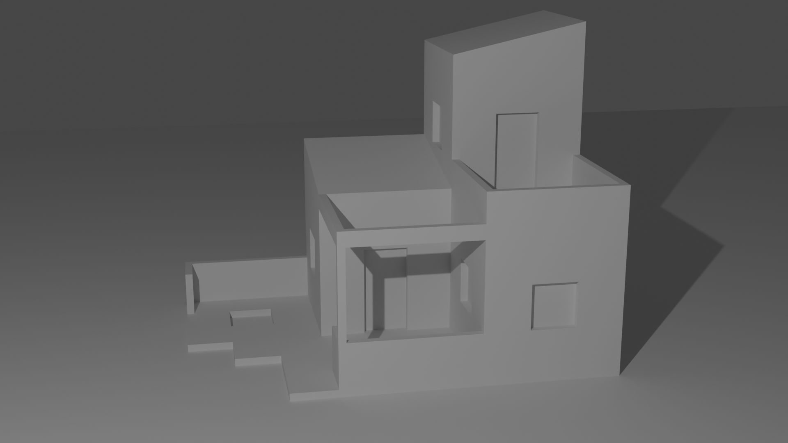

[Today\'s Agenda](220221_agenda.html)

{ width=90% }

## Monochromatic Tone Value Delineation                                         
                                                                                
Grisaille is a painting technique that uses only one color, usually gray, in a range of shades or values. It often serves as an underpainting stage when using opaque paints. The most common way to describe paint is by color. How do we reconcile these two seemingly contradictory descriptions? Is it value or color? Yes!

Figure 4.1.1: Medium Gray Reference Box

Figure 4.1.1 was drawn for illustration purposes here using a scalable
vector program called Inkscape. Let's describe it. It was originally
drawn to be 1 inch square (25mm). It has no outline color, and the fill
was selected as 50% gray. Let's dig a little deeper into our simple
square. Since Inkscape is a vector drawing program, then the code for
the file is text readable. It shows the following attribute:
fill:\#808080;stroke:none;stroke-width:0

For reference, fill is the color inside the square, stroke is the line
bounding the square and stroke-width is the thickness of that line. What
is \#808080? It turns out that this is a very specific color readable on
web pages. It is known as a *color hex value* and does not have much
value for our understanding. Let's dig a little deeper and translate
this description into terms more familiar to us. What are other ways of
describing color?

In kindergarten you no doubt learned of the primary colors: red, blue
and yellow. Later perhaps in high school physics you learned that the
primary colors in light are red, blue and green. In kindergarten we
mixed tempera paints of blue and red together to get purple...two
primary colors make a secondary color. Theoretically if we mix the three
primary colors in equal measure, then we should get a neutral gray like
the square above in the figure. In real life it is much closer to brown.
Incidentally, when mixing red light together with blue light you will
get a very different color, magenta. Magenta is not purple!

Since we are working in both the world of physical pigments and digital
light, we are going to need a more complex definition of color. This
will eventually lead us back to the idea of our 50% gray square in the
figure. Hex color \#808080 can also be defined in at least four
different ways: RGB, HSL, HSV and CYMK. Here is a table of these values
for 50% gray.

  ------ ------- ------- ------- -----
                                 
  RGB    128.0   128.0   128.0   
  HSL    0.0     0.0     0.5     
  HSV    0.0     0.0     50.0    
  CMYK   0.0     0.0     0.0     0.5
  ------ ------- ------- ------- -----

RGB stands for red, green and blue. These are known as channels. Each
channel has a range from 0 to 255. By inference we can say that light in
the amounts of half the range 128 of three channels when mixed is 50%
gray. If a web page presented the square in the figure above on a
computer monitor, then we could infer that it would consist of an area
of 72 ppi or pixels per inch. A pixel with a value of 128 would be
halfway between no light and all light. Could we use the metaphor of a
rheostat or dimmer on a light switch? A rheostat controls the amount of
current by varying the resistance. The more current that passes, then
the brighter the light. Leaving the metaphor behind, we can say that
while a computer bit has only two states, 0 or 1 (off or on,) our pixel
above has 256 discrete states. This is a pretty good abstraction of
continuous color shifts. Indeed, you may have seen that your computer
monitor is capable of 16 million colors! Let's do the math: the cube of
256 is 16.78 million.

HSL stands for hue, saturation and lightness. HSV represents hue,
saturation and value. CMYK represent the printing primary colors of
cyan, magenta, yellow and black. Since most of our work will be done
digitally, then we will focus on the RGB system. The important take away
from this deep dive is that mixing colors differs between pigments and
light. Another idea that arises from this discussion is the importance
of value. We can say that value is a product of mixing colors together.
In the computer this means relative gray values in each of three
channels. For a confirmation of this, check out the three channels of
the color image from a colorful rendering in figure 4.1.2. The red
channel is a monochromatic image. The blue channel is similar but
"highlights" different parts of the image. The green channel is again
slightly different.

{ width=90% }

Figure 4.1.2: Three Monochromatic Channels Make RGB Color Image

Monochromatic values are a fundamental way of discerning pattern
differences. Perhaps second only to the silhouette or outline of an
object, values help us to understand how real-world objects reflect
light. This information yields so much information to the viewer. Since
it is easy to map values that we perceive onto the flat surface of paper
or a viewing screen, then the illustrator can use a value scale to aid
in this coding system. Whereas a computer uses 256 scale values across
several channels, it is often adequate for us to think in only seven
values from black to white. This approximation can be mapped in at least
two different systems, a linear scale and what we'll call here a Lambert
scale. You are recommended to make both scales as rendering practice
ahead of making your Exercise Six. Perspective Projection and Tone Value
Render of a Small Guest House.

{ width=90% }

Figure 4.1.3: Two Grayscale Value Reference Images

#### Photographic Arts as Rendering Paradigm

The development of photography was historically perceived by some as a
threat to painting and even to fine art itself. Artists still paint and
draw now more than ever. Photography has instead become a fine art
itself. Just as electronic modeling and computer rendering is seen by
some as supplanting our need to learn how to draw by hand, what if
architectural illustration is similar to the arc of photography. It is
argued here that photography has improved our capacity to see and
record. It is prudent for the architectural student to develop skills in
all aspects of contemporary practice. That practice can best be
described as a hybrid of several systems.

A paradigm can also be thought of as a model and system. The components
of any system are at least some discrete phenomena we'll call objects
and the interrelationships between these objects. For now, let's keep it
simple. The objects of a rendering are: the represented scene,
transformations from three-dimensional space to two-dimensional
representations, relationships of major and minor representations of
objects as shapes on the *page*, relationships of light reflectance on
the objects and material colors and textures. What is photography to the
architect and illustrator? What does a photographic rendering paradigm
look like? The answer to these questions will be shown as a good
rule-of-thumb or heuristic for our contemporary practices in drawing
that can translate across analog and digital domains.

We are transported back several decades. An architect and photographer
using a single lens reflex (SLR) camera in 1988 visits a project site on
a street corner of a small town. A three-story historical bank will be
renovated into restaurant. In addition to taking photographs to document
the existing conditions, the architect carries a sketchbook, felt-tip
pens and a tape measure. In the camera bag are three *prime* lenses: a
28mm f/1.8, a 50mm f/1.4 and a 105mm f/2.8. Each roll of film is ISO 64
Kodachrome color positive (slide) 35mm film with 36 slides to be
developed by a lab in about one week.

The 28mm lens is effective when taking photographs across the street. It
captures the entire building, although there is a small amount of barrel
distortion that slightly curves the edges of the frame and make the
parallel vertical lines converge to a vanishing point in the sky. This
can either be a useful dynamic view to consider for a rendering later,
or conversely it could be distracting. The illustrator won't know which
until the design idea is considered. The overcast sky makes the light
levels a slight challenge, but this lens is *bright*. Stopping down to
f/4 in these conditions is no problem. Later, when taking photographs
inside, the architect will likely need to use the f/1.8 aperture, and
this will introduce a very shallow depth of field. Again, this
*limitation* can be an attribute or a detraction depending on how the
effect is used creatively.

The 50mm lens most closely resembles our natural field of view that we
see walking around. This will be great for taking exterior shots as
*eye-level* perspective vignettes. These vignettes are so effective at
giving the viewer an experiential quality, so important for making the
project come alive. Again, the even brighter f/1.4 lens will be helpful
for the interior vignettes. All other things being equal the wider the
angle of the lens, then the more light comes through it and is mirrored
onto the film plane. The 28mm allows more light than the 50mm lens, and
the architect is glad for the extra two-third stops available on this
50mm lens. It could mean the difference between getting a low light shot
at 1/30s, which is too hard to hold steady, and 1/60s. Since the
architect forgot the tripod today and must hand hold, that brighter 50mm
will come in very handy!

The 105mm will allow the architect to take detail shots of the
historical cornice. It will help to catalogue the areas where repairs
will be required. No need for a ladder on this trip. These shots can be
taken from the street. It may be useful for the presentation board to
convert some of these images into renderings that demonstrate why the
client should keep the existing cornice for the new design. By the end
of the site visit, the architect has exposed four rolls of film to drop
off at the developer and picked up later that week, hopefully before the
weekend, so that the renderings can be prepared before the client
meeting at the beginning of next week.

Back to the present, you might be asking why did we go into so much
detail about a historical artifact...the 1988 architect and a film
camera? The digital camera mostly has the same physical limitations that
are a function of the glass in the lenses. Further, while these lenses
have been miniaturized to be placed in your phone, the principles remain
the same. And, it turns out, that electronic modeling environments such
as SketchUp, Blender and REVIT use the same terminology borrowed from
photography in setting up the rendered perspective views. While
Kodachrome is almost impossible to find, 35mm negative film stock and
those who can develop it still exist. Used analog cameras are still
available on used markets and lenses are adaptable for both analog and
digital cameras. Does this seem like a good investment or hobby? You
could do worse! It just may help your *eye* for making your renderings.

[Blender Construction of Exercise 6](https://web.microsoftstream.com/video/cfeaa6e1-c09c-495e-9429-b06b31c27343)

